# Google API

## Google workspace developer

To be able to use the API we will need to have the API token or key for that we need, in big terms, to follow:

1. Create a new project and enable the API.
2. Define the type of authentication.
3. Identify the scope
4. Create the credentials, if need it to provide access to User to the specific resources.

## Initial setup

### 1.Google Cloud platform

Navigate to [console.cloud.google.com](http://console.cloud.google.com), if this is your first time you will find something like this

In order to use the Google API we need to have an account in Google, of course, but also we need to set up the google cloud platform.

This is just the standard " term of services" "let me spam you with products" page.

Not much we can do, just agree with the term of services, and is up to you if you want to get the email updates.

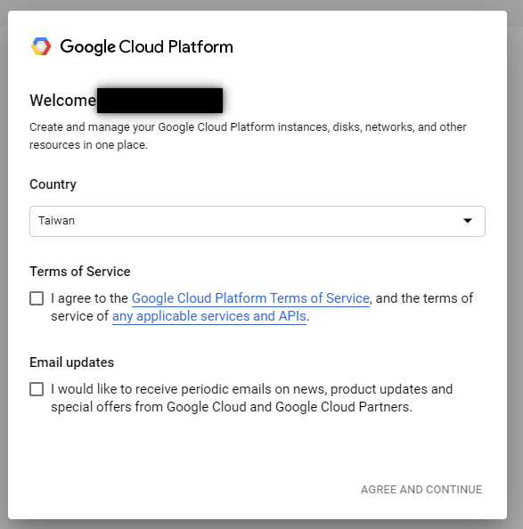{: .center}

Now we are presented with the home page or dashboard for the google cloud

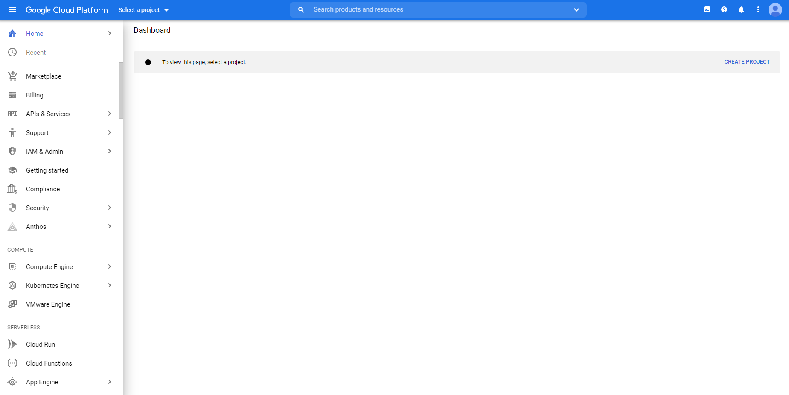{: .center}

### 2. Set up Projects

The projects will represent our application, at least that is how I understand it, so in order to create the access token or the API keys we will need to have a project, we have a limited amount of projects before we need to request an upgrade or to delete previous once, however, the number of projects slots we get initially is pretty generous

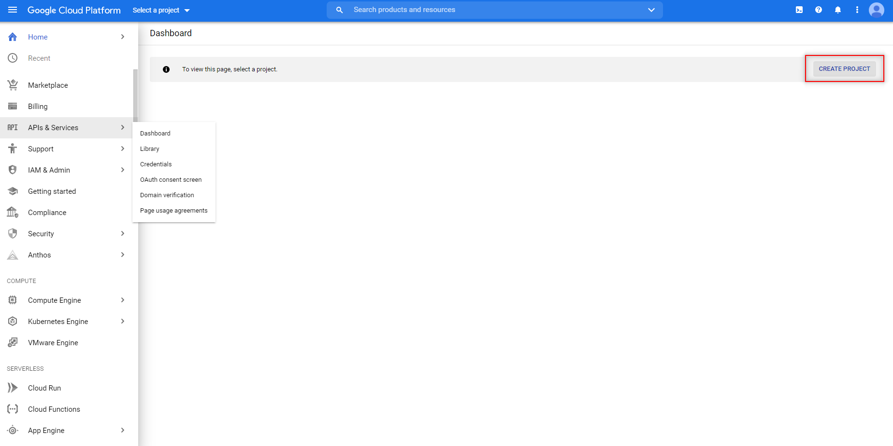{: .center}

#### New project

First, we start by giving a name to the project and adding the organisation.

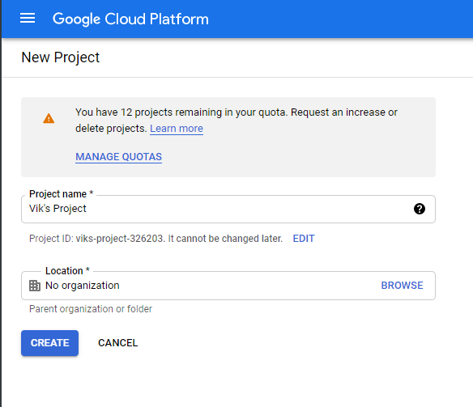{: .center}

once the project is created the dashboard will change and will start to display information about the specific project, we can change the project in the top bar next to the "google cloud platform" title.

{: .center}

Now the dashboard has a lot of information regarding the project, here you can monitor the API consumption in the user or member of your organization interacting with the project.

We already have the project so now we need to get the API, in this case, the example will be related to the Sheets API, but the process is similar for most of the APIs, however, my configuration of Authorization and authentication might not be the best practices, google provide an extensive explanation about this topic, and I'm working on it, but for this notes, I will take a simple approach.

#### API & Services

We need to add the library that we need, in this case, we need to navigate to API & Services >  Library.

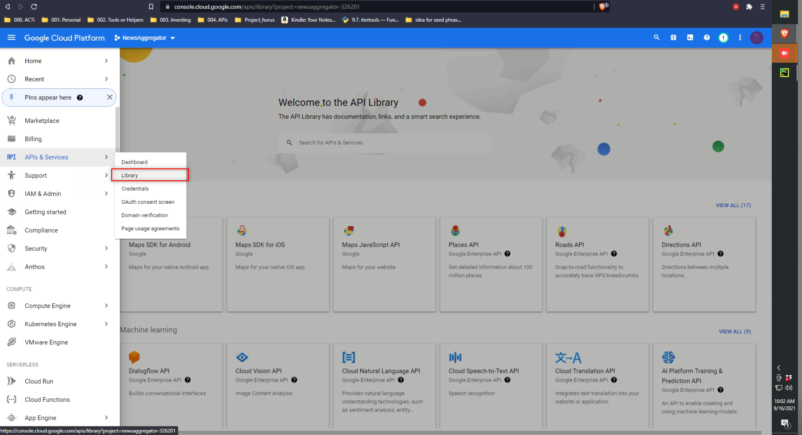{: .center}

once on the new page we need to select the API we want to use, in this case, as mentioned before, I will go for the Google sheet API.

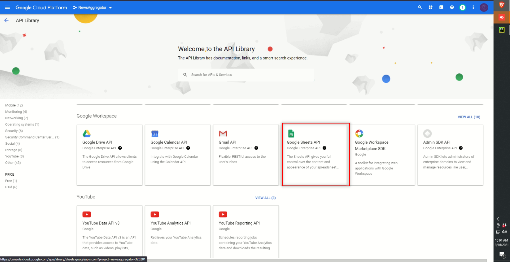{: .center}

Once selected we will see a new page with some description and information. we can either try the API here and confirm this wants we need or go ahead and enable it.

Once enabled we have a second dashboard, this case is just for this API, here we can proceed and create the credentials and the services that we need in order to make use of this API

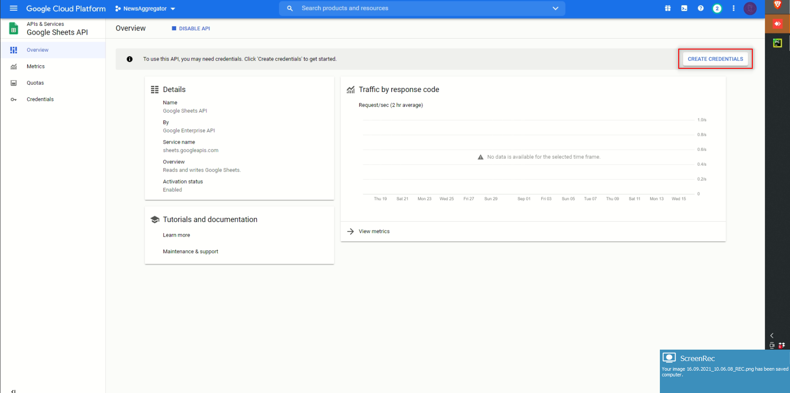{: .center}

#### Credentials

Once we start the process of credential creation we will see different files to set up, here is where you can spend some time making a proper configuration about the scope and who can access, in this case, I will go the easy way and make it simple, creating access just to myself.

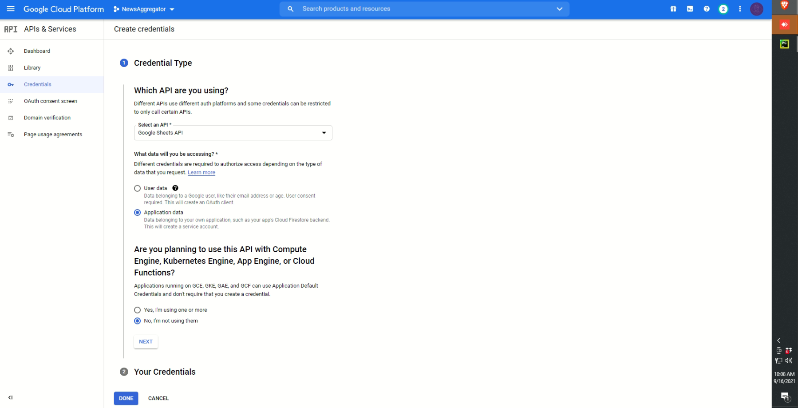{: .center}

Once we get the credentials we go for the services, here is where we are going to define the limits, in this case, I want to have access to the creation, delete and modification of google sheet, thus the scope selected, you will notice an email-like string, that is the service account.

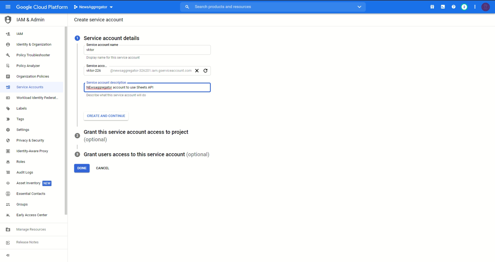{: .center}

#### OAuth 2.0 Client ID

In the examples given by the Google sheet API page, we have one section in the code that we request information from a file called `credential.json` this file is coming from the section OAuth 2.0 Client IDs

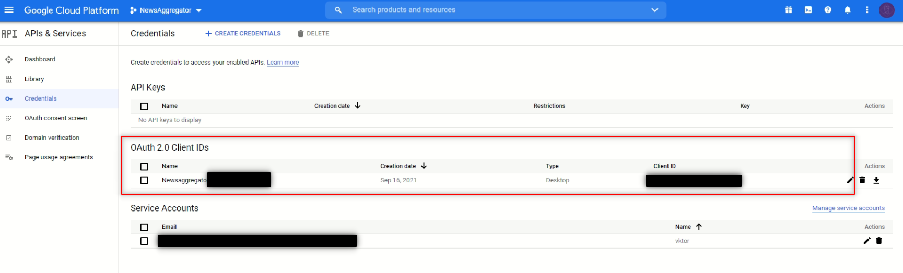{: .center}

To get this file we need to create the client Id, we can do that in the top of the page "+ Create credentials"

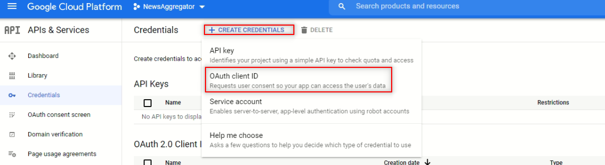{: .center}

It is possible that before creating the OAuth Id we will need to configure the Consent screen, this is the screen that will ask the user to grant permission o the application.

In the configuration of consent, we will be presented with two options internal and external. My project right now is just a personal project so it won't affect me which option I will select so I will go by the external sense is the one I use before.

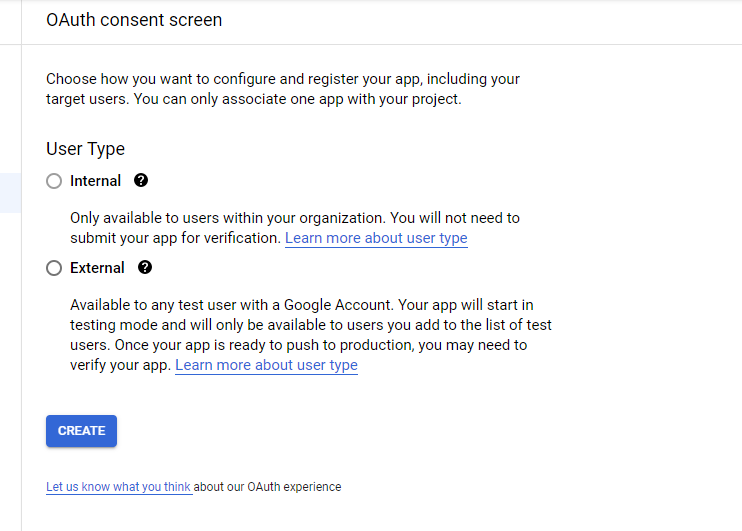{: .center}

We will be asked to add some information, this information will be display to the user once they try to connect to our application, part of this configuration will include the scope I mentioned before, this scopes will define how much access the application has to the customer data and what the user can do with the API.

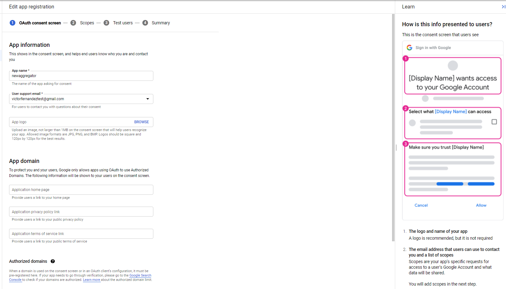{: .center}

Now the scopes

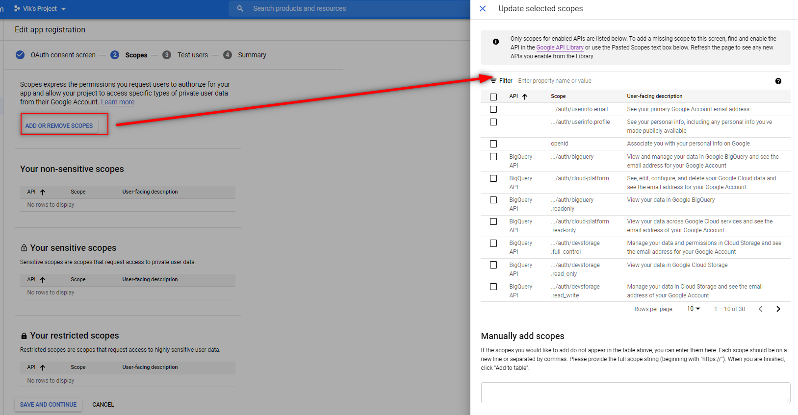{: .center}

I will select the scope Google Sheet API

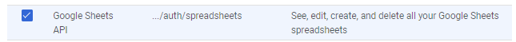{: .center}

so I can create, delete and edit the google sheets.

The next steps in this OAuth consent screen configuration will be the test user, which I won't configure since I'm the only one using it.

Finally, with this configuration, we can proceed and finish the generation of the OAuth 2,0 Client ID

{: .center}

Now we need to select what type of application will interact with the API in this case I will select desktop since the project I planning to work with will be develop in python

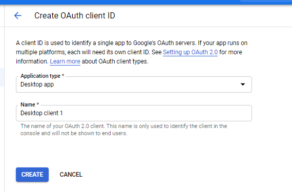{: .center}

We will get a Modal view with the information about the client, this information will be in the json file as well

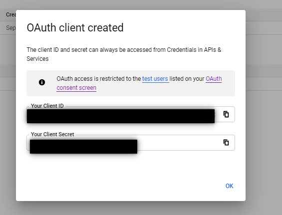{: .center}

To download the .json file ( the one we will rename `credentials.json`) we can do it in the dashboard

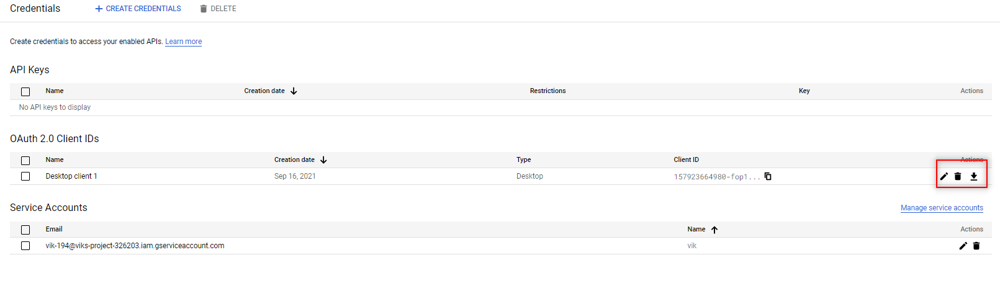{: .center}

## APIs

### Google Sheet API

[Google Sheets API](https://www.notion.so/Google-Sheets-API-c47c725d3a6b4741b4d49ec7e9aa760f)
