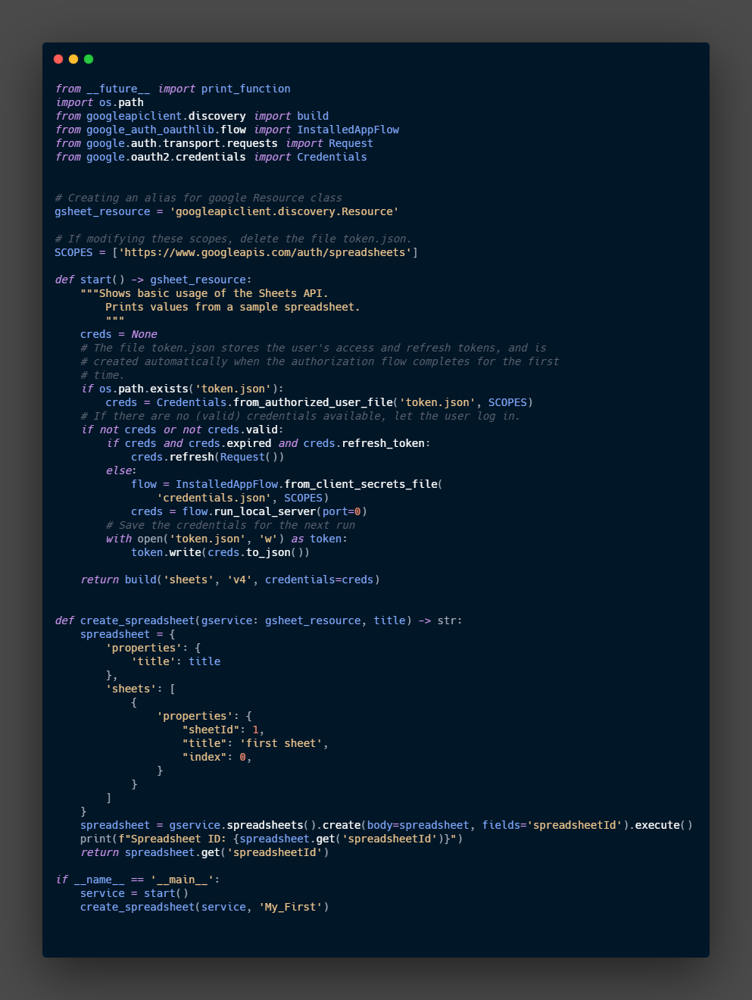

# Create Spreadsheet

To create spreadsheets we need to have authentication and authorization, these can be achieved by the usage of the Class `Flow` and the object `Credentials` for more information we can refer to the documentation in Github. 

[google-api-python-client/oauth.md at main · googleapis/google-api-python-client](https://github.com/googleapis/google-api-python-client/blob/main/docs/oauth.md)

in this case, I will copy and modify the code from the example in the quick start form google documentation 

```python
SCOPES = ['https://www.googleapis.com/auth/spreadsheets']
.
.
def start():
    """Shows basic usage of the Sheets API.
        Prints values from a sample spreadsheet.
        """
    creds = None
    # The file token.json stores the user's access and refresh tokens, and is
    # created automatically when the authorization flow completes for the first
    # time.
    if os.path.exists('token.json'):
        creds = Credentials.from_authorized_user_file('token.json', SCOPES)
    # If there are no (valid) credentials available, let the user log in.
    if not creds or not creds.valid:
        if creds and creds.expired and creds.refresh_token:
            creds.refresh(Request())
        else:
            flow = InstalledAppFlow.from_client_secrets_file(
                'credentials.json', SCOPES)
            creds = flow.run_local_server(port=0)
        # Save the credentials for the next run
        with open('token.json', 'w') as token:
            token.write(creds.to_json())

    service = build('sheets', 'v4', credentials=creds)
    return service
```

We get the use the code to get the credentials and the token need it to interact with the API and return the object service that we will use for the creation of the spreadsheet

### `create()` method

To create a new spreadsheet we will use the method `create()`

This code is a modification of the example code provided by google

```python
def create_spreadsheet(service, title):
    spreadsheet = {
        'properties':{
            'title': title
        },
        'sheets':[
            {
                'properties':{
                    "sheetId": 1,
                    "title": 'first sheet',
                    "index": 0,
                }
            }
        ]
    }
    spreadsheet = service.spreadsheets().create(body=spreadsheet, fields='spreadsheetId').execute()
    print('Spreadsheet ID: {0}'.format(spreadsheet.get('spreadsheetId')))
```

From the above code:

We have the object `spreadsheet` with some properties like the title and sheets, these are not the only properties and parameters we can modify for more information we need to check the spreadsheet resources and the sheet resources

[REST Resource: spreadsheets | Sheets API | Google Developers](https://developers.google.com/sheets/api/reference/rest/v4/spreadsheets)

[Sheets API | Google Developers](https://developers.google.com/sheets/api/reference/rest/v4/spreadsheets/sheets#SheetProperties)

Later we use the method `create()` with the object spreadsheet for the parameter body, finally the method `execute()` to execute the action.

Finally, use `print()` to get the spreadsheet ID, we can use this ID on the browser to find the sheet.


Note the ID in the URL as well as the Sheet ID, at the bottom we have the name of the sheet.

## Personal Changes

I made some personal changes in the code, adding some type of hint. 

