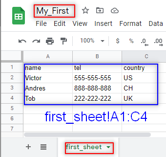
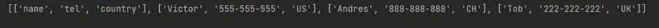
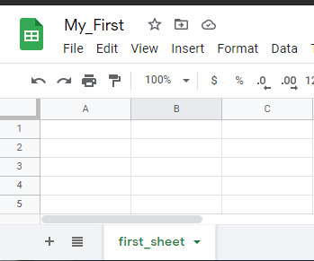
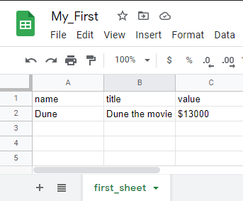
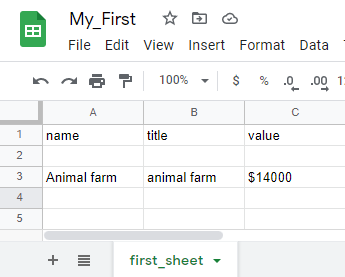
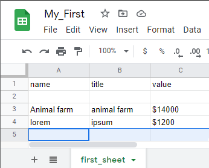

# Reading and Writing spreadsheet

---

A cell is located at interception between a row and a column and may contain a value, to interact with it google sheet API provides the [spreadsheet.values](https://developers.google.com/sheets/api/reference/rest/v4/spreadsheets.values) collection thus I can perform basic reading and writing.

I will focus here on the basic usage of the [spreadsheet.values](https://developers.google.com/sheets/api/reference/rest/v4/spreadsheets.values) collection and won't deal with any formatting properties for the sheets.

# Methods

The following methods are from the [spreadsheet.values](https://developers.google.com/sheets/api/reference/rest/v4/spreadsheets.values) collection

|Range Access  |   Reading                  |     Writing                  |
|:-------------|:--------------------------:|:----------------------------:|
|Single Range  |spreadsheets.values.get     |spreadsheets.values.update    |
|Multiple Range|spreadsheets.values.batchGet|spreadsheet.values.batchUpdate|
|Appending     |                            |spreadsheet.values.append     |

Google Provide additional examples for Basic reading and Basic Writing in the sample pages 

Basic reading samples

[Basic Reading | Sheets API | Google Developers](https://developers.google.com/sheets/api/samples/reading)

Basic Writing samples

[Basic Writing | Sheets API | Google Developers](https://developers.google.com/sheets/api/samples/writing)

# Reading

What do I need to read the spreadsheet?

- The spreadsheet ID
- The range in A1 notation

The output of this action will be control by 3 parameters:

- `majorDimension` ( default value: `ROW`)
- `valueRenderOption` (Default value: `FORMATTED_VALUE`)
- `dateTimeRenderOption` (Default value: `SERIAL_NUMBER`)

## `ValueRange`

Represent the data within the range of the spreadsheet, the data I'm reading.

Its JSON representation is:

```json
{
  "range": string,
  "majorDimension": enum(Dimension),
  "values": [
    array
  ]
}
```

Where:

- `range` type `string`: the range of values in A1 notation, this will be the range I will be reading.
- `majorDimension` type `enum`: This is more difficult to understand, but in few words, depending on the value the output will follow a format, let say the value is `majorDimension=ROWS`the data is A1=1,B1=2,A2=3,B2=4, the `range=A1:B2` the return will be `[ [1,2] [3,4] ]` but if I modify `majorDimension=COLUMNS` the output will be `[ [1,3] [2,4] ]`.
- `values` type `array`: the data to be read, this fallow a format of an array of arrays, the outer array represent the data, each inner array a major dimension and each item inside a cell value.

more info:

[REST Resource: spreadsheets.values | Sheets API | Google Developers](https://developers.google.com/sheets/api/reference/rest/v4/spreadsheets.values#dimension)

### `valueRenderOption`

This will affect how the values are rendered in the output if they will follow a specific format, un-formatted, or a calculation of a formula, the possible values of this parameter are: 

- `FORMATTED_VALUE`
- `UNFORMATTED_VALUE`
- `FORMULA`

More info:

[ValueRenderOption | Sheets API | Google Developers](https://developers.google.com/sheets/api/reference/rest/v4/ValueRenderOption)

### `dateTimeRenderOption`

This option will be used only if `valueRenderOption=FORMATTED_VALUE` and it affects how dates are rendered in the output. the options are: 

- `SERIAL_NUMBER`
- `FORMATTED_STRING`

more info:

[DateTimeRenderOption | Sheets API | Google Developers](https://developers.google.com/sheets/api/reference/rest/v4/DateTimeRenderOption)

## `BatchGetValueResponse`

This is the response I have when I use the method `batchGet()` which is the method to read non-consecutive ranges, or several ranges from a spreadsheet. As well as `valueRange` is has a JSON representation

```json
{
  "spreadsheetId": string,
  "valueRanges": [
    {
      object (ValueRange)
    }
  ]
}
```

Where:

- `spreadsheetId`: It is the ID of the spreadsheet I are reading
- `valueRanges`: is an object that contains `valueRange` in the same order as the request values.

more info: 

[Method: spreadsheets.values.batchGet | Sheets API | Google Developers](https://developers.google.com/sheets/api/reference/rest/v4/spreadsheets.values/batchGet)

## Examples

I have the spreadsheet 

{: .center}

Where:

- `spreadsheetId` is known and will look similar to `10q7CW3zqzb2B3hHluXPC4Q8J`
- The sheet that contains the data is `first_sheet`
- And the range I'm going to read in A1 notation will be `first_sheet!A1:C4`

### Reading single range

Assuming that I already have the resources and tokens (full implementation bellow), the reading function will look like: 

```python
def read_single(gservice: gsheet_resource):
    result = gservice.spreadsheets().values().get(
        spreadsheetId=SAMPLE_SPREADSHEET_ID,
		range=SAMPLE_RANGE_NAME).execute()
    rows = result.get('values')
    print('{0} '.format(rows))
```

Be aware that `values` in the second statement are the item in the `ValueRange` JSON representation I mention earlier.

I didn't provide any information about the `majorDimension` so the default value `ROW` is applied that is why the result is 



### Reading multiple ranges

Using the same spreadsheet, for this example I will change the range to two non-consecutive ranges. I will need to make some changes to the function, I replace the `get()` method for `batchGet()`.

In this case, the response will be a `BatchGetValueResponse` that is an object that contains a list of `ValueRange` and the `spreadsheet_ID`

```python
def read_multiple(gservice: gsheet_resource):
    range_names = [
        'first_sheet!A1:C1',
        'first_sheet!A3:C4'
    ]
    result = gservice.spreadsheets().values().batchGet(
        spreadsheetId=SAMPLE_SPREADSHEET_ID,
        ranges=range_names).execute()
    rows = result.get('valueRanges')
    print('{0} '.format(rows))
```

and the response will be: 

```python
[
{'range': 'first_sheet!A1:C1', 'majorDimension': 'ROWS', 'values': [['name', 'tel', 'country']]}, 
{'range': 'first_sheet!A3:C4', 'majorDimension': 'ROWS', 'values': [['Andres', '888-888-888', 'CH'], ['Tob', '222-222-222', 'UK']]}
]
```

# Writing

Similar to reading I will need few elements to be able to read on the spreadsheet, these elements are:

- `spreadsheetID`.
- The range in A1 notation.
- The data is arranged in the appropriate format in the body of the request.

for the update, I will need to use the parameter `ValueInputOption` ( for a batch update this value is in the body of the request, for a single update, it will be part of the query parameters) 

| valueInputOption| Description |
|:----------------|:------------|
|RAW              |It will place a string without any parse, if the input is =1+2 the value place in the cell will be that =1+2        |
|USER_ENTERED     |The input will be parse following similar pattern that google sheet UI, example, =1+2 will be render as a result of the operation 3           |

## Examples

To write data as it was to read, I have two types, the single range writing and the writing for multiple ranges.

### Writing a single range

For this, I will follow the requested `[spreadsheet.values.update](https://developers.google.com/sheets/api/reference/rest/v4/spreadsheets.values/update)`

I started with a simple empty sheet

{: .center}

I'm going to write in the first and second row, and the code looks like

```python
def write_single(gservice: gsheet_resource):
    values = [
        ['name','title','value'],
        ['Dune','Dune the movie','$13000'],
    ]
    body = {
        'values': values
    }
    result = gservice.spreadsheets().values().update(
        spreadsheetId=SAMPLE_SPREADSHEET_ID,
        range=SAMPLE_RANGE_NAME,
        valueInputOption='RAW',
        body=body
    ).execute()
    print('{0} cells updated.'.format(result.get('updatedCells')))
```

from the code above:

1. I create a list of values the outer array represents all ranges of the spreadsheet, the inner arrays are the rows since I didn't specify the `majorDimention`, and each item in the array is a value of the cell.
2. I define the body of the request, in this case, it is a `valueRange` just the value item is mandatory if I specify the `range` it must match the one provided in the `update` function below. Here I can change the `majorDimension`
3. I have the `update` function, here I will pass the `spreadsheeId`, the `range`, the `valueInputOption` because it is a single range update, otherwise, it will be in the body. Finally, I will pass the `body` containing the values.

{: .center}

### Writing a multiple ranges

In this case, the request use is [spreadsheets.values.batchUpdate](https://developers.google.com/sheets/api/reference/rest/v4/spreadsheets.values/batchUpdate)

The request must be `BatchUpdateValuesRequest` object, this object will contain the `ValueInputOption` and a list of `ValueRange` this will make more sense with an example:

```python
def write_range(gservice: gsheet_resource):
    range_name = 'first_sheet!A1:C1'
    range_name_1 = 'first_sheet!A3:C3' 
    
    values1 = [
        ['name','title','value'],
    ]
    values2 = [
        ['Animal farm','animal farm', '$14000']
    ]
    
    data = [
        {
            'range': range_name,
            'values': values1
        },
        {
            'range': range_name_1,
            'values': values2
        }
    ]
    body = {
        'valueInputOption': 'RAW',
        'data': data
    }
    result = gservice.spreadsheets().values().batchUpdate(
        spreadsheetId=SAMPLE_SPREADSHEET_ID,
        body=body
    ).execute()
    print('{0} cells updated.'.format(result.get('totalUpdatedCells')))
```

From the code above:

1. I define two ranges, ode that will be the first row `first_sheet!A1:C1` and the second will be the third row `first_sheet!A3:C3`.
2. I define two variables that will handle the values, `values1`, and `values2`
3. I create the `data`, Be aware here I have two`valueRange`.
4. I create the `body`, in this case, the `valueInputOption` will be in the body of the request rather than the query parameter like in the example with a single range.
5. I use the function `batchUpdate` to execute the writing.

{: .center}

# Appending

Like writing append will use a specific type of request in this case `spreadsheets.values.append`.

For the most part, the append is similar to the writing single range with the difference in the function use, rather than use `update()` I use `append()`.

```python
def append_range(gservice: gsheet_resource):
    range = 'first_sheet!A3:C3'
    values = [
        [
            'lorem','ipsum','$1200'
        ],
    ]
    body = {
        'values': values
    }
    result = service.spreadsheets().values().append(
        spreadsheetId=SAMPLE_SPREADSHEET_ID, range=range,
        valueInputOption='RAW', body=body).execute()
    print('{0} cells appended.'.format(result.get('updates').get('updatedCells')))
```

from the code above:

1. Define the range where I will start to append ( be aware that if that is used already the new information will be write in the next row)
2. Define the values, the outer array define the data , inner array represent the rows (I haven't defined a `majorDimension` so the default is `ROW`).
3. I create the `body`.
4. I use the function `append()` that will include the query parameter `valueInputOption`

{: .center}

# Full scripts

## Reading

```python
from __future__ import print_function
import os.path
from googleapiclient.discovery import build
from google_auth_oauthlib.flow import InstalledAppFlow
from google.auth.transport.requests import Request
from google.oauth2.credentials import Credentials

# Creating an alias for google Resource class
gsheet_resource = 'googleapiclient.discovery.Resource'

# If modifying these scopes, delete the file token.json.
SCOPES = ['https://www.googleapis.com/auth/spreadsheets']

# The ID and range of a sample spreadsheet.
SAMPLE_SPREADSHEET_ID = '10q7CW3zqzb2B3hHluXPC4Q8JLGludKXQHH3NX9Wi7aU'
SAMPLE_RANGE_NAME = 'first_sheet!A1:C4'

def fetch_resource() -> gsheet_resource:
    """Shows basic usage of the Sheets API.
        Prints values from a sample spreadsheet.
        """
    creds = None
    # The file token.json stores the user's access and refresh tokens, and is
    # created automatically when the authorization flow completes for the first
    # time.
    if os.path.exists('token.json'):
        creds = Credentials.from_authorized_user_file('token.json', SCOPES)
    # If there are no (valid) credentials available, let the user log in.
    if not creds or not creds.valid:
        if creds and creds.expired and creds.refresh_token:
            creds.refresh(Request())
        else:
            flow = InstalledAppFlow.from_client_secrets_file(
                'credentials.json', SCOPES)
            creds = flow.run_local_server(port=0)
        # Save the credentials for the next run
        with open('token.json', 'w') as token:
            token.write(creds.to_json())

    return build('sheets', 'v4', credentials=creds)

def read_single(gservice: gsheet_resource):
    result = gservice.spreadsheets().values().get(
        spreadsheetId=SAMPLE_SPREADSHEET_ID,
        range=SAMPLE_RANGE_NAME).execute()
    rows = result.get('values')
    print('{0} '.format(rows))

def read_multiple(gservice: gsheet_resource):
    range_names = [
        'first_sheet!A1:C1',
        'first_sheet!A3:C4'
    ]
    result = gservice.spreadsheets().values().batchGet(
        spreadsheetId=SAMPLE_SPREADSHEET_ID,
        ranges=range_names).execute()
    rows = result.get('valueRanges')
    print('{0} '.format(rows))

if __name__ == '__main__':
    service = fetch_resource()
    read_single(service)
    read_multiple(service)
```

## Writing

```python
from __future__ import print_function
import os.path
from googleapiclient.discovery import build
from google_auth_oauthlib.flow import InstalledAppFlow
from google.auth.transport.requests import Request
from google.oauth2.credentials import Credentials

# Creating an alias for google Resource class
gsheet_resource = 'googleapiclient.discovery.Resource'

# If modifying these scopes, delete the file token.json.
SCOPES = ['https://www.googleapis.com/auth/spreadsheets']

# The ID and range of a sample spreadsheet.
SAMPLE_SPREADSHEET_ID = '1DjfIxE0ValkVRVyIOVE-8Sa9v7xSkqDvY9NCWGhImPg'
SAMPLE_RANGE_NAME = 'first_sheet!A1:C4'

def fetch_resource() -> gsheet_resource:
    """Shows basic usage of the Sheets API.
        Prints values from a sample spreadsheet.
        """
    creds = None
    # The file token.json stores the user's access and refresh tokens, and is
    # created automatically when the authorization flow completes for the first
    # time.
    if os.path.exists('token.json'):
        creds = Credentials.from_authorized_user_file('token.json', SCOPES)
    # If there are no (valid) credentials available, let the user log in.
    if not creds or not creds.valid:
        if creds and creds.expired and creds.refresh_token:
            creds.refresh(Request())
        else:
            flow = InstalledAppFlow.from_client_secrets_file(
                'credentials.json', SCOPES)
            creds = flow.run_local_server(port=0)
        # Save the credentials for the next run
        with open('token.json', 'w') as token:
            token.write(creds.to_json())

    return build('sheets', 'v4', credentials=creds)

def write_single(gservice: gsheet_resource):
    values = [
        ['name','title','value'],
        ['Dune','Dune the movie','$13000'],
    ]
    body = {
        'values': values
    }
    result = gservice.spreadsheets().values().update(
        spreadsheetId=SAMPLE_SPREADSHEET_ID,
        range=SAMPLE_RANGE_NAME,
        valueInputOption='RAW',
        body=body
    ).execute()
    print('{0} cells updated.'.format(result.get('updatedCells')))

def write_range(gservice: gsheet_resource):
    range_name = 'first_sheet!A1:C1'
    range_name_1 = 'first_sheet!A3:C3'

    values1 = [
        ['name','title','value'],
    ]
    values2 = [
        ['Animal farm','animal farm', '$14000']
    ]

    data = [
        {
            'range': range_name,
            'values': values1
        },
        {
            'range': range_name_1,
            'values': values2
        }
    ]
    body = {
        'valueInputOption': 'RAW',
        'data': data
    }
    result = gservice.spreadsheets().values().batchUpdate(
        spreadsheetId=SAMPLE_SPREADSHEET_ID,
        body=body
    ).execute()
    print('{0} cells updated.'.format(result.get('totalUpdatedCells')))

def append_range(gservice: gsheet_resource):
    range = 'first_sheet!A3:C3'
    values = [
        [
            'lorem','ipsum','$1200'
        ],
    ]
    body = {
        'values': values
    }
    result = service.spreadsheets().values().append(
        spreadsheetId=SAMPLE_SPREADSHEET_ID, range=range,
        valueInputOption='RAW', body=body).execute()
    print('{0} cells appended.'.format(result.get('updates').get('updatedCells')))

if __name__ == '__main__':
    service = fetch_resource()
    write_single(service)
    write_range(service)
    append_range(service)    
```