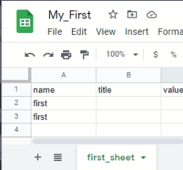
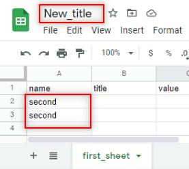

# Update Spreadsheet

I can use the `batchUpdate` method to alter or update some appearance and operation of the spreadsheets, some data I can change will be: 

- Cell format and borders
- named rage
- protected range
- conditional formatting

All these operations can be divided into three groups 

1. Add (and duplicate): add new objects or  duplicate existing one
2. Update ( or set): update the certain property and leaving others as they were. 
3. Delete: Delete objects

How it works is that `batchUpdate` will take one or more request objects, each one will modify, add or delete some kind of parameter or value, there are several types of requests, I will take the information from the official documentation 

[Updating Spreadsheets | Sheets API | Google Developers](https://developers.google.com/sheets/api/guides/batchupdate)

This table will be a short version, for more details go to the official documentation link above

|Object                  | ADD/DUPLICATE    | UPDATE/SET   | DELETE   |
|:----------------------:|:----------------|:------------|:-------------|
|Spreadsheet properties  | | [UpdateSpreadsheetPropertiesRequest](https://developers.google.com/sheets/api/reference/rest/v4/spreadsheets/request#updatespreadsheetpropertiesrequest)|  |
|Sheets                  | [AddSheetRequest](https://developers.google.com/sheets/api/reference/rest/v4/spreadsheets/request#addsheetrequest) , [DuplicateSheetRequest](https://developers.google.com/sheets/api/reference/rest/v4/spreadsheets/request#duplicatesheetrequest)| [UpdateSheetPropertiesRequest](https://developers.google.com/sheets/api/reference/rest/v4/spreadsheets/request#updatesheetpropertiesrequest)           | [DeleteSheetRequest](https://developers.google.com/sheets/api/reference/rest/v4/spreadsheets/request#deletesheetrequest)  |
|Cells                   | | [RepeatCellRequest](https://developers.google.com/sheets/api/reference/rest/v4/spreadsheets/request#repeatcellrequest), [UpdateCellsRequest](https://developers.google.com/sheets/api/reference/rest/v4/spreadsheets/request#updatecellsrequest), [AppendCellsRequest](https://developers.google.com/sheets/api/reference/rest/v4/spreadsheets/request#appendcellsrequest) | |
|Borders                 | | [UpdateBordersRequest](https://developers.google.com/sheets/api/reference/rest/v4/spreadsheets/request#updatebordersrequest)                 |                  |


The official documentation also mentions request that mimics user actions, but the most relevant for me are: 

- [FindReplaceRequest](https://developers.google.com/sheets/api/reference/rest/v4/spreadsheets/request#findreplacerequest)
- [SortRangeRequest](https://developers.google.com/sheets/api/reference/rest/v4/spreadsheets/request#sortrangerequest)

## Filed mask

These are comma-separated values that will ensure just the desire fields are changed, these field masks are required in some update requests, I can use '*' as a shorthand to update every field.

an example of these files in a JSON representation is:

```python
{
  "requests": [{
      "updateSpreadsheetProperties": {
          "properties": {"title": "My New Title"},
          "fields": "title"
      }
  }]
}
```

Some update requests will have a response, these returns are delivered in a form of an array, where each response will occupy the same index that corresponds to the request.

## Example

First, I will display the example from the documentation and later a customized example with few modifications I can use to understand the update request and how to create the requests

```python
requests = []
# Change the spreadsheet's title.
requests.append({
    'updateSpreadsheetProperties': {
        'properties': {
            'title': title
        },
        'fields': 'title'
    }
})
# Find and replace text
requests.append({
    'findReplace': {
        'find': find,
        'replacement': replacement,
        'allSheets': True
    }
})
# Add additional requests (operations) ...

body = {
    'requests': requests
}
response = service.spreadsheets().batchUpdate(
    spreadsheetId=spreadsheet_id,
    body=body).execute()
find_replace_response = response.get('replies')[1].get('findReplace')
print('{0} replacements made.'.format(
    find_replace_response.get('occurrencesChanged')))
```

from the documentation code above:

1. Create a empty array called `requests`.
2. Append the first update request `updateSpreadsheetProperties` this will change the name of the spreadsheet.
3. Append the second request `findReplace` this will find a specific value and replace it.
4. I create the `body` with the requests
5. Execute the `batchUpdate` request using the body I already create.
6. Save and display the response from the `findReplace`request.

For the example, I will start with the following spreadsheet

{: .center}

and I have the following method:

```python
def update_spreadsheet(gservice: gsheet_resource):
    requests = []
    requests.append({
        'updateSpreadsheetProperties':{
            'properties': {
                'title': 'New_title'
            },
            'fields': 'title'
        }
    })
    requests.append({
        'findReplace':{
            'find': "first",
            'replacement': "second",
            'allSheets': True
        }
    })

    body = {
        'requests': requests
    }

    response = gservice.spreadsheets().batchUpdate(
        spreadsheetId=SAMPLE_SPREADSHEET_ID,
        body=body
    ).execute()
    find_replace_response = response
    print(f'{find_replace_response}')
```

The code about it is similar to the example from the documentation with some minor changes: 

1. I add the changes in the title of the spreadsheet and define the strings I want to find and replace 
2. I print the full response for this request 

The response of this request is:

```python
{'spreadsheetId': '1DjfIxE0ValkVRVyIOVE-8Sa9v7xSkqDvY9NCWGhImGp', 'replies': [{}, {'findReplace': {'valuesChanged': 2, 'rowsChanged': 2, 'sheetsChanged': 1, 'occurrencesChanged': 2}}]}
```

I have the ID of the spreadsheet, and  the array that represent the response to the different request

```python
'replies': [{}, {'findReplace': {'valuesChanged': 2, 'rowsChanged': 2, 'sheetsChanged': 1, 'occurrencesChanged': 2}}]}
```

The first item in the array will be empty since the first request was the change of the name, the second is the request to find and replace a string, and here a response `{'findReplace': {'valuesChanged': 2, 'rowsChanged': 2, 'sheetsChanged': 1, 'occurrencesChanged': 2}}]}` we find 2 occurrences of the string `first` and replace it with the string `second` affecting two rows in one sheet.

now the spreadsheet looks like this:

{: .center}

## The script

```python
from __future__ import print_function
import os.path
from googleapiclient.discovery import build
from google_auth_oauthlib.flow import InstalledAppFlow
from google.auth.transport.requests import Request
from google.oauth2.credentials import Credentials

# Creating an alias for google Resource class
gsheet_resource = 'googleapiclient.discovery.Resource'

# If modifying these scopes, delete the file token.json.
SCOPES = ['https://www.googleapis.com/auth/spreadsheets']

# The ID and range of a sample spreadsheet.
SAMPLE_SPREADSHEET_ID = '1DjfIxE0ValkVRVyIOVE-8Sa9v7xSkqDvY9NCWGhImGp'
SAMPLE_RANGE_NAME = 'first_sheet!A1:C4'

def fetch_resource() -> gsheet_resource:
    """Shows basic usage of the Sheets API.
        Prints values from a sample spreadsheet.
        """
    creds = None
    # The file token.json stores the user's access and refresh tokens, and is
    # created automatically when the authorization flow completes for the first
    # time.
    if os.path.exists('token.json'):
        creds = Credentials.from_authorized_user_file('token.json', SCOPES)
    # If there are no (valid) credentials available, let the user log in.
    if not creds or not creds.valid:
        if creds and creds.expired and creds.refresh_token:
            creds.refresh(Request())
        else:
            flow = InstalledAppFlow.from_client_secrets_file(
                'credentials.json', SCOPES)
            creds = flow.run_local_server(port=0)
        # Save the credentials for the next run
        with open('token.json', 'w') as token:
            token.write(creds.to_json())

    return build('sheets', 'v4', credentials=creds)

def update_spreadsheet(gservice: gsheet_resource):
    requests = []
    requests.append({
        'updateSpreadsheetProperties':{
            'properties': {
                'title': 'New_title'
            },
            'fields': 'title'
        }
    })
    requests.append({
        'findReplace':{
            'find': "first",
            'replacement': "second",
            'allSheets': True
        }
    })

    body = {
        'requests': requests
    }

    response = gservice.spreadsheets().batchUpdate(
        spreadsheetId=SAMPLE_SPREADSHEET_ID,
        body=body
    ).execute()
    find_replace_response = response
    print(f'{find_replace_response}')

if __name__ == '__main__':
    service = fetch_resource()
    update_spreadsheet(service)
```