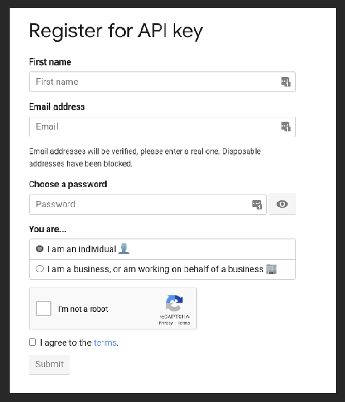

# News API

[News API - Search News and Blog Articles on the Web](https://newsapi.org/)

We can get News and articles from the web using this API.

## Get the API Key

Obtaining the API key is one of the easiest tasks with this API. The only thing we need is an email.

1. Go to the **get started** page. 

{: .center}

1. Click Get API Key.

{: .center}

1. Fill the form, and you get the API Key. Be aware there is a limitation to the free API.

{: .center}

This API provides simple and complete documentation, within this documentation, we can find information about Client libraries in different languages. Although the Python client [mattlisiv/newsapi-python](https://github.com/mattlisiv/newsapi-python) is not an official client it can be useful, at the end of these notes some notes about `newsapi-python`.

## News API Description.

We can say this API is subdivided into two main endpoints, with some specialization in one of these subdivisions, these subdivisions are the endpoints. 

The first endpoint `everything` gathers all information about a specific topic, and the second endpoint `top-headlines` is to get the top-headlines base of country and language with the option of select specific keywords, this endpoint is `top-headlines.`

- `/v2/everything`: The API claim there are more than 80,000 news and blogs.
- `/v2/top-headlines`: This can be used to get the top headlines for a country or specific toping in a region.
    - `/v2/top-headlines/source`: This is a specialized endpoint, it returns information (including name, description, and category) about the most notable sources available for obtaining top headlines from.

## Authentication

They are three different ways to authenticate with the API: 

1. As part of the query string, `apiKey="here API key"`
2. via `X-Api-Key` HTTP header.
3. Via the `Authorization` HTTP header. Including Bearer is optional.

```python
#Via querystring
GET https://newsapi.org/v2/everything?q=keyword&apiKey=db0c830faab34094b9d9f3xxxxxxxx
#Via X-Api-Key HTTP header
X-Api-Key: db0c830faab34094b9d9f3d3xxxxxxxx
#Via Authorization HTTP header
Authorization: db0c830faab34094b9d9f3d3xxxxxxxx
```


If the authentication is not done correctly the `401 - Unauthorized` HTTP error.

## Endpoints

### `/v2/everything`

Like mentioned before the API documentation claim 80,000 news and blogs, this Endpoint is a good option for general-purpose or discovery and analysis. 

For more information check the official documentation 

[Everything - Documentation - News API](https://newsapi.org/docs/endpoints/everything)

#### Request parameters

Some request parameters:

- `apiKey` this is can be pass as part of the string query or as another form previously discussed.
- `q` and `qInTitle` The first parameter is used to provide the phrases or keywords to search. The second `qInTitle` is the focus on keywords and phrases present just in the title of the new.
- `sources` with this parameter we can limit the sources in the response.
- `from` and `to` It is self-explanatory it will limit the time frame for the news.

```commandline
GET https://newsapi.org/v2/everything?q=apple&from=2021-10-02&to=2021-10-02&sortBy=popularity&apiKey=db0c830faab34094b9d9xxxxxxxxxxxx
```

#### Response Object

The response Object will be in JSON format, we can get more information in the documentation but here is a list of some of the most relevant parameters of this response. 

```json
{
"status": "ok",
"totalResults": 2177,
"articles": [
	{results_1},
	{results_2},
]

```

From the code above:

- `status` is just an indicator if the response is successful.
- `totalResult` the number of results.
- `article` is an array of JSON objects that contain the news object response.

Bellow the parameters within each `article` array.  

|Parameter  |Type   | Description                                                                        |
|:----------|:------|:-----------------------------------------------------------------------------------|
|source	    |string	|This identifies the article, it contains two parameter `id` and display name `name`.|
|author	    |string	|The author of the article                                                           |
|title	    |string	|The headline or title of the article                                                |
|description|string	|A short snippet of the news                                                         |
|url	    |string	|URL of the article                                                                  |
|urlToImage |string	|The headline or title of the article                                                |
|publishedAt|string	|date and time of published ( UTC+000)                                               |
|content    |string	|content of the article truncated to 200 characters.                                 |

### `/v2/top-headlines`

This endpoint provides breaking news or headlines for a country, or top news from a specific category in a specific country, a single source, or multiple sources.

The documentation recommends this endpoint to get news for stock tickers or financial-related topics.

[Top headlines - Documentation - News API](https://newsapi.org/docs/endpoints/top-headlines)

#### Request parameters

Some request parameters:

- `apiKey` this is can be pass as part of the string query or as another form previously discussed.
- `country` follow the 2-letter ISO 3166-1 code. example: `co` means Colombia.
- `category` possible options: `business` `entertainment` `general` `health` `science` `sports` `technology`.
- `source` here is a list of sources per country, the [source for official documentation](https://newsapi.org/sources).
- `q` like the previous endpoint this is a parameter for the keyword and phrase search.

```commandline
GET https://newsapi.org/v2/top-headlines?country=us&apiKey=db0c830faab34094b9d9xxxxxxxxxxxx
```

#### Response Object

The response Object will be in JSON format. Follow the same structure of the `/v2/everything` response object.

From the code above:

- `status` is just an indicator if the response is successful.
- `totalResult` the number of results.
- `article` is an array of JSON objects that contain the news object response.

Bellow the parameters within each `article` array.

|Parameter  |Type   | Description                                                                        |
|:----------|:------|:-----------------------------------------------------------------------------------|
|source     |string	|This identifies the article, it contains two parameter `id` and display name `name` |
|author	    |string	|The author of the article                                                           |
|title	    |string	|The headline or title of the article                                                |
|description|string	|A short snippet of the news                                                         |
|url	    |string	|URL of the article                                                                  |
|urlToImage	|string	|The headline or title of the article                                                |
|publishedAt|string	|date and time of published ( UTC+000)                                               |
|content	|string	|content of the article truncated to 200 characters.                                 |


### `/v2/top-headlines/sources`

This endpoint returns the subset of news publishers that top headlines (`/v2/top-headlines`) are available from. The official documentation recommends this endpoint to keep track of the publishers available on the API.

[Sources - Documentation - News API](https://newsapi.org/docs/endpoints/sources)

#### Request Parameters

- `apiKey` this is can be pass as part of the string query or as another form previously discussed.
- `category` possible options: `business` `entertainment` `general` `health` `science` `sports` `technology`.
- `language` this will force answers in a specific language, the default is all language, the options: `ar` `de` `en` `es` `fr` `he` `it` `nl` `no` `pt` `ru` `se` `ud` `zh`.
- `country` the default option in all countries, the options: `ae` `ar` `at` `au` `be` `bg` `br` `ca` `ch` `cn` `co` `cu` `cz` `de` `eg` `fr` `gb` `gr` `hk` `hu` `id` `ie` `il` `in` `it` `jp` `kr` `lt` `lv` `ma` `mx` `my` `ng` `nl` `no` `nz` `ph` `pl` `pt` `ro` `rs` `ru` `sa` `se` `sg` `si` `sk` `th` `tr` `tw` `ua` `us` `ve` `za`.

#### Response Object

From the code above:

- `status` is just an indicator if the response is successful.
- `source` It is an array that contains the answer for the request.

|Parameter  |Type   | Description                                                                        |
|:----------|:------|:-----------------------------------------------------------------------------------|
|id	        |string	|Identify the source .                                                               | 
|name	    |string	|Name of the source.                                                                 |
|description|string	|A short snippet of the news.                                                        |
|url	    |string	|URL of the article.                                                                 |
|category	|string	|The type of news in the response.                                                   |
|language	|string	|The language in the source write in.                                                |
|country	|string	|The country this news source is based in.                                           |

## Errors

This is the response to a bad request.

The response will have:

- `status` this will have the string `error`
- `code` this is the HTTP code.
- `message` this is a description of the error.

```JSON
{
"status": "error",
"code": "apiKeyMissing",
"message": "Your API key is missing. Append this to the URL with the apiKey param, or use the x-api-key HTTP header."
}
```

#### HTTP status

- `200 - OK` success
- `400 - Bad request` Unacceptable, most likely a missing parameter or an error in one.
- `401 - Unauthorized` Your API key is not correct.
- `429 - To Many Request` To many requests in a short window of time.
- `500 - server error` something is wrong with the newsAPI.

#### Error codes

These are just a few of the codes, for a full list check the documentation.

[Errors - Documentation - News API](https://newsapi.org/docs/errors)

- `apiKeyDisabled`- The key is disabled.
- `apiKeyExhausted`- We reach the limit of the plan.
- `parameterInvalid`- The request has some invalid parameters.
- `parametersMissing`- The request is missing some parameters.

## Client Library

For python, the documentation recommends an official python client.

This code is directly copied from the documentations since is the best summary.

#### Installing

```python
pip install newsapi-python
```

#### Code

```python
from newsapi import NewsApiClient

# Init
newsapi = NewsApiClient(api_key='Here API key')

# /v2/top-headlines
top_headlines = newsapi.get_top_headlines(q='bitcoin',
                                          sources='bbc-news,the-verge',
                                          language='en')

# /v2/everything
all_articles = newsapi.get_everything(q='bitcoin',
                                      sources='bbc-news,the-verge',
                                      domains='bbc.co.uk,techcrunch.com',
                                      from_param='2021-09-04',
                                      to='2021-09-12',
                                      language='en',
                                      sort_by='relevancy',
                                      page=2)

# /v2/top-headlines/sources
sources = newsapi.get_sources()
```

From the code above few points

- For `get_top_headlines` it is not possible to make a request using `sources` and `category`/ `country` at the same time, that will give us back an error.
- For `get_everything`  pay attention to the time frame, on the free tier of the NewsAPI we are limited to one-month-old news.

Here an example of a response from `/v2/top-headlines`
