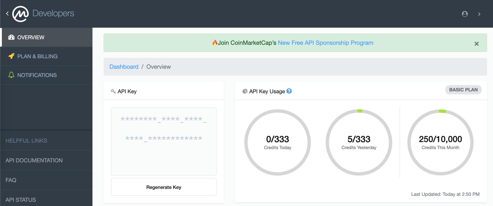

# Coin Market Cap

Coin market cap provides quality information about cryptocurrency and blockchain technologies.
As part of their products they have a blog, portfolio management, and API, etc.
The coin market cap API provides a RESTful JSON endpoint with the latest information about the prices, airdrops, chain supported, and project information.

## Credentials

For CMC, we will need just the API key, and to get this API key:

1. Navigate to [https://coinmarketcap.com/api/](https://coinmarketcap.com/api/)
2. Create an account ( in case we do not have one already)
3. Get an API key (you will find the link asking you if you want to get the API key)
4. You will be redirected to [https://pro.coinmarketcap.com/account](https://pro.coinmarketcap.com/account)



Remember that CMC provides a different package to work with their API, some endpoints are just for pro members, but you can get along with the free package.

## Authentication

You can provide the API key in two ways:

1. Via headers ( `X-CMC_PRO_API_KEY` )
2. As a parameter in the query string ( string parameter `CMC_PRO_API_KEY`)

The recommended method is via headers. Honestly, it is the easiest way.
Here is the example provided by CMC:

```python
from requests import Request, Session
from requests.exceptions import ConnectionError, Timeout, TooManyRedirects
import json

url = 'https://sandbox-api.coinmarketcap.com/v1/cryptocurrency/listings/latest'
parameters = {
  'start':'1',
  'limit':'5000',
  'convert':'USD'
}
headers = {
  'Accepts': 'application/json',
  'X-CMC_PRO_API_KEY': 'YOUR API KEY GOES HERE',
}

session = Session()
session.headers.update(headers)

try:
  response = session.get(url, params=parameters)
  data = json.loads(response.text)
  print(data)
except (ConnectionError, Timeout, TooManyRedirects) as e:
  print(e)
```

From the code above, please notice:

1. There is a variable called headers. Here we added the key `X-CMC_PRO_API_KEY` and the value. This value will be the API key we already generate.
2. the other step is just an API call using `requests`

<aside>
💡 Each plan will have a maximum of daily and monthly calls to the API, each endpoint will have a credit cost.
</aside>
CMC explains it really well in the session [API Key Usage Credits](https://coinmarketcap.com/api/documentation/v1/#section/Authentication)

## Endpoints Overview

Here CMC shows the skill by explaining in detail and few words how the API was designed, here is the main point:

1. There are 8 endpoints each one will provide some type of information.
2. Additional to the endpoint will be some patterns. These patterns will match the type of information provided. For example, if you want the latest market price, the pattern needs it will include `/latest`, now if what you want is the historical data the pattern will include `/historical`.

This table is the same in the documentation.

### Endpoints

| Endpoint Category | Description                                                                              |
|:------------------|:-----------------------------------------------------------------------------------------|
| /cryptocurrency/* | Endpoints that return data about the cryptocurrencies include price, ranking, etc.       |
| /exchange/*       | Endpoints that return data about the cryptocurrency exchanges                            |
| /global-metrics/* | Endpoints that return aggregate market data such as global market cap and BTC dominance. |
| /tools/*          | Useful utilities such as cryptocurrency and fiat price conversions.                      |
| /blockchain/*     | Endpoints that return block explorer-related data for blockchains.                       |
| /fiat/*           | Endpoints that return data around fiats currencies including mapping to CMC IDs.         |
| /partners/*       | Endpoints for convenient access to 3rd party crypto data.                                |
| /key/*            | API key administration endpoints to review and manage your usage.                        |

Here are a couple of notes:

1. The endpoint I use the most is `/cryptocurrency/*` it provides more than enough data.
2. The Endpoint `/tools/*` useful and convenient, if combined with `/cryptocurrency/*` will give you all the information you need.
3. CMC IDs is a mapping system by CMC for the different currencies and projects, for example, `BTC` `CMC ID` will be `1`. 

### Patterns

| End path     | End path tab           | Description                                              |
|:-------------|:-----------------------|:---------------------------------------------------------|
| */latest     | latest market data     | The latest market quote average from the exchanges       |
| */historical | historical market data | OHLCV data or data for charting libraries                |
| */info       | Metadata               | Metadata cryptocurrency exchange URLs or logos           |
| */map        | ID map                 | Utility endpoint to get the map for resources to CMC IDs |

Both endpoints `cryptocurrency` and `exchange` will provide two ways to access the data, the first one as listing `*/listing/*` which can be filtered and sorted. Second, as ID-based resources with `*/quotes/*` and *`*/market-pairs/*`.*

## Standards and Conventions

Each HTTP request must contain a header with the following information:

- `Accept: application/json`
- `Accept-Encoding: deflate,gzip`

### Endpoint Response and Payload Format

 1.  The information returned will be under the key `data` if the call is successful.

1. `status` key is almost always added to successful and not successful calls, and it will contain:
    1. `timestamp` when the call was done.
    2. `credit_count` the number of credits used.
    3. `elapsed` time that took to process the request.
    4. if and error is encounter `error_code` and `error_message`

Bellow the link to the Error and Rate limit page:

[Account](https://coinmarketcap.com/api/documentation/v1/#section/Errors-and-Rate-Limits)

but here a quick summary:

| HTTP Status code  | Description            |
|:-----------------:|:-----------------------|
|        400        | Bad request            |
|        401        | Unauthorized           |
|        402        | Payment Required       |
|        403        | Forbidden              |
|        429        | To Many Request        |
|        500        | Internal Service Error |

### Date and Time Format

The `timestamp` follows the format **ISO-*8601*** (2022-04-04T01:40:40Z) or Unix time (1528249600).

<aside>
💡 The ISO-8601 format will display the date as <strong>YYYY-mm-ddThh:mm:ss.mmmZ</strong>
<ul>
   <li> Z represents the UTC time.</li>
   <li> last three ‘m’ represent milliseconds, not all APIs will provide that value. </li>
</ul>

</aside>

## Best Practice

The documentation provides a series of tips and recommendations, This will make it easier to work with the API. ( also show the dedication of the CMC team)

1. Use CMC ID instead of the Cryptocurrency symbol.
2. Use the right Endpoint for the job. For general consultation use `cryptocurrency/listing/latest`. For a more selective consultation `cryptocurrency/quotes/latest`
3. Implement a caching strategy to avoid repetitive calls.


## A general description of the Endpoint

The documentation provides more detailed information about each endpoint. Here I present just an overview.

### `cryptocurrency`

It has 17 endpoints  

- [/v1/cryptocurrency/map](https://coinmarketcap.com/api/documentation/v1/#operation/getV1CryptocurrencyMap) - Provide the CMC mapping for CMC ID and cryptocurrency
- [/v1/cryptocurrency/info](https://coinmarketcap.com/api/documentation/v1/#operation/getV2CryptocurrencyInfo) - Metadata
- [/v1/cryptocurrency/listings/latest](https://coinmarketcap.com/api/documentation/v1/#operation/getV1CryptocurrencyListingsLatest) - Latest listings
- [/v1/cryptocurrency/listings/historical](https://coinmarketcap.com/api/documentation/v1/#operation/getV1CryptocurrencyListingsHistorical) - Historical listings
- [/v1/cryptocurrency/quotes/latest](https://coinmarketcap.com/api/documentation/v1/#operation/getV2CryptocurrencyQuotesHistorical) - Latest quotes
- [/v1/cryptocurrency/quotes/historical](https://coinmarketcap.com/api/documentation/v1/#operation/getV2CryptocurrencyQuotesLatest) - Historical quotes
- [/v1/cryptocurrency/market-pairs/latest](https://pro-api.coinmarketcap.com/v2/cryptocurrency/market-pairs/latest) - Latest market pairs
- [/v1/cryptocurrency/ohlcv/latest](https://coinmarketcap.com/api/documentation/v1/#operation/getV2CryptocurrencyOhlcvLatest) - Latest OHLCV
- [/v1/cryptocurrency/ohlcv/historical](https://coinmarketcap.com/api/documentation/v1/#operation/getV2CryptocurrencyOhlcvHistorical) - Historical OHLCV
- [/v1/cryptocurrency/price-performance-stats/latest](https://coinmarketcap.com/api/documentation/v1/#operation/getV2CryptocurrencyPriceperformancestatsLatest) - Price performance Stats
- [/v1/cryptocurrency/categories](https://coinmarketcap.com/api/documentation/v1/#operation/getV1CryptocurrencyCategories) - Categories
- [/v1/cryptocurrency/category](https://coinmarketcap.com/api/documentation/v1/#operation/getV1CryptocurrencyCategory) - Category
- [/v1/cryptocurrency/airdrops](https://coinmarketcap.com/api/documentation/v1/#operation/getV1CryptocurrencyAirdrops) - Airdrops
- [/v1/cryptocurrency/airdrop](https://coinmarketcap.com/api/documentation/v1/#operation/getV1CryptocurrencyAirdrop) - Airdrop
- [/v1/cryptocurrency/trending/latest](https://coinmarketcap.com/api/documentation/v1/#operation/getV1CryptocurrencyTrendingLatest) - Trending Latest
- [/v1/cryptocurrency/trending/most-visited](https://coinmarketcap.com/api/documentation/v1/#operation/getV1CryptocurrencyTrendingMostvisited) - Trending Most Visited
- [/v1/cryptocurrency/trending/gainers-losers](https://coinmarketcap.com/api/documentation/v1/#operation/getV1CryptocurrencyTrendingGainerslosers) - Trending Gainers & Losers

Some Endpoints are not available for the free tiers 

- Airdrop and Airdrops
- Listing historical
- listing new
- Trending Gainers & Losers
- Trending Latest
- Trending Most Visit
- Market pairs Laters (v2)
- OHLCV historical
- OHLCV latest (v2)
- Price Performance status (v2)
- Quote historical (v2)

### `fiat`

One Endpoint.

• [/v1/fiat/map](https://coinmarketcap.com/api/documentation/v1/#operation/getV1FiatMap) - CoinMarketCap ID map

### `exchange`

Information about exchanges.

Contain 7 EndPoints.

- [/v1/exchange/map](https://coinmarketcap.com/api/documentation/v1/#operation/getV1ExchangeMap) - CoinMarketCap ID map
- [/v1/exchange/info](https://coinmarketcap.com/api/documentation/v1/#operation/getV1ExchangeInfo) - Metadata
- [/v1/exchange/listings/latest](https://coinmarketcap.com/api/documentation/v1/#operation/getV1ExchangeListingsLatest) - Latest listings
- [/v1/exchange/quotes/latest](https://coinmarketcap.com/api/documentation/v1/#operation/getV1ExchangeQuotesLatest) - Latest quotes
- [/v1/exchange/quotes/historical](https://coinmarketcap.com/api/documentation/v1/#operation/getV1ExchangeQuotesHistorical) - Historical quotes
- [/v1/exchange/market-pairs/latest](https://coinmarketcap.com/api/documentation/v1/#operation/getV1ExchangeMarketpairsLatest) - Latest market pairs

Some Endpoints are not available for the free tiers:

- Listing Latest.
- Market Pairs Latest.
- Quote Historical.
- Quote Latest.

### `global-metrics`

Global Aggregated data.

Two Endpoints.

- [/v1/global-metrics/quotes/latest](https://coinmarketcap.com/api/documentation/v1/#operation/getV1GlobalmetricsQuotesLatest) - Latest global metrics
- [/v1/global-metrics/quotes/historical](https://coinmarketcap.com/api/documentation/v1/#operation/getV1GlobalmetricsQuotesHistorical) - Historical global metrics

One Endpoint is not available for the Free tier:

- Quote Historical

### `tools`

Convenient utilities including price conversion.

One EndPoint.

- [/v1/tools/price-conversion](https://coinmarketcap.com/api/documentation/v1/#operation/getV1ToolsPriceconversion) - Price conversion tool

### `Blockchain`

General information about the BlockChain

One Endpoint.

- [/v1/blockchain/statistics/latest](https://coinmarketcap.com/api/documentation/v1/#operation/getV1BlockchainStatisticsLatest) - Latest statistics

This EndPoint is not supported in the free tier.

### `key`

This Endpoint will provide information about the API usage, like credits remaining.

One Endpoint.

- [/v1/key/info](https://coinmarketcap.com/api/documentation/v1/#operation/getV1KeyInfo) - Key Info


## Target domain and Request example.

All requests must be targeted to:

`https://pro-api.coinmarketcap.com`

however, there is a sandbox domain that we can use for testing 

`https://sandbox-api.coinmarketcap.com`

And here is a request example:

```python
from requests import Request, Session
from requests.exceptions import ConnectionError, Timeout, TooManyRedirects
import json
import os

url = 'https://sandbox-api.coinmarketcap.com/v1/cryptocurrency/listings/latest'
parameters = {
  'start':'1',
  'limit':'5000',
  'convert':'USD'
}
headers = {
  'Accepts': 'application/json',
  'X-CMC_PRO_API_KEY': os.environ['COIN_API_KEY'],
}

session = Session()
session.headers.update(headers)

try:
  response = session.get(url, params=parameters)
  data = json.loads(response.text)
  print(data)
except (ConnectionError, Timeout, TooManyRedirects) as e:
  print(e)
```

Response

```json
{
      "timestamp": "2022-04-24T04:29:28.687Z",
      "data": [
            {
                  "id": 1,
                  "name": "Bitcoin",
                  "symbol": "BTC",
                  "slug": "bitcoin",
                  "num_market_pairs": 9357,
                  "date_added": "2013-04-28T00:00:00.000Z",
                  "tags": [
                        "mineable",
                        "pow",
                        "sha-256",
                        "store-of-value",
                        "state-channel",
                        "coinbase-ventures-portfolio",
                        "three-arrows-capital-portfolio",
                        "polychain-capital-portfolio",
                        "binance-labs-portfolio",
                        "blockchain-capital-portfolio",
                        "boostvc-portfolio",
                        "cms-holdings-portfolio",
                        "dcg-portfolio",
                        "dragonfly-capital-portfolio",
                        "electric-capital-portfolio",
                        "fabric-ventures-portfolio",
                        "framework-ventures-portfolio",
                        "galaxy-digital-portfolio",
                        "huobi-capital-portfolio",
                        "alameda-research-portfolio",
                        "a16z-portfolio",
                        "1confirmation-portfolio",
                        "winklevoss-capital-portfolio",
                        "usv-portfolio",
                        "placeholder-ventures-portfolio",
                        "pantera-capital-portfolio",
                        "multicoin-capital-portfolio",
                        "paradigm-portfolio"
                  ],
                  "max_supply": 21000000,
                  "circulating_supply": 19020456,
                  "total_supply": 19020456,
                  "platform": null,
                  "cmc_rank": 1,
                  "self_reported_circulating_supply": null,
                  "self_reported_market_cap": null,
                  "last_updated": "2022-04-24T04:29:00.000Z",
                  "quote": {
                        "USD": {
                              "price": 39771.52058406209,
                              "volume_24h": 16208164811.782156,
                              "volume_change_24h": -39.0177,
                              "percent_change_1h": 0.05196188,
                              "percent_change_24h": 1.01643893,
                              "percent_change_7d": -1.37701514,
                              "percent_change_30d": -9.62447945,
                              "percent_change_60d": 4.84949453,
                              "percent_change_90d": 12.37243427,
                              "market_cap": 756472457322.2473,
                              "market_cap_dominance": 40.9044,
                              "fully_diluted_market_cap": 835201932265.3,
                              "last_updated": "2022-04-24T04:29:00.000Z"
                        }
                  }
            },
...
```