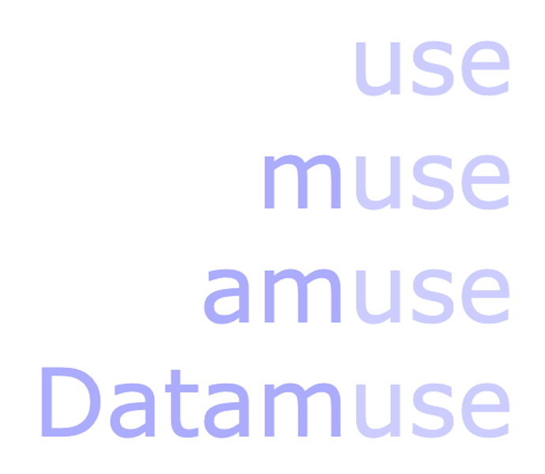

{:.center}
> Datamuse is a collection of free websites, mobile apps, and APIs designed to help people create and communicate more effectively.

[datamuse API](https://www.datamuse.com/api/)

## What is it

the website describe it as: 
*The Datamuse API is a word-finding query engine for developers.*

## For what I can use it?

| To find | end point |
|:------------------------------------------------------------------------|:-----------------------------------------------|
|Meaning similar to a sentence                                             |`/words?ml=[sentence]`                          |
|Related with a word that start with b or ends with a                     |`/words?ml=duck&sp=b*`or `/words?ml=spoon&sp=*a`|
|Word that sound like                                                     |`/words?sl=jirraf`                              |
|A word that start with t has 2 letters between and end k                  |`/words?sp=t??k`                                | 
|Words that are spelled similarly to hippopotamus                          |`/words?sp=hipopatamus`                         |
|Words that rhyme with forgetful                                          |`/words?rel_rhy=forgetful`                      |
|Words that rhyme with grape that are related to breakfast 	              |`/words?ml=breakfast&rel_rhy=grape`             |
|Adjectives that are often used to describe ocean 	                      |`/words?rel_jjb=ocean`                          |
|Adjectives describing ocean sorted by how related they are to temperature|`/words?rel_jjb=ocean&topics=temperature`       |
|Nouns that are often described by the adjective yellow 	              |`/words?rel_jja=yellow`                         |
|Words that often follow "drink" in a sentence, that start with the letter w |`/words?lc=drink&sp=w*`                      |
|Words that are triggered by (strongly associated with) the word "cow"    |`/words?rel_trg=cow`                            |
|Suggestions for the user if they have typed in rawand so far 	          |`/sug?s=rawand`                                 |

## End points

The feacture can be access on: 

* `api.datamuse.com/words`
* `api.datamuse.com/sug`

## `/words` endpoint

>End point return a list of words 

I can divide it in 3 categories;   
1. Hard constraints results (`rd`,`sl`,`sp`,`rel_[code]` and `v`). 
2. Context hints (`topics`, `lc`, `rc`). 
3. Those that affect the order of the results returned.

### Hard Constraints

#### Means like `ml`

This will give back words or sentence that has similar meaning 

```
https://api.datamuse.com/words?ml=ringing+in+the+ears
or
https://api.datamuse.com/words?ml=Python
```

#### Sound like `sl`

Require that the results are pronounced similarly to this string of characters.
```
https://api.datamuse.com/words?sl=jirraf
```

#### spelled like `sp`

Require that the results are spelled similarly to this string of characters.
A pattern can include any combination of alphanumeric characters, spaces, and two reserved characters that represent placeholders: 

* "*" (which matches any number of characters).
* "?" (which matches exactly one character).

```
https://api.datamuse.com/words?sp=t??k
or
https://api.datamuse.com/words?sp=hipopatamus
```

#### Related word `rel_[code]`

[code] is a three-letter identifier from the list below.

|[code]|Description|Example|
|:-:|:-------------|:-----:|
|jja|Popular nouns modified by the given adjective|gradual → increase|
|jjb|Popular adjectives used to modify the given noun|beach → sandy|
|syn|Synonyms|ocean → sea|
|trg|"Triggers", words that are statistically associated with the query word.|cow → milking|
|ant|Antonyms|late → early|
|spc|"Kind of", direct hypernyms.|gondola → boat|
|gen|"More general than", direct hyponyms|boat → gondola|
|com|"Comprises", direct holonyms|car → accelerator|
|par|"Part of", direct meronyms|trunk → tree|
|bga|Frequent followers (w′ such that P(w′\|w) ≥ 0.001)|wreak → havoc|
|bgb|Frequent predecessors (w′ such that P(w\|w′) ≥ 0.001)|havoc → wreak|
|rhy|Rhymes, "perfect" rhymes|spade → aid|
|nry|Approximate rhymes|forest → chorus|
|hom|Homophones, sound-alike words|course → coarse|
|cns|Consonant match|sample → simple|


#### Vocabulary used `v`

Identifier for the vocabulary to use. If none is provided, a $550,000$-term vocabulary of `English` words and multiword expressions is used. (The value es specifies a $500,000$-term vocabulary of words from `Spanish-language` books.