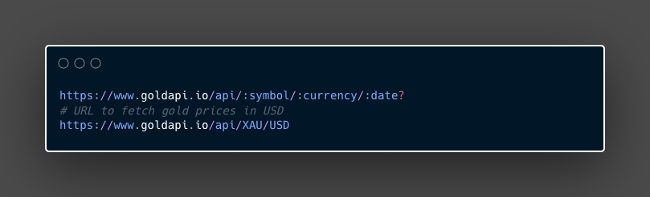
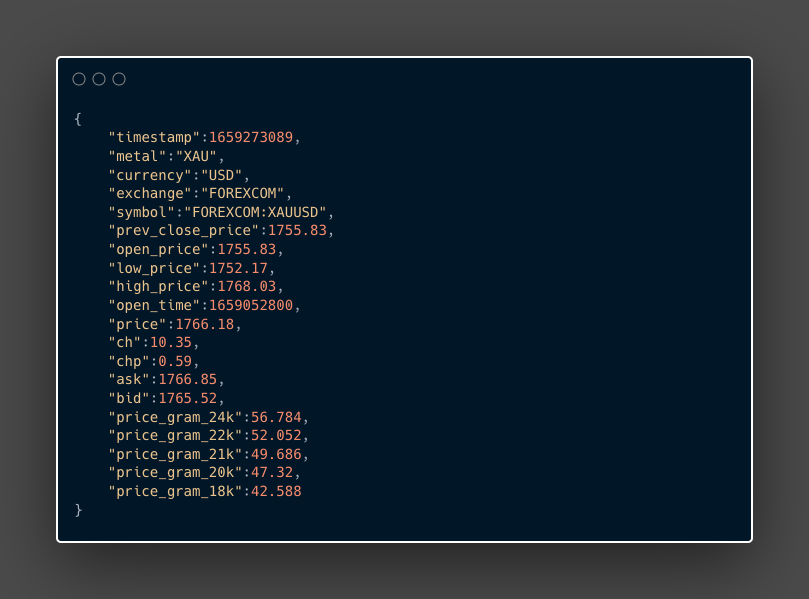

## Main page

[Free Gold and Silver Prices JSON API | GoldAPI.io](https://www.goldapi.io/dashboard)

## Description

Get the prices of the four metals:

- Silver
- Gold
- Platinum
- Palladium

# Endpoints

There are three endpoints 

1. **Get Metal Prices:** Get the prices of the metals
2. **Get Requests Stats:** get the number of requests done in the day, week, and month.
3. **Check API Stats:** Get the status of the API.

**The domain:**

```python
https://www.goldapi.io/api/
```

**The headers:**

```python
"x-access-token": "API_KEY",
"Content-Type": "application/json"
```

## Get Metal Prices

```python
https://www.goldapi.io/api/:symbol/:currency/:date?
# URL to fetch gold prices in USD
https://www.goldapi.io/api/XAU/USD
```


From the API End point:

- `:symbol` Here is the symbol for the metals

```
"XAU": "Gold",
"XAG": "Silver",
"XPT": "Platinum",
"XPD": "Palladium"
```

- `:currency` Here is the currency, format *ISO-4217*

If we want the historical price

- (Option) `:date` the format YYYYMMDD

### Example Response



## Get Request Stats

```python
https://www.goldapi.io/api/stat
```

### Example Response

```python
{
"requests_today":80
"requests_yesterday":4
"requests_month":84
"requests_last_month":0
}
```

## Check API Status

```python
https://www.goldapi.io/api/status
```

### Example Response

```python
{
"result":true
}
```

# Error Handling

[Free Gold and Silver Prices JSON API | GoldAPI.io](https://www.goldapi.io/dashboard?tab=3)