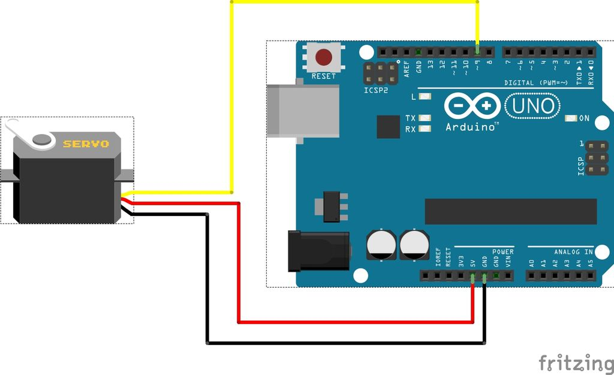

The air vent subproject is part of the Ikea Lack enclosure, more exact to the Air vent or the temperature control. The idea is simple; the vents will be open and close with by a servo, the decision to open or close the vents depending on the current temperature inside the enclosure.

The project is based on [Servo automated iris/aperture for airflow control](https://www.thingiverse.com/thing:3563742) by AcE_Krystal

{: .center}

## First Sketch (Basic Control)

{: . center}
First, we are going to create a sketch to control the servo.
It will move 180 degrees right, later 180 left.

The code will be as follow:

```C++
#include <Servo.h>

Servo servo_air_vent;

int servo_position = 0;

void setup() {

  servo_Air_vent.attach (9);

}

void loop() {

  for (servo_position = 0; servo_position <=180; servo_position +=1){

    servo_Air_vent.write(servo_position);
    delay(10);
  }

  for (servo_position=180; servo_position >= 0; servo_position -=1){

    servo_Air_vent.write(servo_position);
    delay(10);
  }
}
```

1. We are going to import the library `#include <Servo.h>`
2. we are going to give a name to the servo, in this case, "servo_air_vent" `Servo servo_air_vent;`
3. we define the initial position `int servo_position = 0;`
4. in the `setup` block we tell Arduino where the servo is connected `Servo_Air_vent.attach (9);`
5. In the `loop` block we create 2 `for` that will move the servo to the right and later to the left
