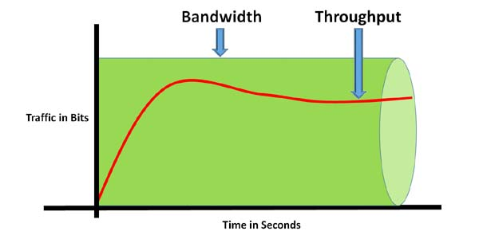
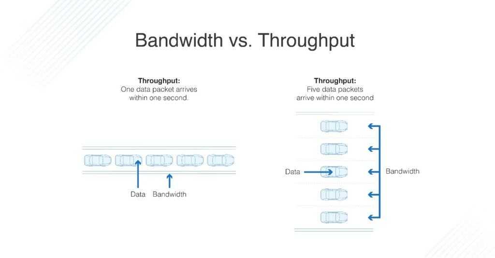
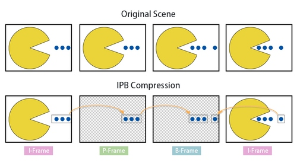
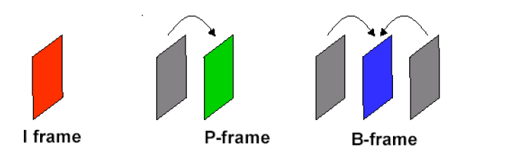

This is the initial draft 2020/08/18 Later with the addition of more information i will segment this in different parts or notes

## Throughput vs Bandwidth

In the nutshell, **Throughput tells you how much data was transferred from a source at any given time** and **bandwidth tells you how much data could theoretically be transferred from a source at any given time.**

{: .center}

### Throughput

The network throughput refers to how much data can be transferred from source to destination withing a frame of time. **Throughput measures how many packets arrive at their destinations successfully.**
Packet loss, latency, and jitter are all related to slow throughput speed. Latency is the amount of time it takes for a packet to make it from source to destination, and jitter refers to the difference in packet delay.

### Bandwidth

although a bit confusing, the bandwidth definition will be **Network bandwidth is defined as the maximum transfer throughput capacity of a network** it measure how much data can be sent and receive at the same time. 
It is important to know bandwidth doesn’t actually increase the speed of a network, it just appears to make the network faster.

>Let’s say 1 Mbps is the equivalent of a single-lane freeway. Let’s also say you want to download a 5 Mb image. If you had a connection with a bandwidth of 1 Mbps (one lane) it would take you about five seconds to download that image. Now, if you were operating with a 5 Mbps bandwidth connection (five lanes)

{: .center}
>You can think of bandwidth as a tube and data throughput as sand. If you have a large tube, you can pour more sand through it at a faster rate. but, if you try to put a lot of sand through a small tube, it will go very slowly.

## I-P-B Frames

{: .center}

**I-FRAME** or Intra-coded picture, least compressible of all frames but it doesn't required other frames to be decoded, it is a complete image, similar to `.jpg`, compress just I-Frames will result in a good quality but heavy file.

**P-Frame** or Predicted picture,more compressible than the I-FRAME, it use information of the previous frame to decompress. It only holds the part of the image that change comparing with the last frame.

**B-Frame** or Bidirectional predicted picture, can use both previous and forward Frame to get the highest amount of date compression, use the difference between the current frame and both  the preceding and following frame to specify its content.

{: .center}  

## Video format and codecs

### Video Formats

It is common to find extension for video files like `.mp4` and `.avi`, and is even more common misunderstand this extension, or containers for the codec.
When we talk about `mp4` we are not talking about a single file, rather a container of multiple files, it will consist of video files, audio files and metadata file.

{:.center}

The most common containers for CCTV will be `AVI` and `MP4`

### Video Codec

Now the name codec comes  from the combination of Coder and decoder 
$$
Codec = Coder + Decoder
$$

> Here we talk about software codec, but be aware that the name `codec` applies to hardware as well.

To make the video manageable and smaller, codec create a encoded stream or a compressed version of the video and the audio, software like **VLC player** can then decode that video stream and present the result. 

It is important to know that most of the codec are "lossy" or "lossy compression", in other words, some quality is lost during the compression. 

The most common codec use in CCTV for video are: 

* [H.265 (HECV)](https://en.wikipedia.org/wiki/High_Efficiency_Video_Coding)[^1]
* [MPEG4](https://en.wikipedia.org/wiki/MPEG-4)  
* [H.264 (AVC)](https://en.wikipedia.org/wiki/Advanced_Video_Coding)[^2]

[^1]: High Efficiency Video Coding  
[^2]: Advanced Video Coding  

> "lossless"  codec we will have **MJPEG**.

{:.center}