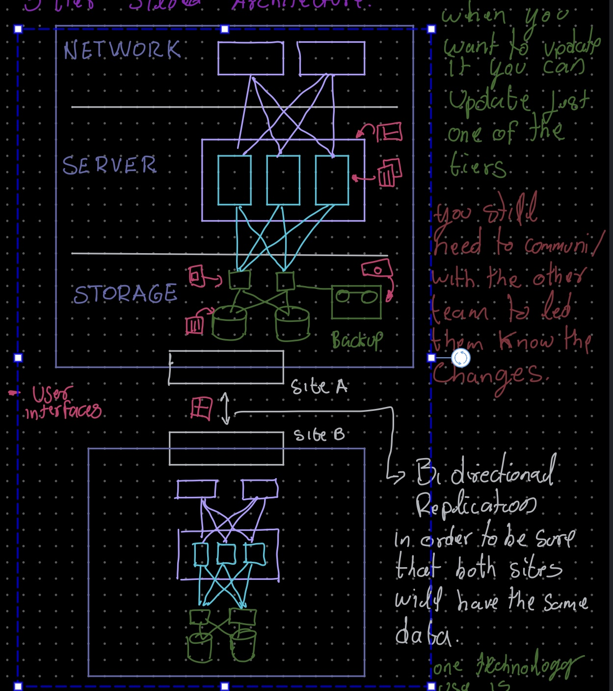
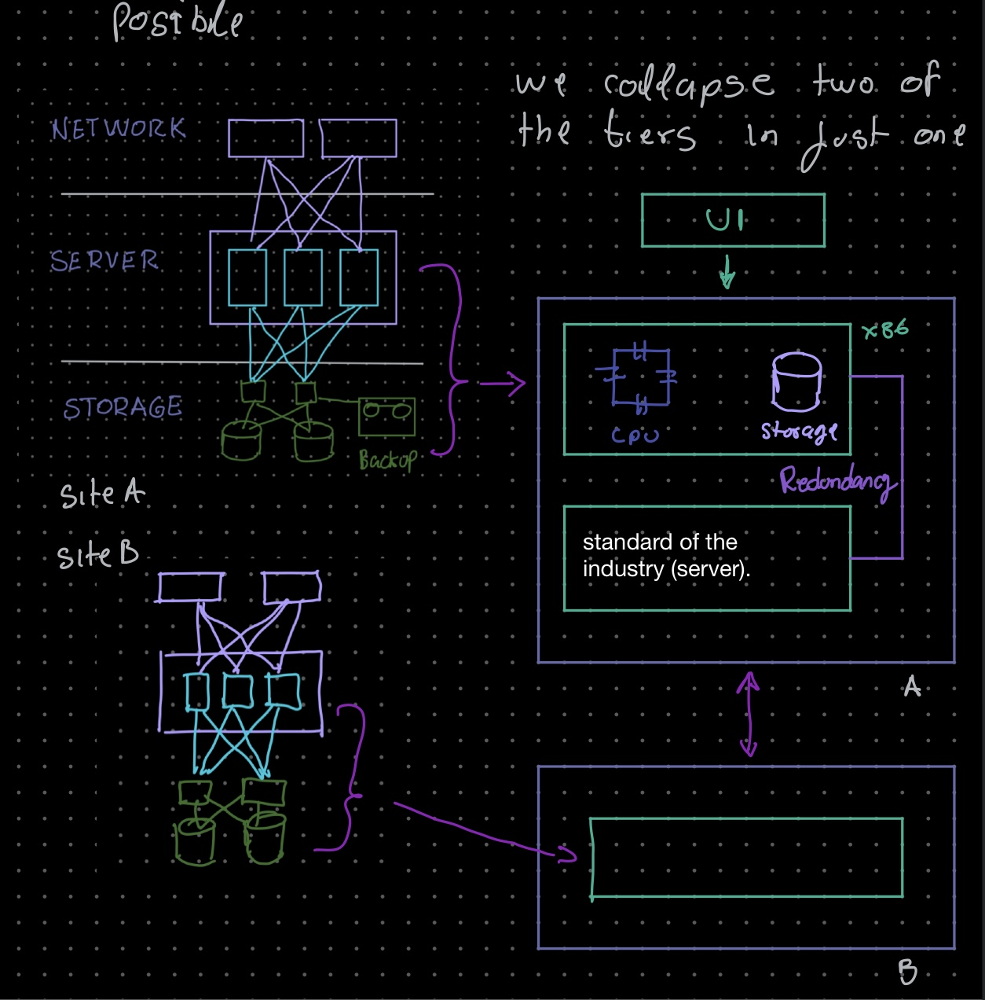

# What is Hyperconverged infrastructure?

> *A good solution for private clouds*

Hyperconverged infrastructure or HCI combine: 

- Computing
- Virtualization
- Networking
- storage

All in a single cluster, this provide cloud-like scalability 

## Components

There are two major components in these system

1. Hypervisors ( VMware, Hyper-v, KVM, Citrix, etc )
2. Storage Controllers ( Stonefly, etc) 

## Available in which forms?

The are available in tow main forms 

- Fully Integrate Hardware appliances (hardware and software same manufacture)
- Standalone Software

## How is it work?

First, an standard or common architecture

### Standard 3-tier "siloed" architecture

We have some point to remark:

Storage tier

1. It will contain:
    1. Storage
    2. controllers or nas switch
    3. Backup
2. There will be 3 different user interphase to control all 

Server Tier

1. Hypervisor to control all servers
2. Servers
3. 2 different UI to control everything

Site A will have a Redundancy Site B

1. To keep the two site sync, a Bidirectional replication is use ( example Wan optimisartion )

It is called 3-tier because is divided in three parts, network, server, storage

One advantage that different parts can be updated independently

The disadvantage you need to notify the other tiers of that update or any change 

## How to improve the 3-tier architecture?

By using Hyperconvergance

1. Remove as many hardware components as possible
2. Remove as many UI as possible ( ideally have just one single UI)

In the example above, two of the three layers is collapsed and it is replace for a single standard server ( with a mirror device as redundancy), all the UI are replace for a single UI.

The Hypervisor will virtualize server resources r, and use the storage controller to provide virtual storage ( vNAS, vSAN, etc) 

This Architecture allow the user to use Available server resources to the maximum capacity 

## Benefits

- Agility
- Flexibility
- Simplicity
- Unified Storage
- Cost-Effective
- Cloud-friendly

### Reference

[Hyperconvergence - Simple Is Beautiful](https://www.youtube.com/watch?v=rxoL-WTNvLc)