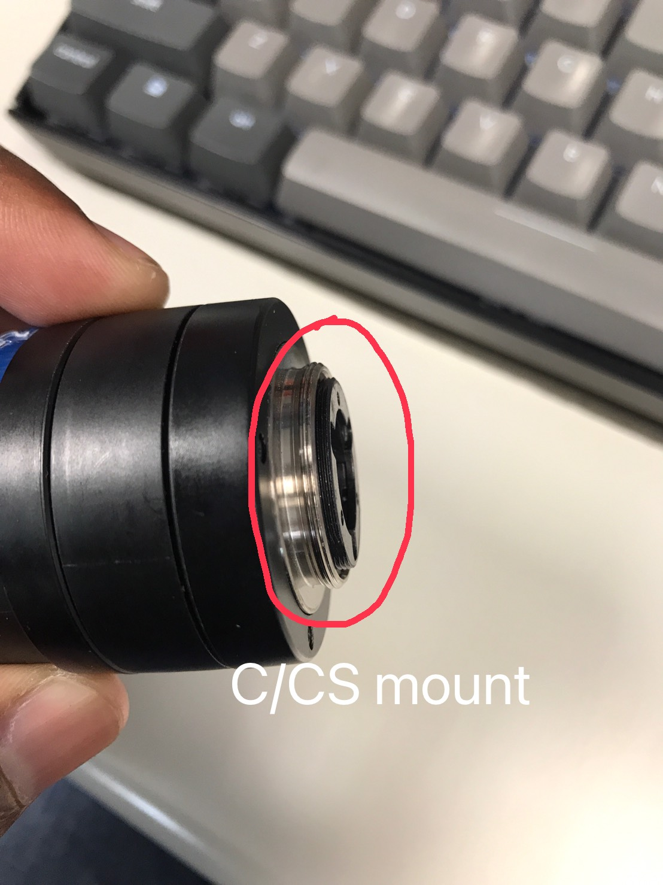
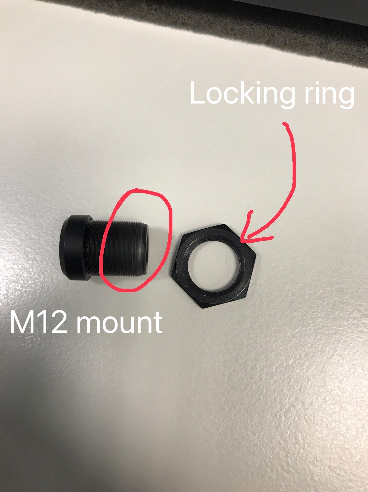
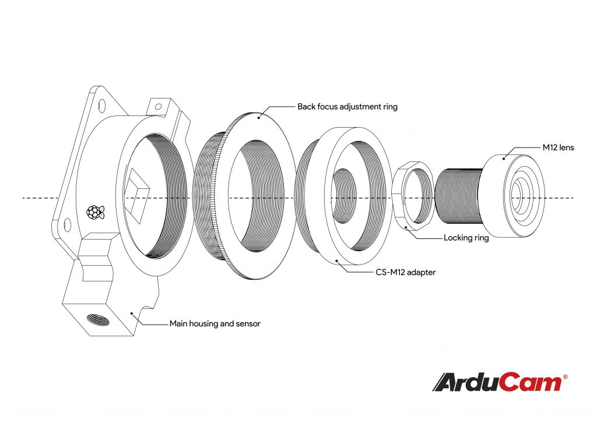
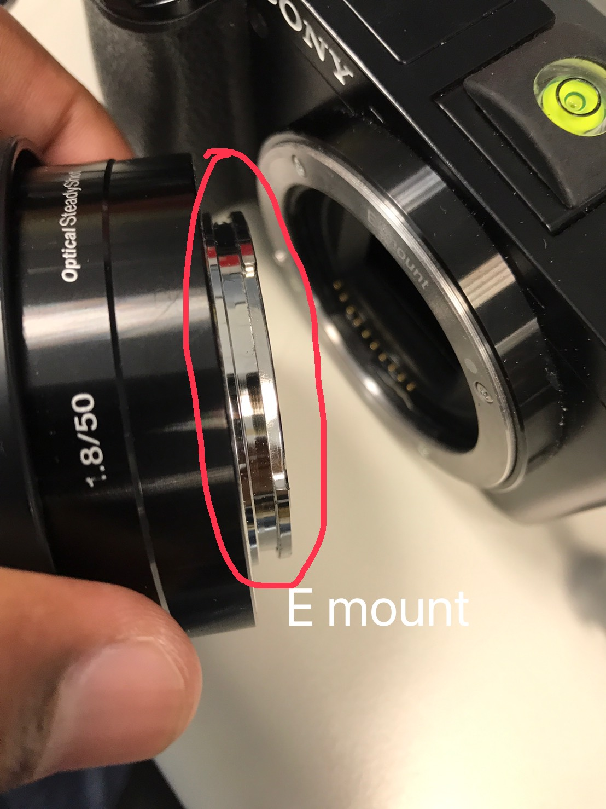

# Different types of mount for lens

## C/CS-Mount Lenses

A C-mount is a type of mount typically used on CCTV cameras. C-mount provides a male thread, which mates with a female thread on the camera. 

The common threats are:
* 25.4 mm in diameter.
* 32 threads per pitch (0.794 mm).

The Flange Focal:
* Distance 17.526 millimeters for C-Mount.
* Distance 12.526 millimeters for CS-Mount.

It is not an easy way to use a CS-Mount lens on C-Mount. The main reason is the **back focal length**. They won’t match. If you cannot focus a CS-Mount lens, check if you leave the 5mm C-CS adapter on the thread.

## M12 (S-mount) Lens

Another typical lens use in CCTV is the M12 or S-Mount lens.

M12 because the lens threat is 12mm, and S stands for Small or short. This lens is shorter or compact comparing with the C/CS-Mount lens because of the size these types of lens are popular on CCTV cameras. 

Adapters from M12 to Raspberry Cam

## DSLR or Mirrorless Lens mounts

Most of these mounts are related to a specific brand of camera or the type of the camera itself.

### Cine Camera Lens

1. EF-Mount (Electronic Focus Mount). 
2. PL-Mount (Positive Lock Mount).
3. F-Mount (Format SLR Mount).

### Photo Camera Lens Mounts

1. A-mount (Sony 'Alpha' Series Mount) Mostly for the old model of cameras replace by E-mount.
2. E-mount (Sony Mirrorless Mount).
3. Z-mount (New Nikon Mirrorless Mount).
4. RF-mount (New Canon EOS Mount).
5. M43-mount (Micro Four Thirds Mount).

