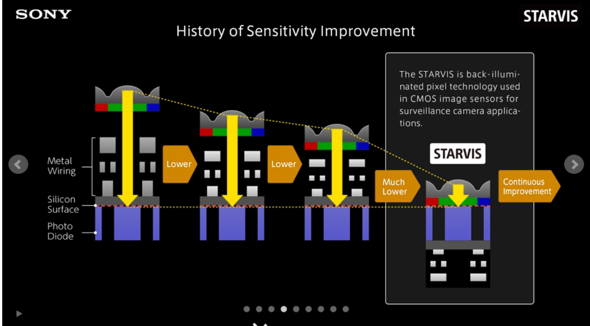
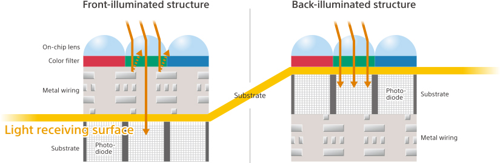
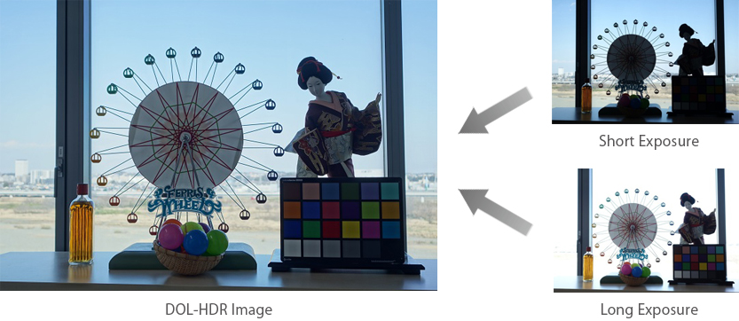

# STARVIS sensor

Sony STARVIS sensor is a back-illuminated pixel technology use in CMOS  image sensors for security camera applications providing high picture quality in the visible-light and near-infrared light regions.

There are two versions STARVIS and STARVIS 2. STARVIS 2 is similar to STARVIS but It also has a wide dynamic range (AD12bit) of more than 8dB compared to STARVIS for the same pixel size in a single exposure and achieves high picture quality in the visible-light and near-infrared light regions.

## What is a back-illuminated CMOS sensor?

With a back-illuminated sensor the light is collected by the backside where the obstacle like wires are minimum, this all the photo-diode to receive a wider range of light which translate in high sensitivity

From [Sony official documentation](https://www.sony-semicon.co.jp/e/products/IS/security/starvis_sl.html)

From [Sony official documentation](https://www.sony-semicon.co.jp/e/products/IS/security/starvis_sl.html)

## What is DOL-HDR?

The DOL-HDR or Digital Overlap High Dynamic Range is a technology for image processing of subjects with high contrast. It synthesizes different exposure conditions into a single image so that both dark and bright data can be seen at the same time 

From [Sony official documentation](https://www.sony-semicon.co.jp/e/products/IS/camera/technology.html)