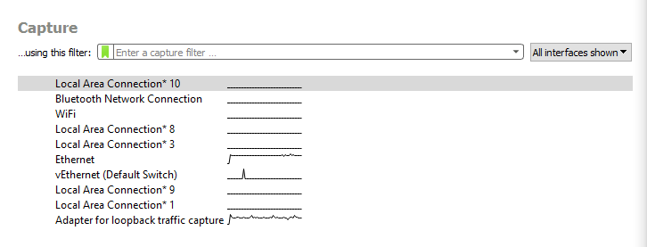
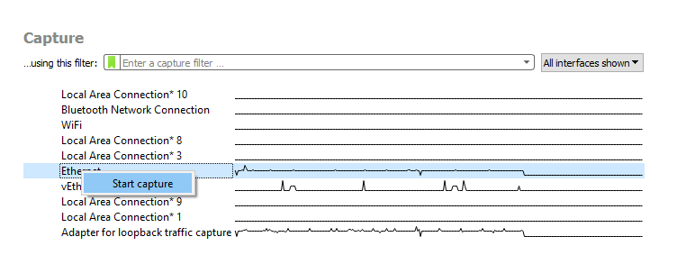
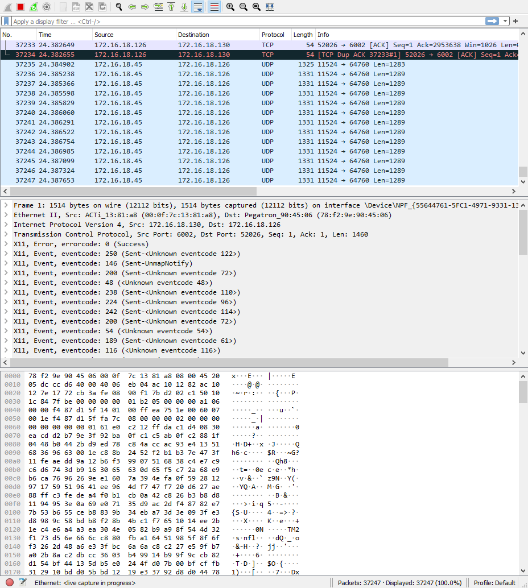
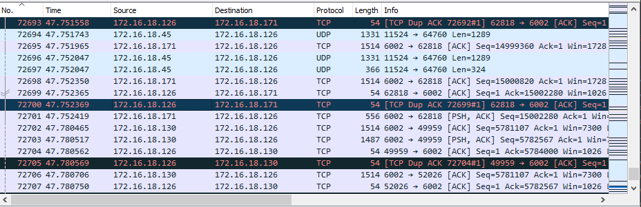
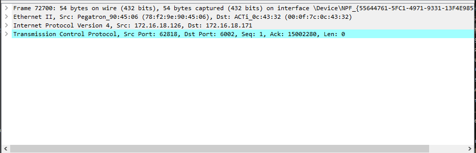
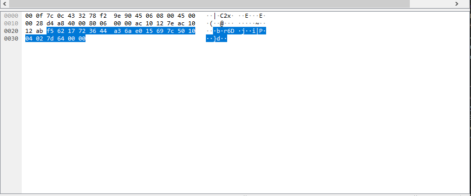
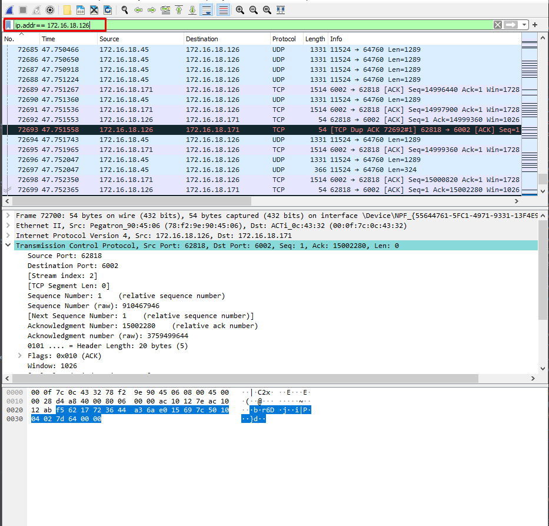

# WireShark
{: .center}

Wireshark displays hundreds of protocols on all major networks. Data packets can be viewed in real-time or analyzed offline.

## How to capture Data Packets

Upon opening or launch, Wireshark will display a screen with the different available networks next to a graph ( EKG-Style) that represents the live traffic.

{: .center}

We can either start the analysis by selecting the network we want to check 

{: .center}

> To stop the analysis, we can click on the red square button on the top

### Panels 

When the analysis starts, we will see 3 different panels, top middle, and bottom.

> To stop the analysis we can click on the red square button on the top.

{: .center}  

The session: 

* The packet list pane (the top section).  
* The packet details pane (the middle section).  
* The packet bytes pane (the bottom section).  

#### Packet list

It displays all the packages captured.

* **No**: This field indicates which packets are part of the same conversation. It remains blank until you select a packet.  
* **Time**: The timestamp of when the packet was captured is displayed in this column. The default format is the number of seconds or partial seconds since this specific capture file was first created.
* **Source**: This column contains the address (IP or other) where the packet originated.
* **Destination**: This column contains the address that the packet is being sent to.
* **Protocol**: The packet's protocol name, such as TCP, can be found in this column.
* **Length**: The packet length, in bytes, is displayed in this column.
* **Info**: Additional details about the packet are presented here. The contents of this column can vary greatly depending on packet contents.

{: .center} 

#### Packet Details

The details pane, found in the middle, presents the protocols and protocol fields of the selected packet in a collapsible format.

{: .center} 

#### Packet Bytes

At the bottom is the packet bytes pane, which displays the raw data of the selected packet in a hexadecimal view. This hex dump contains 16 hexadecimal bytes and 16 ASCII bytes alongside the data offset.

{: .center} 

## How to use filters

On the top of the top panel, we will have a field. We can input some filters in this panel, filters will help us to find a specific message between two IPs or a specific message that uses a specific protocol.

{: .center} 

### Common filters

| Usage                        | Filter syntax           |
|:-----------------------------|:-----------------------:|
|Wireshark Filter by IP        | ip.addr == 10.10.50.1   |
|Filter by Destination IP      | ip.dest == 10.10.50.1   |
|Filter by Source Ips          | ip.src == 10.10.50.1    |
|Filter by IP range            | ip.addr >= 10.10.50.1 and ip.addr <= 10.10.50.100|
|Filter by Multiple Ips        | ip.addr == 10.10.50.1 and ip.addr == 10.10.50.100|
|Filter out/ Exclude IP address|!(ip.addr == 10.10.50.1)|
|Filter IP subnet              |ip.addr == 10.10.50.1/24|
|Filter by multiple specified IP subnets|ip.addr == 10.10.50.1/24 and ip.addr == 10.10.51.1/24|
|Filter by Protocol            |dns http ftp ssh arp telnet icmp|
|Filter by port (TCP)|tcp.port == 25|
|Filter by destination port (TCP)| tcp.dstport == 23|
|Filter by ip address and port| ip.addr == 10.10.50.1 and Tcp.port == 25|
|Filter by URL                |http.host == “host name”|
|Filter by time stamp         |frame.time >= “June 02, 2019 18:04:00”|
|WiresharkMulticast filter|(eth.dst[0] & 1)|
|Host name filter | ip.host = hostname|
|MAC address filter|eth.addr == 00:70:f4:23:18:c4|

