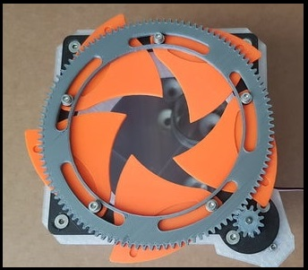
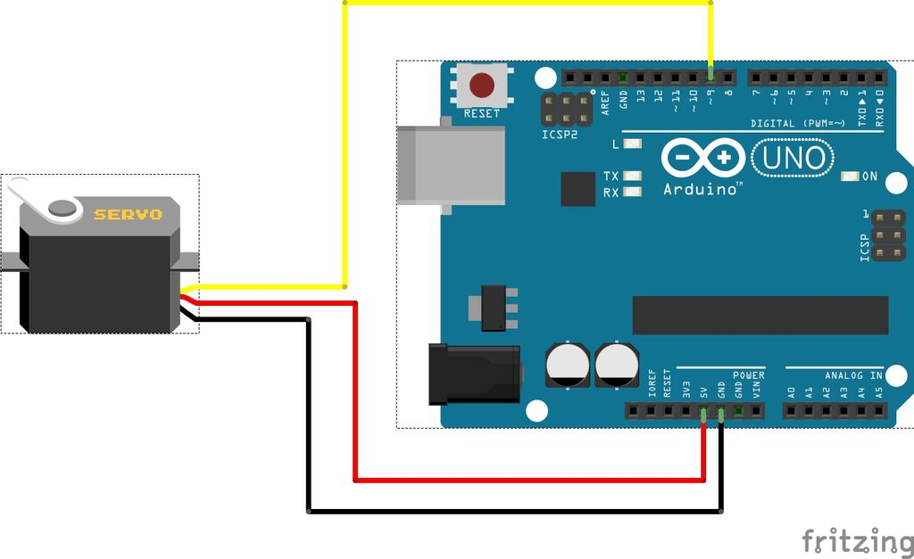

This is part of the project for the Ikea Lack enclosure, more exact to the Air vent or the temperature control, the idea vents will be open and close with the servo, the decision to open or close the vents will be base in the temperature of the main enclosure.

This is base in [Servo automated iris / aperture for air flow control](https://www.thingiverse.com/thing:3563742) by AcE_Krystal

{: .center}

## First Sketch (Basic Control)

{: . center}
First, we are going to create a sketch to control the servo, it will move 180 degrees right and later 180 left

The code will be as follow:

```C++
#include <Servo.h>

Servo servo_air_vent;

int servo_position = 0;

void setup() {

  Servo_Air_vent.attach (9);

}

void loop() {

  for (servo_position = 0; servo_position <=180; servo_position +=1){

    Servo_Air_vent.write(servo_position);
    delay(10);
  }

  for (servo_position=180; servo_position >= 0; servo_position -=1){

    Servo_Air_vent.write(servo_position);
    delay(10);
  }
}
```

1. We are going to import the library `#include <Servo.h>`
2. we are going to give a name to the servo, in this case "servo_air_vent" `Servo servo_air_vent;`
3 we define the initial position `int servo_position = 0;`
4. in the `setup` block we tell arduino where the servo is connected `Servo_Air_vent.attach (9);`
5 In the `loop` block we create 2 `for` that will move the servo to the right and later to the left