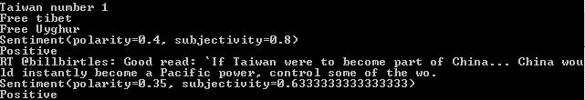

There are two sources for this project:

1. [Twitter Sentiment Analysis - Learn Python for Data Science #2 by Siraj Raval](https://www.youtube.com/watch?v=T5pRlIbr6gg&list=PL2-dafEMk2A6QKz1mrk1uIGfHkC1zZ6UU)
2. [How to build a twitter sentiment Analyzer using TextBlob](https://medium.com/better-programming/how-to-build-a-twitter-sentiments-analyzer-in-python-using-textblob-948e1e8aae14)

In this case we are going to use [TextBlob](https://textblob.readthedocs.io/en/dev/) 

Now, what is sentiment analysis, it is the process of determining whether a piece of writing is positive, negative or neutral, there are several ways to do this sentiment analysis, the two more common approaches will be:

1. Lexicon-base model
2. Machine Learning-based Method

In a really shallow description/definition, Lexicon is a method that will list the worlds as positive and negative, e.g 'nice',+2, 'good',+1,'terrible',-1.5), The algorithm will find all the words and combine individual results and provide a result base in that value.

## Twitter API 

First, we will need to register the app in twitter in order to get the various keys associated with the API, there will be 4 keys:

* `consumer_key`
* `consumer_key_secret`
* `access_token`
* `access_token_secret`

In order to continue we will need to install two packages, [**tweepy**](https://www.tweepy.org/) and **textblob**, we can do this using pip, 

```python
pip install tweepy
```
with this package we will handle the Twitter API

```python
pip install textblob
```

and with this will make the sentiment analysis.
Once we have the packages we can start the code, first we need to import the packages

```python
import tweepy
from textblob import TextBlob
```

now, we assigned the keys to variable to pass it later in the code

```python
consumer_key = ‘[consumer_key]’
consumer_key_secret = ‘[consumer_key_secret]’
access_token = ‘[access_token]’
access_token_secret = ‘[access_token_secret]’
```

## Tweepy

Tweepy support OAuth authentication, this is handle by the class `tweepy.OAuthHandler`, An instance of `OAuthHandler` must be created passing the consumer token and the secret.
Next, on this instance, we will call a function `set_access_token` by passing the `access_token` and `access_token_secret`.
Finally we create and instance of the api with the tweepy function `API()`

```python
auth = tweepy.OAuthHandler(consumer_key,consumer_key_secret)
auth.set_access_token(access_token,access_token_secret)
api = tweepy.API(auth)
```
the next step will be to find the public tweets related to a topic, in this case we use the method `search` of the API.

```python 
public_tweet = api.search('Dogs')
```
##Sentiment Analysis 

###TextBlob

TextBlob is a library Natural Language Processing (NLP).

###Sentiment analysis

As a result of the sentiment analysis we will receive a tuple (polarity, subjectivity). The polarity score is a float within a range of [-1.0,1.0]. The subjectivity is a float within the range [0.0,1.0] where 0.0 is very objective and 1.0 is very subjective.

so now we are going to check each tweeter in our `public_tweets` variable

```python
for tweet in public_tweets:
	print(tweet.text)
	analysis = TextBlob(tweet.text)
	print(analysis.sentiment)
	if analysis.sentiment[0]>0:
		print('positive')
	elif analysis.sentiment[0]<0:
		print('Negative')
	else:
		print('Neutral')
```

here the complite script:

```python 
import tweepy
from textblob import TextBlob

consumer_key = 'xcrKGTL1FWhBB5si7xNrxpxVL'  # this is a place holder not the real key
consumer_key_secret = '8WrC0ukU0ejs9E5eblGlCtJTrLVMsLeXwj7cZCSMqiL3ke67SP' # this is a place holder not the real key

access_token = '90495695-UOx9C6Zl1l2U2xFjw2LitDLOXu6aylWwf0p4UDQDA' # this is a place holder not the real key
access_token_secret ='WXFqNV5Da8hwwh5oIfUXhsBKb9ouvE6gQCZ3fIgQLtdm2' # this is a place holder not the real key


# set the OAuth authentication  

auth = tweepy.OAuthHandler(consumer_key,consumer_key_secret)
auth.set_access_token(access_token,access_token_secret)

api = tweepy.API(auth)


public_tweets = api.search('Taiwan')
for tweet in public_tweets:
	print(tweet.text)
	analysis = TextBlob(tweet.text)
	print(analysis.sentiment)
	if analysis.sentiment[0] > 0:
		print('Positive')
	elif analysis.sentiment[0] < 0:
		print('Negative')
	else:
		print('Neutral')
```

