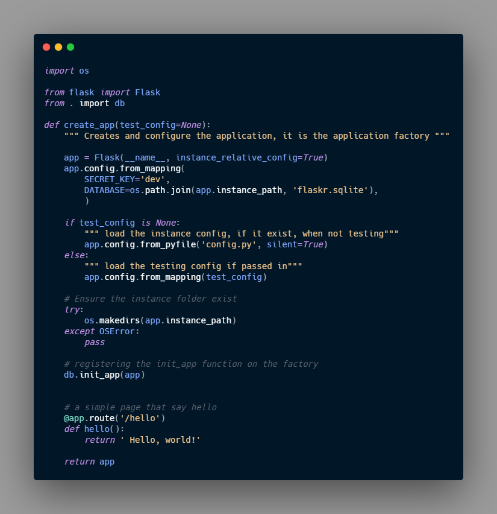

In this notes I will use the example on the official documentation to learn how to use it, in other notes in this same directory i might use other sources, but in this case i will use the [official documentation](https://flask.palletsprojects.com/en/1.1.x/)

Lets first get something out of the ways, the 99% of the examples and tutorials on the web use the basic hello world example of Flask and don't enter in details or good practice, that is the main reason to start with the Official documentation first in this learning path, here is the typical hello world on Flask

{: .center}


## Application Layout

This layout might change depending of the size or the length of the application although i think this will suite most of the application I'm thinking to use Flask for.
Here I follow exactly the documentation


> The tutorial assume that all the content will be in a folder called "Flask-tutorial" and a virtual environment was created 

the documentation suggest some to add an specific `.gitignore` that i thing came useful since will help me to avoid commit any unnecessary document or folder to git or any version control system 

#### `gitignore` Example

```
venv/

*.pyc
__pycache__/

instance/

.pytest_cache/
.coverage
htmlcov/

dist/
build/
*.egg-info/
```

## Application Factory

As shown on the `hello world!` code snippet, a typical Flask application is a instance of the **Flask** class, any configuration, URL or change will be done with the class ( or register with the class), this instance is a global instance.  
In this example, they took another approach, it seems to be a best practice, and a future prove implementation. They, instead of, a global instance, they will create a instance inside a function. This function is called **Application factory**, all configuration registration or set up will be done inside this function, and then application will be returned, in other words, the return of this `application factory` will be the application itself.

We will create a script called `__init__.py` that will serve as container of the **application Factory** and it tells Python to tread the current directory as a package ( in this case the directory is *flaskr*)

**flaskr/__init__.py**
```python 
import os

from flask import Flask

def create_app(test_config=None):
	""" Creates and configure the application, it is the application factory """

	app = Flask(__name__, instance_relative_config=True)
	app.config.from_mapping(
		SECRET_KEY='dev',
		DATABASE=os.path.join(app.instance_path, 'flaskr.sqlite'),
		)

	if test_config is None:
		""" load the instance config, if it exist, when not testing"""
		app.config.from_pyfile('config.py', silent=True)
	else: 
		""" load the testing config if passed in"""
		app.config.from_mapping(test_config)

	# Ensure the instance folder exist
	try: 
		os.makedirs(app.instance_path)
	except OSError:
		pass

	# a simple page that say hello
	@app.route('/hello')
	def hello():
		return ' Hello, world!'

	return app
``` 

#### `create_app()` the application factory

1. `app = Flask(__name__, instance_relative_config=True)` Create a Flask instance:
	*	`__name__` is the name of the current python module, it is a convince way to tell the app where it is located.
	*	`instance_relative_config`  a way to let the app knows the location of some configuration, this configuration are particular of this instance and are not committed to the version control, this configuration are store on [Instance folder](https://flask.palletsprojects.com/en/1.1.x/config/#instance-folders) this folder is located outside the directory `flaskr`
2. `app_config.from_mapping()` set some default configuration that the app will use: 
	*	`SECRET_KEY` it is use by Flask to keep the application safe, in a development stage the value is 'dev' but in production must be replace for a random string.
	*	`DATABASE` it is the path to the instance folder where the SQLite database is store.  
3. `app.config.from_pyfile()` It overwrite the configuration or default configuration, the values are taken from a file called `config.py` file in the instance folder if it exist. the production `SECRET_KEY` can be store here.
	*	`test_config` can be also past to this factory, and it will be use instead of the instance configuration.
4. `os.makedirs()` It ensure the `app.instance_path` exist, Flask doesn’t create the instance folder automatically, but it needs to be created because your project will create the SQLite database file there.
5. `@app.route()` Create the route the the function that will give back the webpage  

## Run the application

We are going to lunch the app in development mode, in this way the browser will be refresh and server restarted after any change in the code.
You should be in the top-level not inside the folder **flaskr**

#### For linux and Mac:
```
export FLASK_APP=flaskr
export FLASK_ENV=development
flask run
```
#### For Windows:
```
set FLASK_APP=flaskr
set FLASK_ENV=development
flask run
```

Run this in the terminal or CMD and we will get a message like
{: .center}

## Regarding the Database and the connection.

For this example the Flask tutorial use the SQLite, since it is already integrated with python.
As it is mentioned in the tutorial, the first thing we need to do when working with databases is to establish a connection, any operation or query to the DB is done through this connections, this connections must be close once the operation is finished.

**flaskr/db.py**
```python 
import sqlite3

import click
from flask import current_app, g
from flask.cli import with_appcontext

def get_db():
	if 'db' not in g:
		g.db = sqlite3.connect(
            current_app.config['DATABASE'],
            detect_types=sqlite3.PARSE_DECLTYPES
        )
		g.db.row_factory = sqlite3.Row

		return g.db

def close_db(e=None):
	db = g.pop('db', None)

	if db is not None:
		db.close()

``` 

There are couple objects that still i don't fully understand but that make the development easier, or with better practice ( according with documentation), this are `g` and `current_app`, here some description ( and links) of this code snippet

1. [`g`](https://flask.palletsprojects.com/en/1.1.x/api/#flask.g)[^1]: it is an special object that is unique for each request, use to store data that might be user accessed by multiple function during the request. In this case the connection is stored and reused instead of creating a new one, if the get_db is use a second time at in the same request.

[^1]: `g` is a namespace object that can store data during an [application context](https://flask.palletsprojects.com/en/1.1.x/appcontext/), this is a [proxy](https://flask.palletsprojects.com/en/1.1.x/reqcontext/#notes-on-proxies) 

2. [`current_app`](https://flask.palletsprojects.com/en/1.1.x/api/#flask.current_app)[^2]:  Another special object, it points to the Flask application handling request, if we develop like this example we will be using the **application factory**, thus, we wont have an application object we writing the rest of the code, *"the `get_db()` will be call when the application is create and is handling a request, so current_app can be used."*

[^2]: `current_app` A proxy to the application handling the current request. This is useful to access the application without needing to import it, or if it can’t be imported, such as when using the application factory pattern or in blueprints and extensions.

3. `sqlite3.connect()` establish a connection to the file pointed at by the `DATABASE` configuration key. at the beginning the file wont exist we need to initialize the database (I will explain it bellow)

4. `sqlite.Row` tells the connection to return rows that behave like `dicts`. This allows accessing the columns by name.  

### Creating the tables

In this case the initial table will be store in a file `.sql`

flaskr/schema.sql
```SQL
DROP TABLE IF EXIST user;
DROP TABLE IF EXIST post;

CREATE TABLE user (
	id INTEGER PRIMARY KEY AUTOINCREMENT,
	username TEXT UNIQUE NOT NULL
	password TEXT NOT NULL
);

CREATE TABLE post (
	id INTEGER PRIMARY KEY AUTOINCREMENT,
	author_id INTEGER NOT NULL, 
	created TIMESTAMP NOT NULL DEFAULT CURRENT_TIMESTAMP,
	title TEXT NOT NULL,
	body TEXT NOT NULL,
	FOREIGN KEY (author_id) REFERENCES user (id)
);
``` 
Now, The next step is create the logic to initialize the database, this will be in different parts and two different files:

1. Create the functions to run the SQL statements, this will be done on **flask/db.py**
2. Register with the application, we need to let the application know that there is a database, create the initializer ( will include some CLI commands) **flaskr/db.py**, and later the logic to import it to the application factory **flaskr/__init__.py**.

### Function to run the SQL commands

code to add:
**flaskr/db.py**
```python 
def init_db():
	db = get_db()

	with current_app.open_resource('schema.sql') as f:
		db.executescript(f.read().decode('utf8'))

@click.command('init-db')
@with_appcontext
def init_db_command():
	""" clear the existing data and create new tables """
	init_db()
	click.echo('Initialized the database.')
``` 


so the code until on **flaskr/db.py** will be: 


###Register the application 

Now the functions `close_db` and `init_db_command` are defined but they are not register to be use by the application, in other words, in order to use the functions we need to register them with the instance of the application, although, in this case we are using **application factory**, so, technically the applications doesn't exist yet, or the instance is not available, so in this case we will need a function that make the registration for us and later we will import that function on the factory.

> basically we create a function on **flaskr/db.py** later import that function on **flask/__init__.py** in the factory function `create_app()`

**flaskr/db.py**
```python 
def init_app(app):
	app.teardown_appcontext(close_db)
	app.cli.add_command(init_db_command)
```   
1. `app.teardown_appcontext()` this function is executed after returning the response, during the clean up process, and basically allow me to run a function in that moment, in that case `close_db()`
2. `app.cli.add_command()` add a new command that can be call with the **flask** command.  

so the **flaskr/db.py** will be


Now we need to call the function `init_app()` from the factory

**flaskr/__init__.py**
```python 
def create_app():
	app = ...
	#existing code

	from . import db
	db.init_app(app)

	return app
``` 
so the Factory function will look like this: 




