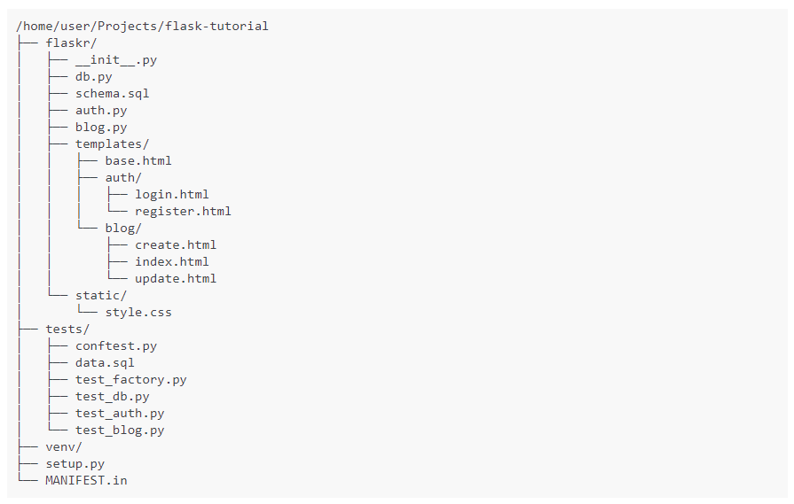

In this notes I will use the example on the official documentation to learn how to use it, in other notes in this same directory i might use other sources, but in this case i will use the [official documentation](https://flask.palletsprojects.com/en/1.1.x/)

Lets first get something out of the ways, the 99% of the examples and tutorials on the web use the basic hello world example of Flask and don't enter in details or good practice, that is the main reason to start with the Official documentation first in this learning path, here is the typical hello world on Flask

{: .center}


## Application Layout

This layout might change depending of the size or the length of the application although i think this will suite most of the application I'm thinking to use Flask for.
Here I follow exactly the documentation



> The tutorial assume that all the content will be in a folder called "Flask-tutorial" and a virtual environment was created 

the documentation suggest some to add an specific `.gitignore` that i thing came useful since will help me to avoid commit any unnecessary document or folder to git or any version control system 

#### `gitignore` Example

```
venv/

*.pyc
__pycache__/

instance/

.pytest_cache/
.coverage
htmlcov/

dist/
build/
*.egg-info/
```

## Application Factory

As shown on the `hello world!` code snippet, a typical Flask application is a instance of the **Flask** class, any configuration, URL or change will be done with the class ( or register with the class), this instance is a global instance.
In this example, they took another approach that seems to be a best practice and a future prove implementation, instead of a global instance, we will create a instance inside a function this function is called **Application factory**, all configuration registration or set up will be done inside this function and then application will be returned, in other words the return of this `application factory` will be the application.

We will create a script called `__init__.py` that will serve as container of the **application Factory** and it tells Python to tread the current directory as a package ( in this case the directory is *flaskr*)

**flaskr/__init__.py**
```python 
import os

from flask import Flask

def create_app(test_config=None):
	""" Creates and configure the application, it is the application factory """

	app = Flask(__name__, instance_relative_config=True)
	app.config.from_mapping(
		SECRET_KEY='dev',
		DATABASE=os.path.join(app.instance_path, 'flaskr.sqlite'),
		)

	if test_config is None:
		""" load the instance config, if it exist, when not testing"""
		app.config.from_pyfile('config.py', silent=True)
	else: 
		""" load the testing config if passed in"""
		app.config.from_mapping(test_config)

	# Ensure the instance folder exist
	try: 
		os.makedirs(app.instance_path)
	except OSError:
		pass

	# a simple page that say hello
	@app.route('/hello')
	def hello():
		return ' Hello, world!'

	return app
``` 

#### `create_app()` the application factory

1. `app = Flask(__name__, instance_relative_config=True)` Create a Flask instance:
	*	`__name__` is the name of the current python module, it is a convince way to tell the app where it is located.
	*	`instance_relative_config`  this is a way to let the app know the location of some configuration, this configuration are particular of this instance and are not committed to the version control, this configuration are store on [Instance folder](https://flask.palletsprojects.com/en/1.1.x/config/#instance-folders) this folder is located outside the directory `flaskr`
2. `app_config.from_mapping()` set some default configuration that the app will use: 
