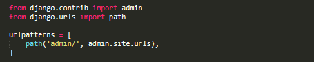

# Verify Django is installed and what Version are we using.

to verify which version are we using we can use:

```
python -m django --version
```

## Creating a project  

To create a project, we need:  
* Navigate to the location where we want to store the project, we can use *cd*  to do so.  
* After navigate to the correct directory, we type:

```
django-admin startproject mysite
```

where `mysite` is the name of the project.
The following will be the structure of the project:

```
mysite/
	manage.py
	mysite/	
		__init__.py
		settings.py
		urls.py
		wsgi.py
```

this files are:

* the outer `mysite/` root directory is just a container for your project, the name doesn't matter to Django;  you can rename it to anything you like.  
* `manage.py`: A command line utility that let you interact with this Django project in various ways.  
* the inner `mysite/` directory is the actual Python package for the project.  
* `mysite/__init__.py`:and empty file that tells Python package that this directory should  be considered a Python package.  
* `mysite/settings.py`: [Settings/configuration](https://docs.djangoproject.com/en/2.2/topics/settings/) for this Django project.   
* `mysite/urls.py`: The URL declarations for this Django project; a “table of contents” of your Django-powered site.  
* `mysite/wsgi.py`: An entry-point for WSGI-compatible web servers to serve your project. See How to deploy with WSGI for more details.  


## Creating the Polls app  

Each application we write in Django consists of a Python package that follows a certain convention. Django comes with a utility that automatically generates the basic directory structure of an app. 

**What’s the difference between a project and an app?**   
An app is a Web application that does something – e.g., a Weblog system, a database of public records or a simple poll app. A project is a collection of configuration and apps for a particular website. A project can contain multiple apps. An app can be in multiple projects.

In this case to create an app we will need to be at the same level that the `manage.py` file, and we can create the app with the command:

```
python manage.py startapp polls
```

this will create a directory like this:

```
polls/
    __init__.py
    admin.py
    apps.py
    migrations/
        __init__.py
    models.py
    tests.py
    views.py
```

this directory house the poll application


### Write your first view  

to write the first view open the file **polls/views.py** and add the following code:

```python
from django.http import HttpResponse


def index(request):
    return HttpResponse("Hello, world. You're at the polls index.")
```

now to be able to see it we will need to create the URLconf.

### `URLconf` for the polls app

To create the URLconf in the polls directory, create a file called **urls.py**, so now the app directory will looks like:

```
polls/
    __init__.py
    admin.py
    apps.py
    migrations/
        __init__.py
    models.py
    tests.py
    urls.py
    views.py
```

in the **Polls/urls.py** add:

```python
from django.urls import path

from . import views

urlpatterns = [
    path('', views.index, name='index'),
]
```

The next step is to point the root URLconf at the **polls.urls**, to achieve that, we will add something in **mysite/urls.py**. 

we need to import `django.urls.include` and insert an `include()` in the `urlpatterns` list

{: .center}

so we will have:

```python
from django.contrib import admin
from django.urls import include, path

urlpatterns = [
    path('polls/', include('polls.urls')),
    path('admin/', admin.site.urls),
]
```

The `include()` function allows referencing other URLconfs. Whenever Django encounters `include()`, it chops off whatever part of the URL matched up to that point and sends the remaining string to the included URLconf for further processing.

The idea behind `include()` is to make it easy to plug-and-play URLs. Since polls are in their own URLconf `(polls/urls.py)`, they can be placed under “/polls/”, or under “/fun_polls/”, or under “/content/polls/”, or any other path root, and the app will still work.

>**When to use `include()`?**   
>You should always use `include()` when you include other URL patterns. **admin.site.urls** is the only exception to this.

Now the index is wired to the URLconf, so we should be able to access  it  under *http://localhost:8000/polls/*

first, lets run:

```
$ python manage.py runserver
```

> The `path()` function is important to find the correct URL. This function pass, two argument <<`path('polls/',include('polls.urls'))`>>, the argument are **route** and 
**view**.


#### `path()` argument: route  

This route argument is a string that contain the URLpattern, Django will start with the first pattern in `urlpatterns` and make its way down the list until find one pattern that matches.
GET and POST parameters are ignore, for example:
`http://www.example.com/myapp/`, the URLconfig will look at `myapp/`.

####`path()` argument: view  

When Django finds a matching pattern, it calls the specific view function with an **HttpRequest** object as it first argument and any "captured" value from the *route* as keyword argument (check [More details about project structure](/Django/More%20details%20about%20project%20structure/) for more details )

#### `path()` argument: kwargs

Arbitrary keyword argument can be passed in a dictionary to the target view

#### `path()` argument: name
Naming your URL lets you refer to it unambiguously from elsewhere in Django, especially from within templates.


> for more explanation of this function we can visit the [documentation](https://docs.djangoproject.com/en/2.2/ref/urls/#django.urls.path) or the notes I made in [More details about project structure](More%20details%20about%20project%20structure.html)


