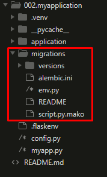
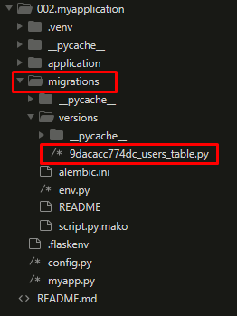

{: .center}
{: .center}

Flask-SQLAlchemy is a wrapper for SQLALChemy, SQLALchemy is a ORM or Object Relational Mapper, this allow the application to manage the database using high level objects such as classes, objects and methods instead of tables and SQL, in other words ORM translate high-level operations in database commands.

1. [Official documentation:](https://flask-sqlalchemy.palletsprojects.com/en/2.x/quickstart/)
2. [PIP page:](https://pypi.org/project/Flask-SQLAlchemy/)

Flask-SQLAlchemy support different databases, relational an no-n relational, we can use a simple database such as SQLite for prototyping and development and once deploy we can switch to a more complex database without the need to change much parts for the code.

### Installation
```bash
pip install flask-sqlalchemy
```

## Database migration 

The author of mega-tutorial make a good point, not all tutorial cover migration of a database, this is important since the relational databases are base in structures data so if data change the database need to change and we will need to make the migration of the data that already exist, so there is where the author introduce a library write by himself called [`Flask-migrate`](https://github.com/miguelgrinberg/flask-migrate) which is a wrapper for [`Alembic`](https://github.com/sqlalchemy/alembic).

### Installation
```bash
pip install flask-migrate
```

## `Flask-SQLAlchemy` Configuration

I will continue using the example of the microblog use in the form extension notes, and we are going to use the SQLite database.

We are going to add two new configuration to the config file

**config.py**
```python 
import os

#1. new configuration
basedir = or.path.abspath(os.path.dirname(__file__))

class Config(object):
	"""COnfiguration class"""
	SECRET_KEY = os.environ.get('SECRET_KEY') or "secretKey"

	#2. New configuration
	SQLALCHEMY_DATABASE_URL = os.environ.get('DATABASE_URL') or 'sqlite:///' + os.path.join(basedir,'app.db')
	SQLALCHEMY_TRACK_MODIFICATIONS = False

``` 

so from the previous code

1. the definition of `basedir`  I just define a base directory.
2. SLQAlchemy take the location of the database from the configuration variable `SQLALCHEMY_DATABASE_UR`  as we mentioned in the notes for forms, it is a good practice store the configuration variable in the environment variable, and provide a fall-back in case of failure `or 'sqlite:///' + os.path.join(basedir,'app.db')` in this case the fall-back will look for a database file in the root directory.
3. `SQLALCHEMY_TRACK_MODIFICATIONS` this variable is set to `false`, this is to disable  a feature from Flask-SQLAlchemy that is not need it , this feature signal the application  every time a change is about to be made.


### Initialize the database and the migration object

The database is going to be represented for the database instance, same as the migration engine. These two object should be create it after the creation of the application, so:

**application/__ini__.py**
```python 
from flask import Flask
from config import Config
from flask_sqlalchemy import SQLALchemy
from flask_migrate import Migrate

app = Flask(__name__)
app.config.from_object(Config)
db = SQLAlchemy(app)
migrate = Migrate(app, db)

from application import routes, models
``` 

from the code we have:

1. like most extensions we have the instance of the objects that will represent that extension, for example `db` which will be the object that represent the database.
2. most of the extension in flask will follow similar pattern 
3. finally we import models ad the end of the script, this model define the structure of the database.

## Database Models

The database will be represented by a collection of classes called `database models`, the ORM layer from SQLAlchemy will take care of the translation of classes to rows and proper tables

{: .center}


so for the table we see 4 different rows
1. `id` whihc is the primary key and will represent each unique user
2. the other 2 field are `username` and `email` the data type is `VARCHAR` which is basically a string.
3. the `password_hash`  this is a good practice, we should never safe the plain text password in the database.

now we need to create the database model, the class that will represent the table

**Application/models.py**
```python 
from application import db

class User(db.Models):
	"""Table USERs"""
	id = db.Column(db.Integer, primary_key=True)
	username= db.Column(db.String(64), index=True, unique=True)
	email = db.Column(db.String(120), index=True, unique=True)
	password_hash = db.Column(db.String(128))

	def __repr__(self):
		return '<User {}>'.format(self.username)

``` 

1. the class that will represent the table will inherit from `db.Model` which is the base for all models from Flask-SQLAlchemy
2. each variable will represent the database columns, there are instance of the `db.Column` class, this class receive as argument the data type and some additional optional arguments like, Primary key, index, and unique. 
3. finally the method `__repr__` this method tells python how to print the objects of this class, it is useful in debugging 

bellow and example of how will python print the object

```bash 
>>> from app.models import User
>>> u = User(username='susan', email='susan@example.com')
>>> u
<User susan>
``` 


## Creating The Migration Repository

the previous class represent the model or the schema of the database, but is highly possible that this structure will change with the time, so we will need to do some migration, the author of the mega-tutorial created a Flask extension **Flask-Migrate** that use **Alembic** to do the migration.

**Alembic** create migration scripts and safe the changes face with each migration, in order to safe those scripts and changes we will need to create a *migration repository* so we can store that information.

*Flask-Migrate* is design to interact with `flask` commands, similar to what we use `flask run` in this case *flask-Migrate* will use `flask db` to manage everything related with databases.

To create the migration repository for our example we use `flask db init`

{: .center}

> these `flask` commands relay in the `FLASK_APP` enviroment variable so it is important to make sure that variable is set properly before execute the command.

after the command is executed a new directory will appear 

{: .center}


## The First Database Migration

There are two ways to do the migration, automatically and manually. To generate the automatic migration Alembic compares the database schema as defined in the database models and the current database, after that it will generate the script to migrate and make the models match to the models defined in the schema. To generate this automatic migrations we use `flask db migrate`

```BASH 
flask db migrate -m "users table"
``` 
{: .center}

from the previous answer: 

1. first two lines are not important for now. 
2. Alembic tell use where the migration script was store, and assigned an unique code.  
3.  the -m in the command was just to add extra description to the migration.  
now the generated script is in the folder 

{: .center}

I wont go to details in what the script mentioned, but we can point that there are two main functions `upgrade()` and `downgrade()`. the `upgrade()` apply the migration and `downgrade()` removes it. This will allow Alembic to perform the migrations to a any point in the history  even older versions using the `downgrade()` path.

It is important to remark that the command `flask db migrate` doesn't perform the changes in the database, it just generate the script, to execute the changes we use `flask db upgrade`.

> Note: the example use SQLite, so in this case a file containing the database will be create but in production if we use different database server we need to create the table first.

By default *Flask_SQLAlchemy* use snake case for the name of the databases, so a model named "AddressAndPhone" will generate a table **"address_and_Phone"** so if we want to change this behavior we can add the attribute `__tablename__` to the model class.

so let's say we want the table to be called  "Users", it will be something like 
```python 
from sqlalchemy import Column, Integer, String
from yourapplication.database import Base

class User(Base):
    __tablename__ = 'Users'
    id = Column(Integer, primary_key=True)
    name = Column(String(50), unique=True)
    email = Column(String(120), unique=True)

    def __init__(self, name=None, email=None):
        self.name = name
        self.email = email

    def __repr__(self):
        return '<User %r>' % (self.name)
``` 

## Database Relationships

## Play Time

## Shell Context  