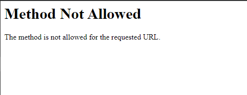
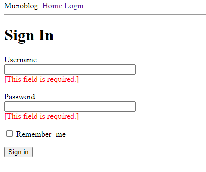

{: .center}

Like most of the Flask extensions they start with `Flask-` in this case we will talk about **Flask-WTF**

FlaskWTF or Flask-WTF is a simple integration of WTFroms for flask including [Cross-Site Request Forgery](https://en.wikipedia.org/wiki/Cross-site_request_forgery) or CSRF (pronounced "seasurf" , file upload, and reCAPTCHA.

1. [Documentation](https://flask-wtf.readthedocs.io/en/stable/)

### Installation

```bash
$ pip install flask-wtf
```

## Features

* Integration with WTForms.
* Secure Form with CSRF token.
* Global CSRF protection.
* reCAPTCHA support.
* File upload that works with Flask-Uploads.
* Internationalization using Flask-Babel.

## Example

Following the `separation of concerns` it is a good practice to keep the forms in a different file/module, in the following example we will consider an app that will ask customer to log in, this log in form will include: 

* Username.
* Password.
* Remember me check box.
* Submit Button.

### The LoginForm class
**application/forms.py**
```python 
from flask_wtf import FlaskForm
from wtforms import StringField, PasswordField, BooleanField, SubmitField
from wtforms.validators import DataRequired

class LoginForm(FlaskForm):
	"""Login form class"""
	username = StringField('Username', validators=[DataRequired()])
	password = PasswordField('Password', validators=[DataRequired()])
	remember_me = BooleanField('Remember_me')
	submit = SubmitField('Sign in')

``` 

From the code we got: 

1. `FlaskForm` is the base form class and all the clases we will create will inherit from it, this class is part of `flask_wtf`.  
2. The 4 type of field are represented as classes and they came form `wtforms`, since the `Flask-WTF` extension does not provide customized versions.  
3. Each instance or object of the field class has as first argument a label, and the second and optional argument will be the validators, in this case we use the validator `DataRequired()`

### Form Templates

We have the form, now 2 things are missing the template and the view function, in this section we will talk about the template.

We will follow the template inheritance and will will be using `` to extend inherit from the base template.

we will create a new template `login.html` and it will be same in the template folder (in more complex application this might be different). 

**application/templates/login.html**
```html



	<h1>Sign In</h1>
	<form action="" method="post" novalidate>
		{{ form.hidden_tag() }}
		<p>
			{{ form.username.label}}</br>
			{{ form.username(size=32)}}
		</p>
		<p>
			{{ form.password.label}}</br>
			{{ form.password(size=32)}}
		</p>
		<p>
			{{ form.remember_me}} {{ form.remember_me.label}}
		</p>
		<p> {{ form.submit() }}</p>
	</form>

```

From the script we have: 

1. The template expect a object instance of the `LoginForm` that object is refer as `form` we will see in the view function were we need to pass that object and how we create the instance.
2. We use the tag `<form>` to contain the web form.  
3. The `action` attribute of the form is used to tell the browser the URL that should be used when submitting the information the user entered in the form. When the `action` is set to an empty string the form is submitted to the URL that is currently in the address bar, which is the URL that rendered the form on the page.  
4. The method is set as "post".  
5. The `novalidate` attribute is used to tell the web browser to not apply validation to the fields in this form, which effectively leaves this task to the Flask application running in the server This is optional, but we use it in this case so we can test the validation in the server-side.
6. `form.hidden_tag()` template argument generates a hidden field that includes a token that is used to protect the form against **CSRF** attacks. All you need to do to have the form protected is include this hidden field and have the SECRET_KEY variable defined in the Flask configuration.

**IMPORTANT:** if we check the template in detail we notice that there are not `<input >` tags  this is because he fields from the form object know how to render themselves as HTML.
1. All I needed to do was to include `{{ form.<field_name>.label }}` where I wanted the field label, and `{{ form.<field_name>() }}` where I wanted the field.  
2. To modify the field we can use the attributes that will be in th `<input>` example, `size` argument.  

### Form Views

The last step need it is the form view, the view function that will render the template.
This new view function can be add it to a routes module as follow 

**application/routes.py**
```python 
from flask import render_template
from application import app
from application.form import LoginForm

@app.route('/')
@app.route('/index')

def index():

	user = {'username': 'Victor'}
	posts = [
		{
			'author': {'username': 'John'},
			'body': 'Beautiful day in Portland!'
		},
		{
			'author': {'username': 'Susan'},
			'body': 'The Avengers movie was so cool!'
		}
	]

	return render_template('index.html', title='Home', user=user, posts=posts)

@app.route('/login')
def login():
	form = LoginForm()
	return render_template('login.html', title='Sign In', form=form)
``` 

What are we doin is importing the calls `LoginForm` from the module `forms.py` and we create and instant object of that class called `form` later in `render_template` we pass that object `form` to the variable `form` this variable is the required for to get the fields rendered

Now we can add a link to login in or base template

```HTML
<div>
    My app:
    <a href="/index">Home</a>
    <a href="/login">Login</a>
</div>
```

However if we click in submit button we will have 
{: .center}

This is because we don't have the logic to handle the request using `POST` and the form is using post top send the information 

#### Receiving Form Data

In order to the the request or to be able to handle the request we need to add some extra code to the view function 

**application/routes.py**
```python 
from flask import render_template, flash, redirect

@app.route('/login', methods=['GET','POST'])
def login():
	from = LoginForm()
	if form.validate_on_submit():
		flash('Login requested for user {}, remember_me={}'.format(form.username.data, form.remember_me.data))
		return redirect('/index')
	return render_template('login.html', title="Sign In", form=form)
``` 

from the previous code:

1. We add `methods` to the decorator, the default method in the decorator will be `GET` so in order to support the post request done when the form is submitted we need to let the view function knows.
2. the `form.validate_on_submit()` method does all the form processing work, it work in to "phases", first, when the page request the form using `GET`  the function `form.validate_on_submit()` return `false` so the if block is skip and the page render the form. Second, when user press submit the request is done with `POST` in which case the function `form.validate_on_submit()`, if the validation is correct, it will return `True` and the code in the if block will be executed.
3. `flash()` Is a function to show a message to the user, in this case since we dont have a database to compare the login credentials we will use it to send a confirmation that the form was submitted correctly, bellow we will modify the template to be able to display the `flash()` message.
4. `redirect()` this function give instructions to the client web browser to automatically navigate to a different page, given as argument.

**appplication/templates/base.html**
```html
<html>
    <head>
        
        <title>{{ title }} - microblog</title>
        
        <title>microblog</title>
        
    </head>
    <body>
        <div>
            Microblog:
            <a href="/index">Home</a>
            <a href="/login">Login</a>
        </div>
        <hr>
        
        
        <ul>
            
            <li>{{ message }}</li>
            
        </ul>
        
        
        
    </body>
</html>
```

as we mentioned before `flash()` is a function use to give messages to the user, but to be able to see it we need to modify the templates to do it, in this case we are going to modify the `base.html` template.

1. `` the `with` is a construct that we are going to use to assign the return value of `get_flashed_messages()` to the variable `messages`, all in the context of this template.
2. `get_flashed_messages()`  this function come from Flask and it returns a list of messages register to `flash()`.  
3. `` is a condition to check if the variable has some content, if the variable has some content we will use a `HTML` list and a jinja `` to loop and display all the messages in the list.  

#### Improving the Field Validation

For the most part the validation and the form are working, although if we fail during the validation we don't know what is the filed that failed and we don't have any way to alert the user that there is a mistake or an error in the form.

We can create some messages in the **login.html** template so if the customer fail in some field we can give the feedback

**application/templates/login.html**

```HTML



    <h1>Sign In</h1>
    <form action="" method="post" novalidate>
        {{ form.hidden_tag() }}
        <p>
            {{ form.username.label }}<br>
            {{ form.username(size=32) }}<br>
            
            <span style="color: red;">[{{ error }}]</span>
            
        </p>
        <p>
            {{ form.password.label }}<br>
            {{ form.password(size=32) }}<br>
            
            <span style="color: red;">[{{ error }}]</span>
            
        </p>
        <p>{{ form.remember_me() }} {{ form.remember_me.label }}</p>
        <p>{{ form.submit() }}</p>
    </form>

```

From the previous template we can see the changes, in this case we are using `form.username.errors` and `form.password.errors` to check if there is any error in this field, the validator attached to every field will be `form.<filed_name>.errors)`

{: .center}

### Generating Links

For now the login is basically complete, but we have some hardcoded URLs whihc is not a goo practice, so far we have:

**application/templates/base.html**
```HTML
    <div>
        Microblog:
        <a href="/index">Home</a>
        <a href="/login">Login</a>
    </div>
```
and 

**Application/routes.html**
```python 
@app.route('/login', methods=['GET', 'POST'])
def login():
    form = LoginForm()
    if form.validate_on_submit():
        # ...
        return redirect('/index')
    # ...
``` 

The good practice will be, generate those URLs using `url_for()` whihc generate the URLs bas in the internal mapping, The argument of `url_for()` will be the name of the view function, so for example, `url_for('login')` because the view function is called `/login` will returns /login, and same for  `url_for('index')` return `/index`.

So the previous links will be

**application/templates/base.html**
```HTML
    <div>
        Microblog:
        <a href="{{ url_for('index') }}">Home</a>
        <a href="{{ url_for('login') }}">Login</a>
    </div>
```
and

**Application/routes.html**
```python 
 from flask import render_template, flash, redirect, url_for

# ...

@app.route('/login', methods=['GET', 'POST'])
def login():
    form = LoginForm()
    if form.validate_on_submit():
        # ...
        return redirect(url_for('index'))
    # ...
``` 
