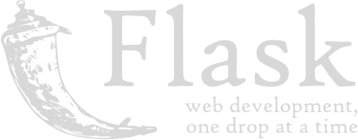

#Flask
{: .center}

>Flask is a micro web framework written in Python. It is classified as a microframework because it does not require particular tools or libraries.

1. [Pypi page](https://pypi.org/project/Flask/)
2. [Documentation](https://flask.palletsprojects.com/en/1.1.x/)

## *Things I learn from error*

#### Cache 
>If CSS is not reflected try clean the cache of the browser.

I was struggling in a project, i made changes on the CSS and didn't see those reflected in the browser, i check the code and the redo the whole thing, add the end and after lot lot of stack-overflow i found one comment on a youtube video recommending clean the cache of the browser, and that solve the issue

## Index

I have several notes in this case, the first notes are from a youtube video and explain how to make a small application that use SQLite as database and Heroku for "live deployment", be aware that the app still use the `DEBUG=True` in a really live app that should be set to `False`.

1. [First App with Flask](first_app_flask.html)
2. [Minimal application]()
3. Official Flask tutorial.  
3.1. [Application Layout (Structure)](flask_structure.html).  
3.2. [Application Factory](flask_application_factory.html).  
3.3. [Application Database](flask_database.html).  
3.4. [Blueprints (part 01-Auth)](flask_blueprints_part1.html).  
3.5. [Templates](flask_templates.html).  
3.6. [Blueprints (part 02-Blog)](lask_blueprints_part2.html).  

## How I use it/ How I find it

I wanted to get some UI for some projects, but Django was way to complicated, since the idea was a simple display, just a table and a form, so Someone recommended Flask, and i found that the tutorials were shorter and the documentation was easier to digest than Django. I'm sure Django will have its usage and in some case be a better choice than Django but i think for smaller projects i will stay with Flask.

## Extra notes

### Nuggets for Template Jinja2

* ``  it is similar to inheritance.
* `` it is use to add to the current template, in some cases are called partial, this is to further separate the templates, it is use to 'include' extra parts to the base or other templates.

### Common plug-ins

* **Flask-SQLAlchemy**:  For database interaction 
* **Flask-Session**:  User sessions management 
* **Flask-login**: Management user login
* **Flask-WTF**: To handle forms 

#### Common configuration variables 

##### General
* FLASK_ENV
* DEBUG
* TESTING
* SECRET_KEY
* SERVER_NAME

##### Flask SQLAlchemy
* SQLALCHEMY_DATABASE_URI
* SQLALCHEMY_ECHO
* SQLALCHEMY_ENGINE_OPTIONS

##### Flask-Session
* SESSION_TYPE	
* SESSION_PERMANENT
* SESSION_KEY_PREFIX
* SESSION_REDIS
* SESSION_MEMCHED
* SESSION_MONGODB
* SESSION_SQLALCHEMY

