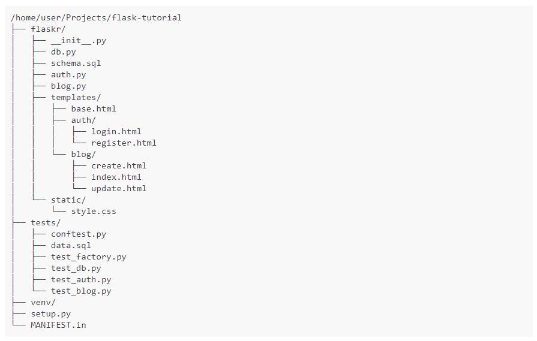

In this notes I will use the example on the official documentation to learn how to use it, in other notes in this same directory i might use other sources, but in this case i will use the [official documentation](https://flask.palletsprojects.com/en/1.1.x/)

Lets first get something out of the ways, the 99% of the examples and tutorials on the web use the basic hello world example of Flask and don't enter in details or good practice, that is the main reason to start with the Official documentation first in this learning path, here is the typical hello world on Flask

{: .center}


## Application Layout

This layout might change depending of the size or the length of the application although i think this will suite most of the application I'm thinking to use Flask for.
Here I follow exactly the documentation



> The tutorial assume that all the content will be in a folder called "Flask-tutorial" and a virtual environment was created 

the documentation suggest some to add an specific `.gitignore` that i thing came useful since will help me to avoid commit any unnecessary document or folder to git or any version control system 

#### `gitignore` Example

```
venv/

*.pyc
__pycache__/

instance/

.pytest_cache/
.coverage
htmlcov/

dist/
build/
*.egg-info/
```