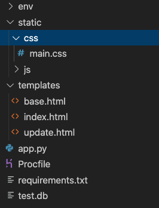
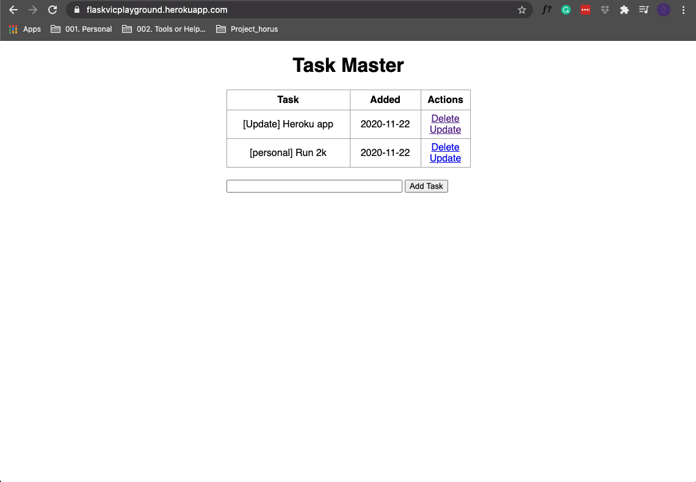
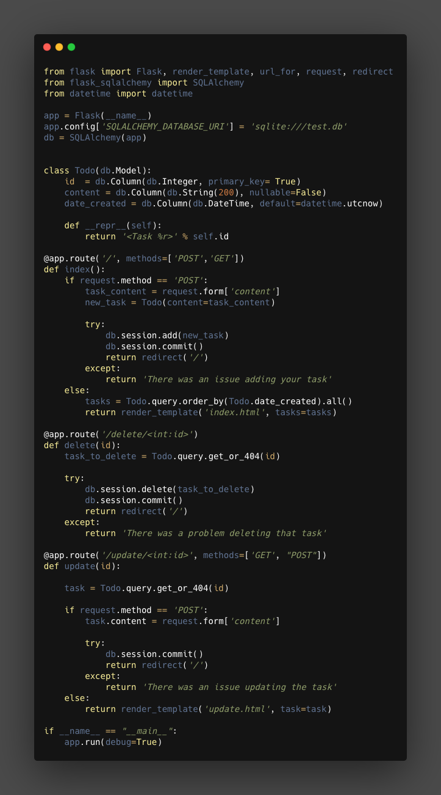

This notes are based in the  youtube video release by [freecodecamp](https://www.youtube.com/watch?v=Z1RJmh_OqeA)

## The structure

> a virtual environment is created thus the folder env, it contain all the documents and files need it to run the virtual environment 

now the structure of the application is simple, we wont use **blue prints** a concept that is really important to create modular, efficient and reusable application, for that reason we will have all the logic running in one single document `app.py` this document will contain the model and the controllers, the views as always will be manage by the **templates** like in all Flask application these templates are in the folder templates ( we use the template inheritance of jinja2). We will have just a one single `.css` file in the folder static, and few other documents, `requirements.txt` for the requirements, the `Procfile` for Heroku deplayment and the *SQLite* database as test.db

{: .center}

## how will looks like

after deploy in heroku and as a first version will look like 
[live app](https://flaskvicplayground.herokuapp.com/)



## The app.ppy

The whole script will look like 
{: .center}

Now we are going to go a bit deeper and check some of the details 

Be aware that the script has `if __name__ == '__main__'` at the end
there we set the app to enable `DEBUG` as `True` 

```python
if __name__ == "__main__":
    app.run(debug=True)
```
so we can see the error during the development, in a real application the `DEBUG` must be set to `False`.

### Imports

Here is just the typical imports 

```python
from flask import Flask, render_template, url_for, request, redirect
from flask_sqlalchemy import SQLAlchemy
from datetime import datetime
```

From flask we will import 

* `Flask` the class and what we instanciate to create the app.  
* `render_template` Function to render the view from the template in the folder templates
* `url_for` this one more complex to explain but basically will create URI to specific resources, example URL for the .css file to be use in the base for the templates.  
* `request` to handle the request of the forms implemented in the templates.   
* `redirect` To redirect to a specific view after some action.   
* `SQLAlchemmy` to handle everything related with the database.     

### Declaration app and database

Here we create the class object that represent Flask and we bind it with a database flavor and we create a database object

```python
app = Flask(__name__)
app.config['SQLALCHEMY_DATABASE_URI'] = 'sqlite:///test.db'
db = SQLAlchemy(app)
```
The `///` means relative path, for a direct or explicit path we need to use `////`

### Database

This step normally will be done after we create some of the logic or some of the controllers and views, but since it is good practice to put it first on the script, I decided to put it first in the notes 

```python
class Todo(db.Model):
    id  = db.Column(db.Integer, primary_key= True)
    content = db.Column(db.String(200), nullable=False)
    date_created = db.Column(db.DateTime, default=datetime.utcnow)

    def __repr__(self):
        return '<Task %r>' % self.id
```

Here there are two parts, the first one is the description of the model, what columns and what type of information. The second is just a method that will reply something every time we finish to add some new content, is just a responds to an action, the method is `__repr__`

note that in the first part, in the creation of the model we use `datatime.utcnow` to log the time of the creation of the task.

### Controllers 

For the controllers there will be 3:
1. The index and landing page.
2. The delete
3. The update

>during development we will be creating controllers and views( templates) at the same time, since there are connected and they need each other, but in this case we are going to make a description of the controllers first and bellow in the next section we will check the views (templates).  

#### Index

```python
@app.route('/', methods=['POST','GET'])
def index():
    if request.method == 'POST':
        task_content = request.form['content']
        new_task = Todo(content=task_content)

        try:
            db.session.add(new_task)
            db.session.commit()
            return redirect('/')
        except:
            return 'There was an issue adding your task'
    else:
        tasks = Todo.query.order_by(Todo.date_created).all()
        return render_template('index.html', tasks=tasks)
```
1. `@app.route('/', methods=['POST'.'GET'] ` Is The decorator to create the root, if  the user go to `https://[ipaddress:port]/`  this controller will be executed, be aware that Flask by default use just `GET` so we need to specify the methods if we want to use something different, like in this case `@app.route('/', methods=['POST', 'GET'])`.  
2. The if statement will handle the request, if there is a `POST` request we will trigger the code to create a new task, later commit to the database, finally redirect to the same page where will display the information. Finally the `else`  it is important to mentioned since this is the one that contain the code that get the task from the database and that send to the view `index.html` in the variable `tasks`.  

#### Delete

```python
@app.route('/delete/<int:id>')
def delete(id):
    task_to_delete = Todo.query.get_or_404(id)

    try:
        db.session.delete(task_to_delete)
        db.session.commit()
        return redirect('/')
    except:
        return 'There was a problem deleting that task'
```

here there are 2 important things:

1. The decorator contain `<int:id>` which means that it will be expecting a value `int` from the variable `id`, example a URI like `https://[domain]/delete/1`.
2. A function `get_or_404(id)` this function will get the information based in the id pass as parameter but if it is not correct or the `id` doesn't exit will return `404`.

#### Update

```python
@app.route('/update/<int:id>', methods=['GET', "POST"])
def update(id):

    task = Todo.query.get_or_404(id)

    if request.method == 'POST':
        task.content = request.form['content']

        try:
            db.session.commit()
            return redirect('/')
        except:
            return 'There was an issue updating the task'
    else:
        return render_template('update.html', task=task)
```

It is similar to the other two controllers it will get some information on the URL, thus the decorator with the `<int:id>` and it will redirect to a new template to perform some actions using the `id`.

## The Templates

There will be 3 templates;

1. `base.html` this is the base template and all the other template will inherit form this one.
2. `indext.html` it is the landing and is where most of the task and information will be display
3. `update.html` here is where we will perform the updates, the button in the template `index.html` with the name of `update` will redirect to this pages.

#### `base.html`

```html
<!DOCTYPE html>
<html lang="en">
<head>
    <meta charset="UTF-8">
    <meta name="viewport" content="width=device-width, initial-scale=1.0">
    <meta http-equiv="X-UA-Compatible" content="ie=edge">
    <link rel="stylesheet" href="{{ url_for('static', filename='css/main.css') }}">
    
</head>
<body>
    
</body>
</html>
```

1.  Here we are using the method `url_for` to create a URI to the resources in the static folder, in this case will be the styles for the templates, in few works, the method will give me the path to the CSS file containing the styles.  
2.  ` ` is part of the jinja2 syntax, this will allow us to input content from other file in this location.

#### `index.html`

```html



<title>Task Master</title>



<div class="content">
    <h1 style="text-align: center">Task Master</h1>
    
    <h4 style="text-align: center">There are no tasks. Create one below!</h4>
    
    <table>
        <tr>
            <th>Task</th>
            <th>Added</th>
            <th>Actions</th>
        </tr>
        
            <tr>
                <td>{{ task.content }}</td>
                <td>{{ task.date_created.date() }}</td>
                <td>
                    <a href="/delete/{{task.id}}">Delete</a>
                    <br>
                    <a href="/update/{{task.id}}">Update</a>
                </td>
            </tr>
        
    </table>
    

    <div class="form">
        <form action="/" method="POST">
            <input type="text" name="content" id="content">
            <input type="submit" value="Add Task">
        </form>
    </div>
</div>

```

1. `` this is how the inheritance is done, here I'm telling flask that this template inherit from the `base.html` template.
2. ` ` and `` hre i'm evaluating if a variable `tasks` is bigger than 1, thi sis part of the jinja2 syntax. 
3. `...` and ` ... ` this is how we input content in the templates.
4. on the **block body** we will fine more jinja2 syntax, in this case is on the table `<a href="/delete/{{task.id}}">Delete</a>` and `<a href="/update/{{task.id}}">Update</a> ` in this case what we tell Flask is that this links will use the controllers `delete` and `update` respectively. 

## The static files
Here is not much to say, we will store the static files like stylesheet and javascript  documents in this folder, in this example we have just `.css` files so there are the only that have some importance in this example, below i will add the css file, 

```css 
body, html {
    margin: 0;
    font-family: sans-serif;
}

.content {
    margin: 0 auto;
    width: 400px;
}

table, td, th {
    border: 1px solid #aaa;
}

table {
    border-collapse: collapse;
    width: 100%;
}

th {
    height: 30px;
}

td {
    text-align: center;
    padding: 5px;
}

.form {
    margin-top: 20px;
}

#content {
    width: 70%;
}
```

## Deploy to heroku

The deployment to heroku will required a series of steps and the preparation of some extra documents

### What we need

We need: 

1. account in [Heroku](https://dashboard.heroku.com/)
2. The [`CLI` client for Heroku](https://devcenter.heroku.com/articles/heroku-cli)
3. A library called [`gunicorn`](https://pypi.org/project/gunicorn/)
4. A file `Procfile`

#### Procfile

The Procfile contain the following:

```
web: gunicorn app:app
```

#### Freeze the requirements

We need to run in the console the Freeze command to freeze the libraries version and we can sabe it to a file called requirement

```bash
pip3 freeze > requirements.txt 
```

#### Create the git repo

We need to keep track of the version and prepare the repo so Heroku can use it to get the application, the steps are simple:

```bash
git init
git add .
git commit -m "init repo"
git remote -v
```

we have one more git command to execute but first we need to create the app on heroku

#### Creating the app in Heroku

we need to create a new app in heroku for that purpose we will use the `CLI` with the following command

```bash
heroku create [NameOfTheApp]
```

after the creation of the app we execute the last `GIT` command

```bash
git push heroku master
```

Finally if everything is in order we should be able to see the live app in the URL given 
https://flaskvicplayground.herokuapp.com/
> I will continue working on it testing things like bootstrap to improve the visual, and in some cases i will try to add javaScript to play with animation so the current version of the live app might look different of the visual presented in this notes.

