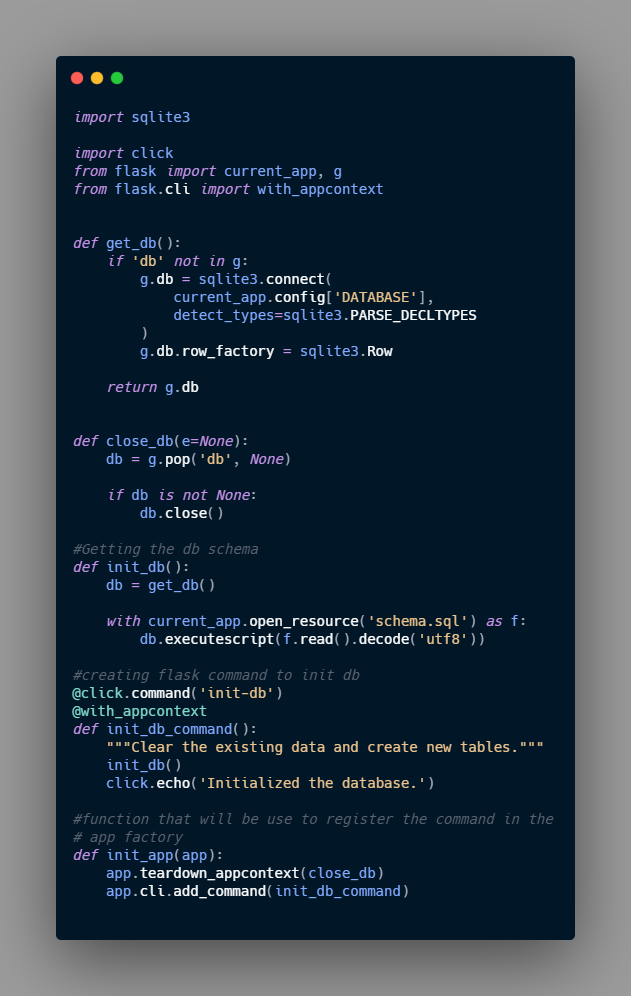

## Regarding the Database and the connection.

For this example the Flask tutorial use the SQLite, since it is already integrated with python.
As it is mentioned in the tutorial, the first thing we need to do when working with databases is to establish a connection, any operation or query to the DB is done through this connections, this connections must be close once the operation is finished.

**flaskr/db.py**
```python 
import sqlite3

import click
from flask import current_app, g
from flask.cli import with_appcontext

def get_db():
	if 'db' not in g:
		g.db = sqlite3.connect(
            current_app.config['DATABASE'],
            detect_types=sqlite3.PARSE_DECLTYPES
        )
		g.db.row_factory = sqlite3.Row

		return g.db

def close_db(e=None):
	db = g.pop('db', None)

	if db is not None:
		db.close()

``` 

There are couple objects that still i don't fully understand but that make the development easier, or with better practice ( according with documentation), this are `g` and `current_app`, here some description ( and links) of this code snippet

1. [`g`](https://flask.palletsprojects.com/en/1.1.x/api/#flask.g)[^1]: it is an special object that is unique for each request, use to store data that might be user accessed by multiple function during the request. In this case the connection is stored and reused instead of creating a new one, if the get_db is use a second time at in the same request.

2. [`current_app`](https://flask.palletsprojects.com/en/1.1.x/api/#flask.current_app)[^2]:  Another special object, it points to the Flask application handling request, if we develop like this example we will be using the **application factory**, thus, we wont have an application object we writing the rest of the code, *"the `get_db()` will be call when the application is create and is handling a request, so current_app can be used."*

3. `sqlite3.connect()` establish a connection to the file pointed at by the `DATABASE` configuration key. at the beginning the file wont exist we need to initialize the database (I will explain it bellow)

4. `sqlite.Row` tells the connection to return rows that behave like `dicts`. This allows accessing the columns by name.  

### Creating the tables

In this case the initial table will be store in a file `.sql`

flaskr/schema.sql
```SQL
DROP TABLE IF EXIST user;
DROP TABLE IF EXIST post;

CREATE TABLE user (
	id INTEGER PRIMARY KEY AUTOINCREMENT,
	username TEXT UNIQUE NOT NULL
	password TEXT NOT NULL
);

CREATE TABLE post (
	id INTEGER PRIMARY KEY AUTOINCREMENT,
	author_id INTEGER NOT NULL, 
	created TIMESTAMP NOT NULL DEFAULT CURRENT_TIMESTAMP,
	title TEXT NOT NULL,
	body TEXT NOT NULL,
	FOREIGN KEY (author_id) REFERENCES user (id)
);
``` 
Now, The next step is create the logic to initialize the database, this will be in different parts and two different files:

1. Create the functions to run the SQL statements, this will be done on **flask/db.py**
2. Register with the application, we need to let the application know that there is a database, create the initializer ( will include some CLI commands) **flaskr/db.py**, and later the logic to import it to the application factory **flaskr/__init__.py**.

### Function to run the SQL commands

code to add:
**flaskr/db.py**
```python 
def init_db():
	db = get_db()

	with current_app.open_resource('schema.sql') as f:
		db.executescript(f.read().decode('utf8'))

@click.command('init-db')
@with_appcontext
def init_db_command():
	""" clear the existing data and create new tables """
	init_db()
	click.echo('Initialized the database.')
``` 


so the code until on **flaskr/db.py** will be: 


###Register the application 

Now the functions `close_db` and `init_db_command` are defined but they are not register to be use by the application, in other words, in order to use the functions we need to register them with the instance of the application, although, in this case we are using **application factory**, so, technically the applications doesn't exist yet, or the instance is not available, so in this case we will need a function that make the registration for us and later we will import that function on the factory.

> We create a function on **flaskr/db.py** later import that function on **flask/__init__.py** in the factory function `create_app()`

**flaskr/db.py**
```python 
def init_app(app):
	app.teardown_appcontext(close_db)
	app.cli.add_command(init_db_command)
```   
1. `app.teardown_appcontext()` this function is executed after returning the response, during the clean up process, and basically allow me to run a function in that moment, in that case `close_db()`
2. `app.cli.add_command()` add a new command that can be call with the **flask** command.  

so the **flaskr/db.py** will be


Now we need to call the function `init_app()` from the factory

**flaskr/__init__.py**
```python 
def create_app():
	app = ...
	#existing code

	from . import db
	db.init_app(app)

	return app
``` 
so the Factory function will look like this: 


### Initialize the database

We create the Flask commands, we register those commands and import it to the factory, so now we can initialize the database using `flask`

on the Command (CMD) or terminal 
```bash
flask init-db
# --> Initialized the database
```

There now on the **instance** folder we will have a file **flask.sqlite**

[^1]: `g` is a namespace object that can store data during an [application context](https://flask.palletsprojects.com/en/1.1.x/appcontext/), this is a [proxy](https://flask.palletsprojects.com/en/1.1.x/reqcontext/#notes-on-proxies) 

[^2]: `current_app` A proxy to the application handling the current request. This is useful to access the application without needing to import it, or if it can’t be imported, such as when using the application factory pattern or in blueprints and extensions.