For the review or refresh of pandas we will follow the structure bellow:

* Series.  
* DataFrames.  
* Missing Data.  
* GroupBy.  
* Operations.  
* Data Input and Output.  

##Series

Series are similar to Numpy arrays ( they are build on top of Numpy arrays)  and the difference is that SEris can have axis labels, that means that can be located not just by numbers but by labels, and they can hold much more than just numbers, they can hold any type of python object.

We are going to create Series in different ways: 

###Creating a series.

First we will need to import numpy and pandas

```python 
import numpy as np
import pandas as pd
``` 

now we are going to create a list, a numpy array and a dictionary that later will be use to create the series

```python 
lables = ['a','b','c']
my_list = [10,20,30]
arr = np.array([10,20,30])
d = {'a':10,'b':20,'c':30}
``` 

####1. Using List

```python 
pd.Series(data=mylist)
#0    10
#1    20
#2    30
#dtype: int64
``` 
The about is a Series that use just number as labels, now let use the labels defined before with the list `lables`

```python 
pd.Series(data=my_list,index=labels)
#a    10
#b    20
#c    30
#dtype: int64
``` 
now a shorter way

```python 
pd.Series(my_list,labels)
#a    10
#b    20
#c    30
#dtype: int64
``` 

####2. Using NumPy arrays

```python 
pd.Series(arr)
#0    10
#1    20
#2    30
#dtype: int64
``` 
now with the labels

```python 
pd.Series(arr,labels)
#a    10
#b    20
#c    30
#dtype: int64
``` 

####3. Using Dictionaries
```python 
pd.Series(d)
#a    10
#b    20
#c    30
#dtype: int64
``` 

### Using Index

Pandas use the index name or numbers which allow to access the information ( the index are the rows).

```python 
sales_Q1 = pd.Series(data=[250,450,200,150], index=['USA','China','India','Brazil'])
Sales_Q1 
#USA       250
#China     450
#India     200
#Brazil    150
#dtype: int64

sales_Q2 = pd.Series([260,500,210,100],index = ['USA', 'China','India', 'Japan'])  
sales_Q2
#USA      260
#China    500
#India    210
#Japan    100
#dtype: int64

sales_Q1['USA']
#250

sales_Q1 + sales_Q2
#Brazil      NaN
#China     950.0
#India     410.0
#Japan       NaN
#USA       510.0
#dtype: float64
``` 

## DataFrames

Datafarames are inspire in **R programming** they look like a group of series put together to share the same index.

```python 
import pandas as pd
import numpy as np
from numpy.random import randint

# define columns and index to use later in the DataFrame
columns = ['W','X','Y','Z'] # four columns
index = ['A','B','C','D','E'] # five rows

np.random.seed(42)
data = randint(-100,100,(5,4))
# randint(low,high, size)

print(data)
#array([[  2,  79,  -8, -86],
#       [  6, -29,  88, -80],
#       [  2,  21, -26, -13],
#       [ 16,  -1,   3,  51],
#       [ 30,  49, -48, -99]])

df = pd.DataFrame(data,index,columns)
print(df)

``` 


###Selection and indexing

We can select and grad columns or parts of the DataFrame

####Columns

To grap a single column

```python 
print(df['W'])
#A     2
#B     6
#C     2
#D    16
#E    30
#Name: W, dtype: int64
``` 

Grap multiple Columns

```python 
print[['W','Z']]
#  	W	Z
# A	2	-86
# B	6	-80
# C	2	-13
# D	16	51
# E	30	-99
``` 

If we use the method `type()` we can see that the columns are just pandas series

```python 
print(type(df['W']))
# pandas.core.series.Series
``` 

####Create a new column

```python 
df["new"] = df['W'] + df['Y']
print(df['new'])
``` 

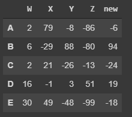


####Removing Columns

for the removing of a column is important to understand that if it is not reassigned (df = de.drop()) the removal wont be save, see in the example:

```python 
# axis=1 because its a column
print(df.drop('new',axis=1))
#	W	X	Y	Z
# A	2	79	-8	-86
# B	6	-29	88	-80
# C	2	21	-26	-13
# D	16	-1	3	51
# E	30	49	-48	-99

print(df)
#	W	X	Y	Z	new
# A	2	79	-8	-86	-6
# B	6	-29	88	-80	94
# C	2	21	-26	-13	-24
# D	16	-1	3	51	19
# E	30	49	-48	-99	-18

df = df.drop('new',axis=1)
``` 


### Working with Rows

Now to select a row we will need to use a bit different approach, in this case we will need to use `df.loc[]` we use `loc` and the name or number of the row.

```python 
print(df.loc['A'])
#W     2
#X    79
#Y    -8
#Z   -86
#Name: A, dtype: int64
``` 

The selection by numerical index will be

```python 
print(df.iloc[0])
#W     2
#X    79
#Y    -8
#Z   -86
#Name: A, dtype: int32
``` 


#### Multi-row selection

Similar with columns we can select multiple rows at the same time
```python 
print(df.loc[['A'.'C']])
#	W	X	Y	Z
# A	2	79	-8	-86
# C	2	21	-26	-13
``` 

now by numerical index

```python 
print(df.iloc[0:2])

#	 W	 X	 Y	 Z
# A	 2	 79	 -8	 -86
# B	 6	-29	 88	 -80
``` 
Now we can select a subset of rows and columns 

```python 
print(df.loc[['A','C'],['W','Y']])
#	 W	 Y
# A	 2	 -8
# C	 2	 -26
``` 


#### Removing a row

To remove a row we use `drop()` but this time the parameter `axis=0`, and in the same way with columns, if this is not reassigned the removal wont take place.

```python 
print(df.drop('C',axis=0))
#	 W	X	Y	Z
# A	 2	79	-8	-86
# B	 6	-29	88	-80
# D	 16	-1	3	51
# E	 30	49	-48	-99

print(df)
#	 W	X	Y	Z
# A	 2	79	-8	-86
# B	 6	-29	88	-80
# C	 2	21	-26	-13
# D	 16	-1	3	51
# E	 30	49	-48	-99
``` 
### Select a specific cell

You can select a specific cell in the DataFrame, you can use the function `at()`

```python 
df = pd.DataFrame([[0, 3, 4], [0, 5, 2], [20, 30, 40]],
                  index=[1, 2, 3], columns=['P', 'Q', 'R'])
df.at[1, 'Q']
# 3
``` 


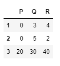{.center}


### Conditional Selection


Pandas allow the conditional selection similar to NumPy, for the examples of this we will use the DataFrame: 


```python 
print(df>0)
#		W		X		Y		Z
# A	 True	 True	 False	 False
# B	 True	 False	 True	 False
# C	 True	 True	 False	 False
# D	 True	 False	 True	 True
# E	 True	 True	 False	 False

print(df[df>0])
#	 W	 X	 	Y	 Z
# A	 2	 79.0	NaN	 NaN
# B	 6	 NaN	88.0 NaN
# C	 2	 21.0	NaN	 NaN
# D	 16	 NaN	3.0	 51.0
# E	 30	 49.0	NaN	 NaN
``` 

More examples

```python 
print(df['X']>0)
#A     True
#B    False
#C     True
#D    False
#E     True
#Name: X, dtype: bool

print(df[df['X']>0])
#	W	X	Y	Z
#A	2	79	-8	-86
#C	2	21	-26	-13
#E	30	49	-48	-99

print(df[df['X']>0]['Y'])
#A    -8
#C   -26
#E   -48
#Name: Y, dtype: int64

print(df[df['X']>0][['Y','Z']])
#	 Y	  Z
#A	-8	-86
#C	-26	-13
#E	-48	-99
```
If we want to use more than one conditional we can us binary operator like "|" or "&".
```python 
print(df[(df['W']>0) & (df['Y'] > 1)])
#	W	X	Y	Z
#B	6	-29	88	-80
#D	16	-1	3	51
``` 

#### More about index

We can reset the index, this means change the index selected ( in this case the letters A to E) for the number (starting in 0), lit copy if this change is not reassigned it wont take place.

Again we start with   


```python 
# Reset to default 0,1...n index
df.reset_index()

#	index	W	X	Y	Z
#0	A	2	79	-8	-86
#1	B	6	-29	88	-80
#2	C	2	21	-26	-13
#3	D	16	-1	3	51
#4	E	30	49	-48	-99
``` 

now we can create new index, in the following example we will create a new index starting from a string

```python 

newid = 'CA NY WY OR CO'.split()
df['states'] = newind
df = df.set_index('states')


``` 


#### Summaries

THere are 3 methods we can use to get information about the data in the DataFrames they are:

* `describe()` which will give a statistic description of the values 

```python 
df.describe()
``` 


* `info()` overall description of what is in the table 
```python 
df.info()
``` 
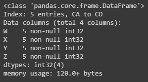


* `dtypes()` to display the data type


### Missing Data

There are some methods in POandas that allow you to handle missing data in the DataFrames or series, 

First lets create a new DataFrame with missing data

```python 
import numpy as np
import pandas as pd

df = pd.DataFrame({'A':[1,2,np,nan,4],
					'B':[5,np,nan,np,nan,8],
					'C':[10,20,30,40]})
``` 


#### Removing missing data

To remove horizontally 


```python 
df.dropna()
#	A	B	C
#0	1.0	5.0	10
#3	4.0	8.0	40

``` 

To do it Vertically

```python 
df.dropna(axis=1)
#    C
# 0	10
# 1	20
# 2	30
# 3	40
``` 

#### Threshold 

We can set a threshold for each column or row, if the row or column has equal or more of specific number of non-NaN

```python 
df.dropna(thresh=2)
#	A	B	C
#0	1.0	5.0	10
#1	2.0	NaN	20
#3	4.0	8.0	40
``` 

#### Filling missing data


Now to fill the empty values we can use `fillna(value=0)`  using as a argument for the parameter `value` either a *string* of an *integer*

```python 
df.fillna(value='FILL VALUE')

#	A			B			C
#0	1			5			10
#1	2			FILL VALUE	20
#2	FILL VALUE	FILL VALUE	30
#3	4			8			40

``` 


```python 
df['A'].fillna(value=0)

#0    1.0
#1    2.0
#2    0.0
#3    4.0
#Name: A, dtype: float64
``` 


```python 
df['A'].fillna(df['A'].mean())

#0    1.000000
#1    2.000000
#2    2.333333
#3    4.000000
#Name: A, dtype: float64
``` 

### Groupby

the Method `groupby()` allow me to group different rows and call other functions ( aggregate functions)

first we will need to choose the column that we are going to use as a categorical column, which is the same that we are going to use with `groupby`, Second choose the aggregated function (e.g. max,min, mean, std, etc...) 


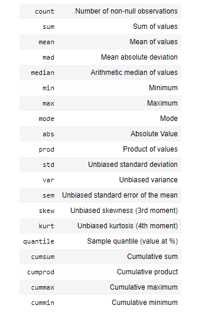{: .center}

let make and example, we are going to read a file called "Universities.csv"  and use the column 'Year' to group. 

```python 
import pandas as pd

#read the csv file
df = pd.read_csv('Universities.cvs')

#now we can show the first rows 
df.head()
``` 

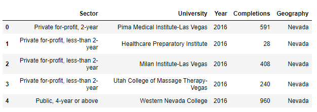{: .center}


```python 
#now group by Year
df.groupby('Year')
#<pandas.core.groupby.generic.DataFrameGroupBy object at 0x00000220102EC048>
# the groupby will be a DataFrame

# we can use the the aggregated 
df.groupby('Year'),mean()
``` 

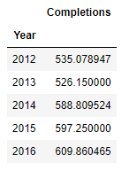{: .center}


As well as the `groupby` the result of `df.groupby('Year').mean()` will be a DataFrame as well.

we can sort the results of `mean()`

```python 
df.groupby('Year').mean().sort_index(ascending=False)
``` 
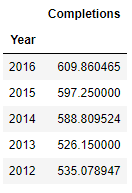{: .center}


#### Groupby by multiple columns

We can make the grouping by multiple columns we just need to

```python 
df.groupby(['Year','Sector']).mean()
``` 

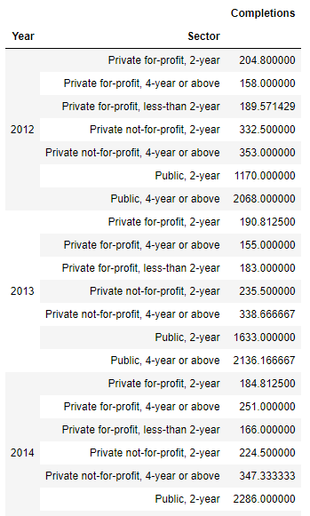{: .center}


Now we are going to use `describe()` which will give use information about this dataFrame, but we will combine it with `transpose()` so we can change the columns for the rows and display it in a more readable way ( we are going to use just `groupby` with "Year")

```python 
df.groupby('Year').describe().transpose()
``` 

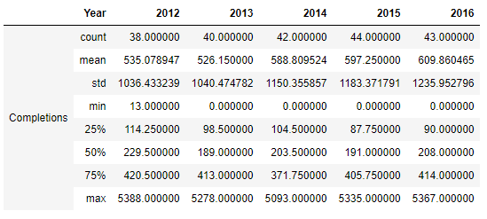{: .center}


### Operations 

There are a set of operation that are useful but don't fall in a specific category 

for the next operation we will create the following DataFrame:

```python 
import pandas as pd

df_one = pd.DataFrame({'k1':['A','A','B','B','C','C'],'col1':[100,200,300,300,400,500],'col2':['NY','CA','WA','WA','AK','NV']})
``` 

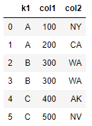{: .center}

#### Unique Values

* Get the unique values.
```python
df_one['col2'].unique()
# array(['NY', 'CA', 'WA', 'AK', 'NV'], dtype=object)
``` 

* Get number of unique values.
```python 
df_one['col2'].nunique()
# 5
```

* Count and Get the number of times a value is repeated 
```python 
df_one['col2'].value_counts()
# WA    2
# CA    1
# NV    1
# NY    1
# AK    1

``` 

* To remove duplicated rows 

```python 
df_one['col2'].drop_duplicates()
``` 

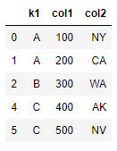{: .center}

 
#### Create new Columns with Operations and Functions 

```python 
def_one['New col'] = df_one['col1'] * 10
``` 

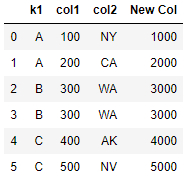{: .center}


or we can use the method `apply()` and pass a customize function as a parameter 

```python 
def grab_first_letter(state):
	return state[0]


df_one['first letter'] = df_one['col2'].apply(grab_first_letter)

``` 
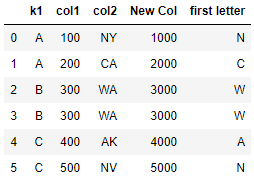{: .center}

> Be aware that we are not making a call of the function `grab_first_letter()`, there is not "()". 


#### Mapping 

now we are going to mapped some value to other 
lets check the column "k1"

{: .center}

```python 
df_one['k1'].map({'A':1,'B':2,'C':3})

``` 

{: .center}


#### Sorting, min, max, columns and index

to get the max, min or their positions we use:

* To find max value: `df_one['col1'].max()` 
* The index of the max value: `df_one['col1'].idxmax()`
* To find min value: `df_one['col1'].min()`
* The index of the min value: `df_one['col1'].idxmin()`
* Now for sorting: `df_one.sort_values('col2')`

#### Concatenate DataFrames and Dummy variables 

to concatenate we need to be careful in which axis we want to work with,

```python 
features = pd.DataFrame({'A':[100,200,300,400,500],
                        'B':[12,13,14,15,16]})
predictions = pd.DataFrame({'pred':[0,1,1,0,1]})

pd.concat([features,predictions])
``` 
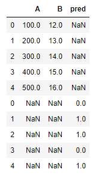{: .center}

```python 
pd.concat([features,predictions],axis=1)
``` 
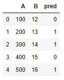{: .center}

for the dummy variables, first, we are going to change the name of the columns 

```python 
df_one.columns = ['C1','C2','C3','C4','C5','C6']
``` 
later we can make the dummy variable

```python 
pd.get_dummies(df_one['C1'])
``` 
{: .center}

### Data input and Data Output

for more detailed information of the different type of files and please visit the [pandas documentation](https://pandas.pydata.org/pandas-docs/stable/user_guide/io.html)

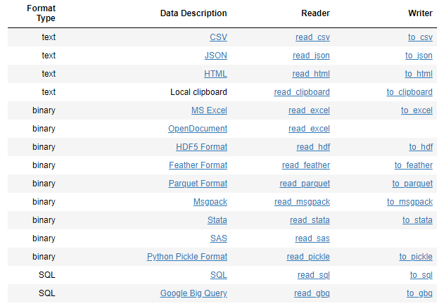{: .center}

#### CSV

To be able to read this type of files we need two additional libraries:

* xlrd ( `pip install xlrd` ).  
* openpyxl ( `pip install openpyxl `).  

for reading CSV: 
```python 
df = pd.read_csv('example.csv')
``` 

for the Output
```python 
df = df.to_csv('example.csv', index = False)
``` 

#### HTML

Pandas is able to read table tabs of the HTML (if the firewall allow pandas to read the HTML) but it is necessary to add the following libraries:

* lxml ( `pip install lxml`).  
* html5lib (`pip install html5lib`).  
* beautifulsoap4 ( `pip install beautifulsoap4`).  

for the input, the `read_html` function willl read tables of the webpage and return a list of DataFrame object:

```python 
tables = pd.read_html('http://www.fdic.gov/bank/individual/failed/banklist.html')
tables[0].head()
``` 
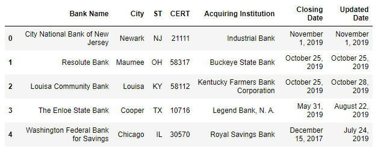{: .center}


