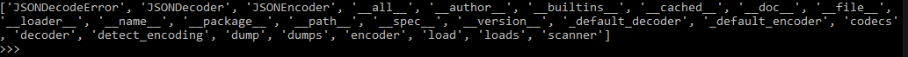
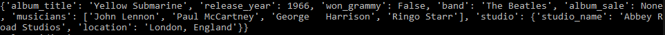
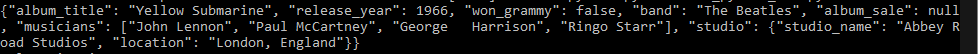
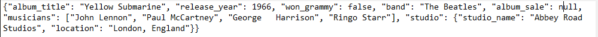

JSON Object in python 

let start for the basic and the well know definition of what is JSON 
> JSON stand for Java Script Object Notation and it is a light weight data format with many similarities to python dictionaries. JSON objects can be parse by many, if not all, modern browsers, which is ideal for transporting data between a client and a server. 


## Defining a JSON

First let make and example file, that can be copy and save as a .txt and it will represent our JSON file

```Json
{
     "album_title" : "Yellow Submarine",     
     "release_year" : 1966,   
     "won_grammy" : false,
     "band" : "The Beatles",
     "album_sale": null,
     "musicians" : ["John Lennon", "Paul McCartney", "George   Harrison", "Ringo Starr"],
     "studio" : {"studio_name": "Abbey Road Studios", "location": "London, England"}
     }
```
First, what we know, the keys are strings and the values can be strings, numbers (floats or ints), boolean values, lists, null, or another JSON object. 
second, what are the difference with Python dictionaries; A JSON objects, for example, represent the boolean values as lower case and empty values are `null`. 

A python dictionary equivalent is:

```python
{
     "album_title" : "Yellow Submarine",     
     "release_year" : 1966,   
     "won_grammy" : False,
     "band" : "The Beatles",
     "album_sale": None,
     "musicians" : ["John Lennon", "Paul McCartney", "George   Harrison", "Ringo Starr"],
     "studio" : {"studio_name": "Abbey Road Studios", "location": "London, England"}
     }
```

Notice that in python dictionaries boolean values are capitalize and empty value are `None`

I will save this JSON in a .txt and called 'album.txt', later import `json` library and use `dir()` to check the available methods:

```python
import json
print(dir(json))
```



## `load()` and `dump()`

We will focus in `load()` and `dump()` methods, for that we will open the file, and album.txt that contain a JSON object, we will open this file using `open()` and we can choose if open in writing mode or reading mode, this case will be reading so the second argument will be `'r'`

```python 
import json as j

album_json_file = open("album.TXT",'r')
album = j.load(album_json_file)
print(album)
``` 


if we use `print(type(album))` the result will be a python dictionary type

$$
<class 'dict'>
$$

We can verify this by checking two values, the value of ‘won_grammy’ that now is `False` and the value of ‘album_sale’ that now is `None`.

Not that is parse as a dictionary we can call the different values as a dictionary: 

``` python
print("Album Title: ", album['album_title'])
```
or
```python 
print("Release Year: ", album['release_year'])
``` 

## JSON in a string form and the method `loads()`

In client server applications it is common for JSON objects to arrive in the form of strings. For example, our JSON object for album information can look something like this:

```python
album_string = """{"album_title" : "Yellow Submarine",
     "release_year" : 1966,
     "won_grammy" : false,
     "band" : "The Beatles",
     "album_sale": null,
     "musicians" : ["John Lennon", "Paul McCartney", "George   Harrison", "Ringo Starr"],
     "studio" : {"studio_name": "Abbey Road Studios", "location": "London, England"}
     }"""
```

To load this data using the JSON module, we use the `loads()` method:

```python
album_s = json.loads(album_string)
album_string.close()
print(album_s)
```

Now, suppose we start with dictionary formatted data and wish to send this data to a database in JSON format. 

We can use the `dumps()` methods to convert dictionaries to string JSON objects. 
```python 
album2 = {'album_title': 'Yellow Submarine', 'release_year': 1966, 'won_grammy': False, 
 'band': 'The Beatles', 'album_sale': None, 'musicians': ['John Lennon', 'Paul McCartney', 'George   Harrison', 'Ringo Starr'], 
 'studio': {'studio_name': 'Abbey Road Studios', 'location': 'London, England'}}
print(json.dumps(album2))
print(type(json.dumps(album2)))
``` 


We see that the ‘album_sale’ value, ‘None’, is now ‘null’ and the ‘won_grammy’ value, ‘False’, is now ‘false’.

Finally, we can write this JSON object to a ‘.txt’ file using the dump method:

```python
file2 = open("album2.txt", "w")
json.dump(album2, file2)
```
