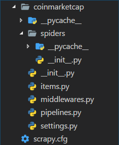
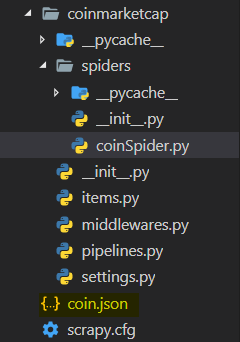
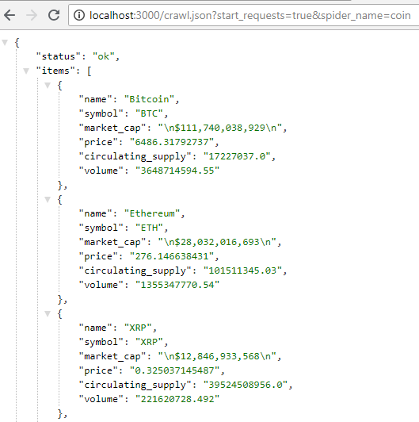

**Scrapy** is a free and *open-source* web crawling framework written in Python. With Scrapy we can send requests to websites and parse the HTML code received as response.

**Scrapyrt** (Scrapy realtime), we can create an HTTP server that can control Scrapy through HTTP requests. The response send by the server will be data formatted as JSON and it will contain the data scraped by Scrapy.

With the combination of these two tools, We can create an entire API without need a database.

##Set up Scrapy and create your spider

To install Scrapy we can use `pip`

```
pip install scrapy
```
Once the installation completed, you can start a Scrapy project by running:

```
scrapy startproject <project_name>
```

We will use an article from Medium.com as guide, for that we will use coinmarketcap.com

```
scrapy startproject coinmarketcap
```

We will scrape the URL: [https://coinmarketcap.com/all/views/all/](https://coinmarketcap.com/all/views/all/). It contains information about cryptocurrencies such as their current prices, their price variations, etc.

The goal is to collect those data with Scrapy and then to return them as JSON value with Scrapyrt.

the project folder structure should currently look like this:

{:.center}

## The First Spider

To create the new spider we need to create a new file in the spiders folder. 

>The file’s name doesn’t really matter, it should just represent what your spider is scraping. in this example we simply call it `coinSpider.py`.

First let’s create a class that inherits from scrapy.Spider.

```python 
import scrapy

class CoinSpider(scrapy.Spider):
``` 
A Spider class must have a `name` attribute. This element will help you to inform Scrapy which crawler you want to start.

```python 
import scrapy

class CoinSpider(scrapy.Spider):
    name = "coin"
``` 
Now we need to tell Scrapy what is the URL we want to send the request to. 
We’ll use `start_requests` method. This method will return the Scrapy request to the URL we want to crawl. 

```python 
import scrapy

class CoinSpider(scrapy.Spider):
    name = "coin"

    def start_requests(self):
        url = "https://coinmarketcap.com/all/views/all/"
        yield scrapy.Request(url=url, callback=self.parse)
``` 
The `scrapy.Request` function takes the URL we want to crawl as the first parameter and a callback function that will parse the response we’ll receive from the request.

Now we need to create that callback function

```python 
def parse(self, response):
        for row in response.css("tbody tr"):
            yield {
                "name": row.css("a.currency-name-container::text").extract_first(),
                "symbol": row.css("td.col-symbol::text").extract_first(),
                "market_cap": row.css("td.market-cap::text").extract_first(),
                "price": row.css("a.price::attr(data-usd)").extract_first(),
                "circulating_supply": row.css("td.circulating-supply span::attr(data-supply)").extract_first(),
                "volume": row.css("a.volume::attr(data-usd)").extract_first()
            }
``` 
Our parse method will go through each row of the table containing the cryptocurrency data that we want for our API. It then selects the wanted information using CSS selector.

The line `for row in response.css(“tbody tr”)` basically says “take the content of the response, select all the `<tr>` in the `<tbody>`, assign individually the content of each of them in the row variable”. The value of this variable would look like something like this for the first line of the table:

```html
<tr id="id-bitcoin" class="odd" role="row">
    <td class="text-center">
        1
    </td>
    <td class="no-wrap currency-name" data-sort="Bitcoin">
        <div class="s-s-1 logo-sprite"></div>
        <span class="currency-symbol visible-xs"><a class="link-secondary" href="/currencies/bitcoin/">BTC</a></span>
        <br class="visible-xs">
        <a class="currency-name-container link-secondary" href="/currencies/bitcoin/">Bitcoin</a>
    </td>
    <td class="text-left col-symbol">BTC</td>
    <td class="no-wrap market-cap text-right" data-usd="1.10882148223e+11" data-btc="17226975.0" data-sort="1.10882148223e+11">$110&nbsp;882&nbsp;148&nbsp;223</td>
    <td class="no-wrap text-right" data-sort="6436.54200598">
        <a href="/currencies/bitcoin/#markets" class="price" data-usd="6436.54200598" data-btc="1.0">$6&nbsp;436,54</a>
    </td>
    <td class="no-wrap text-right circulating-supply" data-sort="17226975.0">
        <span data-supply="17226975.0" data-supply-container="">17&nbsp;226&nbsp;975</span>
    </td>
    <td class="no-wrap text-right " data-sort="3666361510.97">
        <a href="/currencies/bitcoin/#markets" class="volume" data-usd="3666361510.97" data-btc="571144.12818">$3&nbsp;666&nbsp;361&nbsp;511</a>
    </td>
    <td class="no-wrap percent-change   text-right positive_change" data-timespan="1h" data-percentusd="0.01" data-symbol="BTC" data-sort="0.0133683">0,01%</td>
    <td class="no-wrap percent-change   text-right positive_change" data-timespan="24h" data-percentusd="0.65" data-symbol="BTC" data-sort="0.648688">0,65%</td>
    <td class="no-wrap percent-change   text-right positive_change" data-timespan="7d" data-percentusd="0.97" data-symbol="BTC" data-sort="0.974922">0,97%</td>
    <td class="more-options-cell dropdown" data-more-options="" data-cc-id="1" data-cc-slug="bitcoin">
        <button class="btn btn-transparent dropdown-toggle" type="button" id="dropdown-menu-1" data-toggle="dropdown">
            <span class="glyphicons glyphicons-more text-gray"></span>
        </button>
        <ul class="dropdown-menu dropdown-menu-right" role="menu" aria-labelledby="dropdown-menu-1">
        <li role="presentation"><a role="menuitem" tabindex="-1" href="#" data-watchlist-add="">Add to Watchlist</a></li>
        <li role="presentation"><a role="menuitem" tabindex="-1" href="#" data-watchlist-remove="" style="display: none;">Remove from Watchlist</a></li>
        <li class="disabled" role="presentation"><a role="menuitem" tabindex="-1" href="#" data-watchlist-full="" style="display: none;">Watchlist full!</a></li>
        <li role="presentation"><a role="menuitem" tabindex="-1" href="/currencies/bitcoin/#charts">View Chart</a></li>
        <li role="presentation"><a role="menuitem" tabindex="-1" href="/currencies/bitcoin/#markets">View Markets</a></li>
        <li role="presentation"><a role="menuitem" tabindex="-1" href="/currencies/bitcoin/historical-data/">View Historical Data</a></li>
        <li role="presentation"><a role="menuitem" tabindex="-1" href="https://payments.changelly.com/?crypto=BTC&amp;fiat=USD&amp;ref_id=coinmarketcap" target="_blank" rel="nofollow noopener">Buy / Sell Instantly</a></li>
        </ul>
    </td>
</tr>
```

We then loop through each row and apply one more CSS selector to extract the exact value that we want. For example; 
The name of the currency is contained in a link `<a>` which has the class `currency-name-container` assigned to it. By adding `::text` to the selector, we specify that we want the text between `<a>` and `</a>`. The method `.extract_first()` is added after the selector to indicate that we want the first value found by the parser.

We repeat the process with all the data we want to extract, and we then return them in a dictionary.

>Quick note: if the data that you want to extract is not between two HTML tags but in an attribute, you can use `::attr(<name_of_the_attribute>)` in the CSS selector. In our case we have `::attr(data-usd)` as an example.

So putting everything together the spider will look like:

```python
import scrapy

class CoinSpider(scrapy.Spider):
    name = "coin"

    def start_requests(self):
        url = "https://coinmarketcap.com/all/views/all/"
        yield scrapy.Request(url=url, callback=self.parse)
    
    def parse(self, response):
        for row in response.css("tbody tr"):
            yield {
                "name": row.css("a.currency-name-container::text").extract_first(),
                "symbol": row.css("td.col-symbol::text").extract_first(),
                "market_cap": row.css("td.market-cap::text").extract_first(),
                "price": row.css("a.price::attr(data-usd)").extract_first(),
                "circulating_supply": row.css("td.circulating-supply span::attr(data-supply)").extract_first(),
                "volume": row.css("a.volume::attr(data-usd)").extract_first()
            }
```

## Run the spider

Using the terminal and set our working directory in your Scrapy project folder. example:

`
C:\Users\BlackDesktop\Documents\Hero of Alexandria\006. [Scrapy] Create an API with Scrapy and Scrapyrt\coinmarketcap
`

To start the crawler and save the scraped data in a JSON file, run the following command:

`
scrapy crawl <name_of_the_spider> -o <output_file_name>.json
`

In our case:

`
scrapy crawl coin -o coin.json
`

The file coin.json should be created at the root of your coinmarketcap folder



It should contain the result scraped by the spider similar to the following format:

```json
[
{"name": "Bitcoin", "symbol": "BTC", "market_cap": "\n$111,793,976,147\n", "price": "6489.45341094", "circulating_supply": "17227025.0", "volume": "3643933075.18"},
{"name": "Ethereum", "symbol": "ETH", "market_cap": "\n$28,021,091,521\n", "price": "276.039836485", "circulating_supply": "101511042.311", "volume": "1356884351.47"},
{"name": "XRP", "symbol": "XRP", "market_cap": "\n$12,774,073,210\n", "price": "0.323193723266", "circulating_supply": "39524508956.0", "volume": "221046052.002"},
{"name": "Bitcoin Cash", "symbol": "BCH", "market_cap": "\n$9,107,466,682\n", "price": "526.167151135", "circulating_supply": "17309075.0", "volume": "291574904.596"},
  ...
```

##Install Scrapyrt and combine it with our project

Let’s now use Scrapyrt to serve those data through an HTTP request instead of having them saved in a JSON file.

To install scrapyrt we run

`
pip install scrapyrt
`

To use it, open your terminal again and set your working directory to the Scrapy project folder. Then run the following command:

`
scrapyrt -p <PORT>
`

`<PORT>` can be replaced with a port number. For example

`
scrapyrt -p 3000
`

With this command Scrapyrt will setup locally a simple HTTP server that will allow you to control your crawler.  We can access it with a `GET` request through the endpoint `http://localhost:<PORT>/crawl.json.` 

To work properly it also needs at least these two arguments: `start_requests (Boolean)` and `spider_name (string)`. to see the results we can open the browser on:

`
http://localhost:3000/crawl.json?start_requests=true&spider_name=coin
`

The result should look like this:


