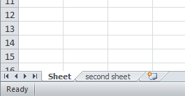
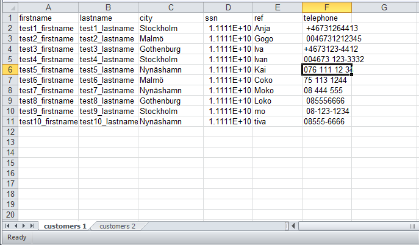
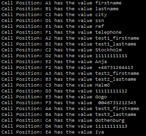
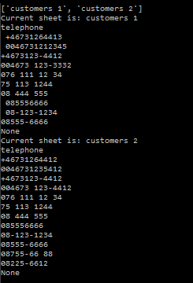

First we are going to create a csv file using the build-in csv module, after that we will proceed to use a third party library to create a xlsx file.

## Creating a CSV file

To be able to work with this type of file we are going to import CSV in the following way

```python
import csv
```

### CVS Module

the CVS module includes all necessary methods built-in some of which are:

* csv.reader  
* csv.writer  
* csv.DictReader  
* csv.DictWriter  

with this method we can edit, modify and manipulate the stored data in a csv file.

### Initial preparation 

First we will need to prepare the file so it can be run with `python namefile.py` for that we  add the `if __name__ == "__main__"`

```python
import csv


if __name__ = "__main__":
	main()
```

#### Name of the file, header and data

Now, we proceed to define some variables, the name of the file with `filename`, later the headers ( or the name of the columns) with `header` and provide some data with `data`

```python
import csv

filename = "imdb_top_4.csv"
header = ("Rank", "Rating", "Title")
data = [
(1, 9.2, "The Shawshank Redemption(1994)"),
(2, 9.2, "The Godfather(1972)"),
(3, 9, "The Godfather: Part II(1974)"),
(4, 8.9, "Pulp Fiction(1994)")
]


if __name__ = "__main__":
	main()

```

### Function to write on the file

The next step will be create a function that write the data on the file,
this function will have 3 parameters, `header`,`data`, and `filename`.
Inside this function we will write the first line of the file with the content of header, this will give the name to the columns and later with a `for` loop we will write the data.


```python

def writer(header,data,filename):
	with open(filename,"w",newline = " ") as csvfile:
		movies = cvs.writer(csvfile)
		movies.writerow(header)
		for x in data:
			movies.writerow(x)
```

so the full, first version of the script will be, notice that there is a call to the function `writer` after the variable `data` is defined.

```python
import csv

filename = "imdb_top_4.csv"
header = ("Rank", "Rating", "Title")
data = [
(1, 9.2, "The Shawshank Redemption(1994)"),
(2, 9.2, "The Godfather(1972)"),
(3, 9, "The Godfather: Part II(1974)"),
(4, 8.9, "Pulp Fiction(1994)")
]

writer(header, data, filename, "write")

def writer(header,data,filename):
	with open(filename,"w",newline = " ") as csvfile:
		movies = cvs.writer(csvfile)
		movies.writerow(header)
		for x in data:
			movies.writerow(x)


if __name__ = "__main__":
	main()

```

And the result will be like:

{: .center}

### Updating a CSV files

To update this type of file and in this case we will need to create a new function named '*updater*' that will just take the `filename` as a parameter.


```python
def updater(filename):
	with open(filename, newline= "") as file:
		readData = [row for row in csv.DictReader(file)]
		readData[0]['Rating'] = '9.4'

		readHeader = readData[0].keys()
		writer(readHeader,readData,filename,"update")
```

In this function:

1. We open the file define in `filename` and we are going to called it 'file'.
2. Save all the information from that file in a variable called `readData`,  [cvs.DictReader](https://docs.python.org/3/library/csv.html#csv.DictReader)
3. the next line `readData[0]['Rating'] = '9.4'` is hard-coding the value 9.4 in the 'Rating' column.
4. the last line will tell the function `writer` that we are executing an update ( this option is not yet define in the function `writer` that will be the next step)
5. finally we add a call to the function `uodater` after the call to the function `writer`

```python
import csv

filename = "imdb_top_4.csv"
header = ("Rank", "Rating", "Title")
data = [
(1, 9.2, "The Shawshank Redemption(1994)"),
(2, 9.2, "The Godfather(1972)"),
(3, 9, "The Godfather: Part II(1974)"),
(4, 8.9, "Pulp Fiction(1994)")
]

writer(header, data, filename, "write")
updater(filename)

def writer(header,data,filename):
	with open(filename,"w",newline = " ") as csvfile:
		movies = cvs.writer(csvfile)
		movies.writerow(header)
		for x in data:
			movies.writerow(x)
	# TODO option to update

def updater(filename):
	with open(filename, newline= "") as file:
		readData = [row for row in csv.DictReader(file)]
		readData[0]['Rating'] = '9.4'

		readHeader = readData[0].keys()
		writer(readHeader,readData,filename,"update")


if __name__ = "__main__":
	main()

```

#### Create the option for update

Now, we need to modify the function `writer` to be able to receive an extra parameter, and inside, some modifications to handle these options for "*write*"
and "*update*".

1. lets add the extra parameter, this will be called **option**

```python
def writer(header, data, filename, option):
	...
```

2. Inside we are going to create a decision loop to execute some part of the code depending of the the parameter **option** 

```python
def writer(header, data, filename, option):
	with open(filename, "w", newline = "") as csvfile:
		if option == "write":
			movies = csv.writer(csvfile)
			movies.writerow(headers)
			for x in data:
				movies.writerow(x)

		elif option == "update":
			writer = csv.DictWriter(csvfile, fieldnames = headers)
			writer.writeheader()
			write.writerow(data)
		else:
			print("option is not know")
```

More information about `DictWriter` [here](https://docs.python.org/3/library/csv.html#csv.DictWriter.writeheader) but basically here is use to write a row with the field names.

so with all this changes we will have a script that look like this: 

```python
import csv

filename = "imdb_top_4.csv"
header = ("Rank", "Rating", "Title")
data = [
(1, 9.2, "The Shawshank Redemption(1994)"),
(2, 9.2, "The Godfather(1972)"),
(3, 9, "The Godfather: Part II(1974)"),
(4, 8.9, "Pulp Fiction(1994)")
]


writer(header, data, filename, "write")
updater(filename)


def writer(header, data, filename, option):
	with open(filename, "w", newline = "") as csvfile:
		if option == "write":
			movies = csv.writer(csvfile)
			movies.writerow(headers)
			for x in data:
				movies.writerow(x)

		elif option == "update":
			writer = csv.DictWriter(csvfile, fieldnames = headers)
			writer.writeheader()
			write.writerow(data)
		else:
			print("option is not know")

def updater(filename):
	with open(filename, newline= "") as file:
		readData = [row for row in csv.DictReader(file)]
		readData[0]['Rating'] = '9.4'

		readHeader = readData[0].keys()
		writer(readHeader,readData,filename,"update")


if __name__ = "__main__":
	main()

```

## The xlsx File 


This will be an enhancement of the previous part, that doesn't mean previous part is not a solution, just that this solution will include [*openpyxl*](https://openpyxl.readthedocs.io/en/stable/)  which is a all in one solution to work with worksheets, loading, updating m renaming and deleting them.


### Basic terminology 

* WorkBook is the name for a an Excel file in `openpyxl`.
* A workbook consist of sheets( default is 1 sheet). sheets are referenced by their names.
* A Sheet consist of rows ( horizontal lines) starting from the number 1 and columns ( vertical lines) starting the letter A.
* Rows and columns result in a grid and form cells which may contain some data ( numerical or string value) or formulas.


## First Steps with openpyxl

First we need to install `openpyxl` this can be done using `pip`

```Bash
pip install openpyxl
```

For the most basic usage, this been creating a new workbook with just one sheet

### Create a workbook

To create a workbook we can use the function `Workbook()`

```python
from openpyxl import Workbook
wb = Workbook()
```
now, we need to create the first sheet, the following statement is just for the first sheet

```python
from openpyxl import Workbook
wb = Workbook()

ws = wb.active
```

by default the name of the sheet will be "sheet" and a number, so the first sheet will be "sheet", the second "Sheet1", etc. 

Now, we have the workbook and the first sheet, what about the second sheet?, To create the second sheet and all the following sheets, we use `create_sheet("name of the sheet")`

```python
from openpyxl import Workbook
wb = Workbook()

ws = wb.active
ws1 = wb.create_sheet("second sheet")
```

{: .center}

We can use the `create_sheet("name of the sheet")` and by defautl the sheet will be created after the previous sheet, but if we want to insert the sheet in a specific spot we can use `create_sheet("name of the sheet",0)` in this case this sheet will be insert in the first spot.

At any moment we can change the title of the sheet using `.title` as follow

```python
from openpyxl import Workbook
wb = Workbook()

ws = wb.active
ws1 = wb.create_sheet("second sheet")

#change the name of the first sheet
ws.title = "first sheet"
```
{: .center}


### Save the workbook

To save the workbook, first we need to give it a name `dest_filename = "name of the file"`, later, we use the function `save(filename="name of the workbook")`

```python
from openpyxl import Workbook

# Creating the workbook
wb = Workbook()

# the name of the file 
dest_filename = 'test_openpyxl.xlsx'

ws = wb.active
ws1 = wb.create_sheet("second sheet")

#change the name of the first sheet
ws.title = "first sheet"

wb.save(filename = dest_filename)
```

For more details or tutorial we can visit [openpyxl documentation](https://openpyxl.readthedocs.io/en/stable/tutorial.html)

> we just saw how to create a workbook, now, for this example, we are going to focus in manipulate a workbook that already exist, for that reason we will create one called "Customers1.xlsx" and continue working on it


### Working with xlsx files

Now, we are going to work with an existing file called "*customers1.xlsx*", this look like this:

{: .center}

The file contain 6 columns and 11 rows, We are going to import it and:

1. Print the sheets name
2. save the current sheet on the variable `current_Sheet`
3. print the value of the second column and 4 row (B4).

```python
import openpyxl as opxl

theFile = opxl.load_workbook('Customers1.xlsx')
print(theFile.sheetnames)
```
the result:

{: .center}

We got the file, and display the sheets names, now step 2 and 3, Save the current sheet in a variable and print the value of the cell B4.

```python
import openpyxl as opxl

theFile = opxl.load_workbook('Customers1.xlsx')
print(theFile.sheetnames)

current_sheet = theFile['customers 1']
print(current_sheet['B4'].value)
```

{: .center}


there is hardcoded values in this script which make it not that flexible, but we can make modifications in the future, for now we are going to do the following:

* Read the file
* Get all sheet names
* Loop through all sheets
* In the last step, the code will print values that are located in B4 fields of each found sheet inside the workbook.

```python
import openpyxl as opxl

the_File = opxl.load_workbook('Customers1.xlsx')
print(the_File.sheetnames)

all_sheets = the_File.sheetnames

for x in all_sheets:
	current_sheet = the_File[x]
	print(current_sheet['B4'].value)
```

Next, We will use the string `'ABCDEF'` to create a loop through the content of each sheet.

```python
import openpyxl as opxl

the_File = opxl.load_workbook('Customers1.xlsx')
print(the_File.sheetnames)

columns_marks = 'ABCDEF'

all_sheets = the_File.sheetnames

for x in all_sheets:
	current_sheet = the_File[x]
	for row in range(1, current_sheet.max_row + 1):
		for column in columns_marks:
			cell_name = "{}{}".format(column, row) # creat the structure B4 or C4 etc
			print("Cell Position: {} has the value {}".format(cell_name,current_sheet[cell_name].value))
```

{: .center}


### Rudimentary way to find content of a column 

The idea will be find the content of the column named "telephone" and display its content.
For that we will start by creating a function that will hold the loops, this loops will look row by row and column by column until we found the column named "telephone"

```python

def find_specific_cell():
	for row in range(1, current_sheet.max_row + 1):
		for column in columns_marks:
			cell_name = "{}{}".format(column,row)
			if current_sheet[cell_name].value == "telephone":
				return cell_name
```

now with the function, we can create a loop that iterate over the different sheets looking for the specific column that we are looking for

```python
for sheet in all_sheets:
	current_sheet =  the_File[sheet]
	print(find_specific_cell)
```

so the script including this new function will be:

```python
import openpyxl as opxl

the_File = opxl.load_workbook('Customers1.xlsx')
print(the_File.sheetnames)

columns_marks = 'ABCDEF'

all_sheets = the_File.sheetnames

def find_specific_cell():
	for row in range(1, current_sheet.max_row + 1):
		for column in columns_marks:
			cell_name = "{}{}".format(column, row) # create the structure B4 or C4 etc
			if  current_sheet[cell_name].value == "telephone":
				return cell_name

for sheet in all_sheets:
	print("Current sheet is: {}".format(sheet))
	current_sheet = the_File[sheet]
	print(find_specific_cell())
```

{: .center}

so, with few modification and the creation of the second functions we have 

```python 

import openpyxl as opxl

the_File = opxl.load_workbook('Customers1.xlsx')
print(the_File.sheetnames)

columns_marks = 'ABCDEF'

#adding all the sheets to this variable
all_sheets = the_File.sheetnames

def find_specific_cell():
	for row in range(1, current_sheet.max_row + 1):
		for column in columns_marks:
			cell_name = "{}{}".format(column, row) 
			if  current_sheet[cell_name].value == "telephone":
				return (cell_name,column)

def print_all(cell_name):
	_ , column_letter = cell_name
	for row in range(1, current_sheet.max_row +1):
		cell = column_letter + str(row)
		print(current_sheet[cell].value)

for sheet in all_sheets:
	print("Current sheet is: {}".format(sheet))
	current_sheet = the_File[sheet]
	cell = find_specific_cell()
	print(print_all(cell))
```


{: .center}


