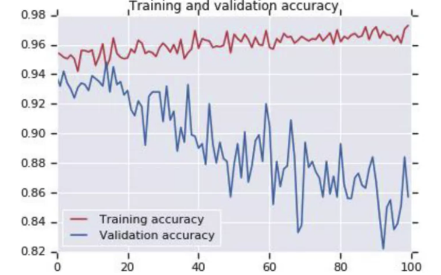

## Preparing pre-trained model

Transfer Learning is basically use pre-trained models as base for our models, those pre-trained models in most of the cases have been train with millions of samples and the have been improve for specialist in the field. In most of the cases use this transfer learning will reduce the implementation time and increase the value of the result obtained.

For this example we will use a model called **InceptionV3**

### The Inputs

We will need to do some manipulation of the model the layers of the pre-train model, we need to changes the weights as well as some layers, for that we need to import coupe things

```python
import os
from tensorflow.keras import layers
from tensorflow.keras import Model
```
### Import the pre-trained model
we need some new weight, in this case we can get those new weights from 
> https://storage.googleapis.com/mledu-datasets/inception_v3_weights_tf_dim_ordering_tf_kernels_notop.h5 

1. We will import the model.   
2. We will create a variable to hold the new pre-trained weights.  
3. Create the `pre_trained_model` be aware of `include_tope=False` and `weights=None`. Inception model has a dense connected layer on the top, and we dont need it so with `include_tope=False` we can remove that dense layer. `weights=None` tell the model that we will use our own weights.   

```python
import os

from tensorflow.keras import layers
from tensorflow.keras import Model

# This is to download the model to the colab environment 
!wget --no-check-certificate \
    https://storage.googleapis.com/mledu-datasets/inception_v3_weights_tf_dim_ordering_tf_kernels_notop.h5 \
    -O /tmp/inception_v3_weights_tf_dim_ordering_tf_kernels_notop.h5
  
from tensorflow.keras.applications.inception_v3 import InceptionV3

# Variable that hold the weights
local_weights_file = '/tmp/inception_v3_weights_tf_dim_ordering_tf_kernels_notop.h5'

#  get the pre-trained model without top layer or weights
pre_trained_model = InceptionV3(input_shape = (150, 150, 3), 
                                include_top = False, 
                                weights = None)
# add our own weights
pre_trained_model.load_weights(local_weights_file)
```
### Lock layers

Now, we don't need to retrained the layers on the pre_trained_model, so we need to lock that layer so they are not going to be trained, for that we will go layer by layer locking them up.

```python 
for layer in pre_trained_model.layers:
  layer.trainable = False
  
# pre_trained_model.summary()
```
## Adding our own code

To add our own code first we need to know which is the last layer, in this model the last layer is a convolution of $3x3$ but we can get other layers and use it as last layer, to do that we will use the names of the layers, yes the layers have a name, so we can get them using the names, in this, case we will use the layer called **`mixed7`**

```python
last_layer = pre_trained_model.get_layer('mixed7')
print('last layer output shape: ', last_layer.output_shape)
last_output = last_layer.output
```
### Defining a new model

To define the new model we will use the last layer of the previous steps and some new layers, few things to be aware of, we will use a slightly different syntax, but we will just adding new layers to the model. Once we have all the layers we will use the abstract class `Model` to create our new model.

```python
from tensorflow.keras.optimizers import RMSprop

# Flatten the output layer to 1 dimension
x = layers.Flatten()(last_output)
x = layers.Dense(1024, activation='relu')(x)
x = layers.Dense  (1, activation='sigmoid')(x)           

model = Model( pre_trained_model.input, x) 

model.compile(optimizer = RMSprop(lr=0.0001), 
              loss = 'binary_crossentropy', 
              metrics = ['accuracy'])
```
In the previous code: 

1. We flatten the last_output that is what is coming form the pre-trained model.  
2. Create a dense layer.   
3. Create a last Dense layer that will be the output of the whole model.  
4. Use the abstract class `Model` to create the new model, we pass the input of the pre-trained model and the layer definition we did in the previous steps.  

### Augmentation and fitting

We don't need to change anything form the augmentation and the fitting section.

> just a remainder of the augmentation we did before.
```python
train_datagen = ImageDataGenerator(rescale = 1./255.,
                                   rotation_range = 40,
                                   width_shift_range = 0.2,
                                   height_shift_range = 0.2,
                                   shear_range = 0.2,
                                   zoom_range = 0.2,
                                   horizontal_flip = True)
``` 

We will see that we are having an over-fitting case.
{.center}

## Dropout Layers

In some cases we will have some over-fitting after the image augmentation, so it is a good practice to have some Dropout Layers, this layer will randomly turn off and on some of the neurones in the layers, preventing the over-fitting.

> Dropout layers are **Regulazers**

the dropout layer will look like this: 
```python
x = layers.Dropout(0.2)(x)  
```
The `0.2`  tell the model to drop up to 20% of the neurons.

so the code will be: 

```python
# Flatten the output layer to 1 dimension
x = layers.Flatten()(last_output)
# Add a fully connected layer with 1,024 hidden units and ReLU activation
x = layers.Dense(1024,activation='relu')(x)
# Add a dropout rate of 0.2
x = layers.Dropout(0.2)(x)                  
# Add a final sigmoid layer for classification
x = layers.Dense(1, activation='sigmoid')(x)           

model = Model(pre_trained_model.input, x) 

model.compile(optimizer = RMSprop(lr=0.0001), 
              loss = 'binary_crossentropy', 
              metrics =['accuracy']) 

model.summary()
``` 

> the full model in this [Colab](https://colab.research.google.com/drive/1qngZFC62pVIDwXktxUqBrgzlPGW2Vh6U?usp=sharing)
>>>>>>> 34277d71620fd6e8b442837ae1bc3d161014df4e
