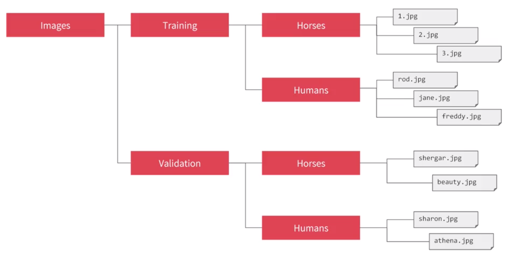

This part of the week we the course focus more in the convolutional Network, using as example the cats and dogs Kaggle competition.

## Dataset and file/directory structure

First we will need to organize the directory in such way that mimic the structure that we use in previous example


But in this case we will do it with the cats and dogs dataset.

### 1. Download the dataset 

First we need to download the dataset from kaggle ( [casts vs dogs dataset](https://www.kaggle.com/c/dogs-vs-cats)) 

This data set contain images of cats and dogs all in a single directory.

### 2. Reorganize the dataset in a specific directory structure

We want to re-organize the data to follow the structure:
```
cats-v-dogs
		|
		--> Training
				|
				--->dogs
				|
				--->cats 
		|
		--> Testing
				|
				--->dogs
				|
				--->cats 
```

For that we will make use of the `os` library and the `path.join()` and `os.mkdir()` functions  

## Regarding the code

###1. Libraries to import 

We will need several libraries but for the first step we will need something to get the Dataset .zip file, something to create the path and directories and something to copy the files to the new directory

1. `import os` It will allow use to make directories and create the paths
2. `import zipfile` allow use to handle .zip files
3. `from shutil import copyfile` allow use to copy files from one directory to other.

> `import random` we will use it later to randomize the samples, so later we can divide the dataset in training and test in the random way.

```python 
import os
import zipfile
import random
import tensorflow as tf
from tensorflow.keras.optimizers import RMSprop
from tensorflow.keras.preprocessing.image import ImageDataGenerator
from shutil import copyfile
``` 
We will use the `ImageDataGenerator` class just for re-scale the data but in the future we will use it to generate more data.

###2. Handle the zipfile

THis is going to use code use on colab and jupyter notebooks, this might be different if we are using just an script and running it locally.

```python 
!wget --no-check-certificate \
    "https://download.microsoft.com/download/3/E/1/3E1C3F21-ECDB-4869-8368-6DEBA77B919F/kagglecatsanddogs_3367a.zip" \
    -O "/tmp/cats-and-dogs.zip"

local_zip = '/tmp/cats-and-dogs.zip'
zip_ref = zipfile.ZipFile(local_zip, 'r')
zip_ref.extractall('/tmp')
zip_ref.close()
``` 
The content of the zip file will be "unzip" on the directory `/tmp`
