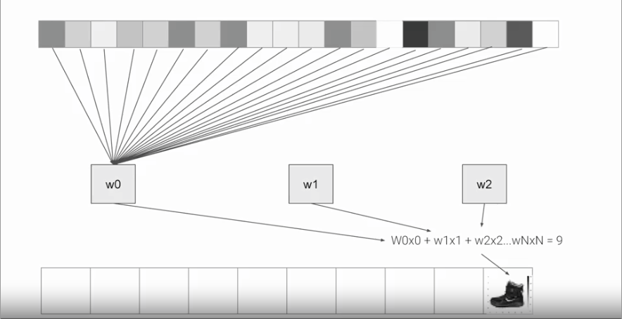

#Introduction to computer vision

so in the previous notes we use the numpy array as a way to provide the arrays for training the model, although in a real scenario, hard coding the data won't be possible, in the following example we are going to use a data set call [fashion-mnist](https://github.com/zalandoresearch/fashion-mnist) and since this is a data set with 60.000 example for training and 10.000 examples for testing we will need to load the data in a different way.

##Importing fashion-mnist using keras

Fortunately, it's still quite simple because Fashion-MNIST is available as a data set with an API call in TensorFlow. We simply declare an object of type MNIST loading it from the Keras database.

```python
fashion_mnist = keras.dataset.fashion_mnist
(train_images, train_label), (test_images, test_labels) = fashion_mnist.load_data()
```

We simply declare an object of type MNIST loading it from the Keras database. On this object, if we call the load data method, it will return four lists to us. That's the training data, the training labels, the testing data, and the testing labels.

##Input Shape

Here you saw how the data can be loaded into Python data structures that make it easy to train a neural network. 

 

The image is represented as a 28x28 array of greyscales, and how its label is a number. Using a number is a first step in avoiding bias -- instead of labelling it with words in a specific language and excluding people who don’t speak that language!

###Labels
Each training and test example is assigned to one of the following labels:

Label |	Description|
:----:|:----------:|
0	  | T-shirt/top|
1	  |	Trouser    |
2	  |	Pullover   |
3	  |	Dress      |
4	  |	Coat       |
5	  |	Sandal     |
6	  |	Shirt      |
7	  |	Sneaker    |
8	  |	Bag        |
9	  | Ankle boot |

## About the layers of the model

we will look at the code for the neural network definition. before we have just one layer, now we have three layers, the important think to look at are the first and the last layers.

```python
model = keras.Sequential([
	keras.layers.Flatten(input_shape=(28,28)),
	keras.layers.Dense(128, activation=tf.nn.relu),
	keras.layers.Dense(10, activation=tf.nn.softmax)])
```

The last layer has 10 neurons in it because we have ten classes of clothing in the dataset. They should always match. The first layer is a flatten layer with the input shaping 28 by 28, this is because the images are 28X28, so we're specifying that this is the shape that we should expect the data to be in. Flatten takes this 28 by 28 square and turns it into a simple linear array. 

The interesting stuff happens in the middle layer, sometimes also called a hidden layer. This is a 128 neurons in it, we can think these neurons as variables in a function. Maybe call them x1, x2 x3, etc.



if you then say the function was `y` equals `w1` times `x1`, plus `w2` times `x2`, plus `w3` times `x3`, all the way up to a `w128` times `x128` ($y = w_1x_1 +w_2x_2+w_3x_3+...+w_{128}x_{128}$). By figuring out the values of `w`, then `y` will be `9`, which is the category of the shoe.

We can check the exercise in the colab [A Computer Vision Example](https://gist.github.com/CubeVic/5b560b7106a25e31cddb5f53b8d3e0dc) 

## An Example of a script 

A full script will look like:

```python
import tensorflow as tfprint(tf.__version__)
#The Fashion MNIST data is available directly in the tf.keras datasets API. You load it like this:
mnist = tf.keras.datasets.fashion_mnist
(traning_images. training_labels),(test_images, test_labels) = mnist.load_data()
#You'll notice that all of the values in the number are between 0 and 255. If we are training a neural network, for various reasons it's easier if we treat all values as between 0 and 1, a process called 'normalizing'...and fortunately in Python it's easy to normalize a list like this without looping. You do it like this:

training_images  = training_images / 255.0
test_images = test_images / 255.0

model = tf.keras.models.Sequential([tf.keras.layers.Flatten(), 
                                    tf.keras.layers.Dense(128, activation=tf.nn.relu), 
                                    tf.keras.layers.Dense(10, activation=tf.nn.softmax)])
model.compile(optimizer = tf.train.AdamOptimizer(),
              loss = 'sparse_categorical_crossentropy',
              metrics=['accuracy'])

model.fit(training_images, training_labels, epochs=5)
# now let see how good is the model
model.evaluate(test_images, test_labels)
```

##Explanation of some Keywords  

* **Sequential:** That defines a SEQUENCE of layers in the neural network

* **Flatten:** Remember earlier where our images were a square, when you printed them out? Flatten just takes that square and turns it into a 1 dimensional set.

* **Dense:** Adds a layer of neurons

Each layer of neurons need an activation function to tell them what to do. There's lots of options, but just use these for now.

* **Relu** effectively means "If X>0 return X, else return 0" -- so what it does it it only passes values 0 or greater to the next layer in the network.

* **Softmax** takes a set of values, and effectively picks the biggest one, so, for example, if the output of the last layer looks like [0.1, 0.1, 0.05, 0.1, 9.5, 0.1, 0.05, 0.05, 0.05], it saves you from fishing through it looking for the biggest value, and turns it into [0,0,0,0,1,0,0,0,0] -- The goal is to save a lot of coding!

##Callback to stop the training 

first we will need to create the class `myCallback` 

```python
class myCallback(tf.keras.callback.Callback):
	"""docstring for myCallback"""
	def on_epoch_end(self,epoch,logs={}:
		if(logs.get('acc')>0.6):
			print("\n Reached 60% accuracy so cancelling training!")
			self.model.stop_training = True

```

Instantiate the myCallback class

```python
callbacks = myCallbacks()
```

now we can make changes in the `fit` function to add the callback

```python
model.fit(x_training,y_training, epochs=1-,callbacks=[callbacks])
```		

so the completed script will be:

```python
import tensorflow as tf

class myCallback(tf.keras.callbacks.Callback):
  def on_epoch_end(self, epoch, logs={}):
    if(logs.get('acc')>0.6):
      print("\nReached 60% accuracy so cancelling training!")
      self.model.stop_training = True

mnist = tf.keras.datasets.fashion_mnist

(x_train, y_train),(x_test, y_test) = mnist.load_data()
x_train, x_test = x_train / 255.0, x_test / 255.0

callbacks = myCallback()

model = tf.keras.models.Sequential([
  tf.keras.layers.Flatten(input_shape=(28, 28)),
  tf.keras.layers.Dense(512, activation=tf.nn.relu),
  tf.keras.layers.Dense(10, activation=tf.nn.softmax)
])
model.compile(optimizer='adam',
              loss='sparse_categorical_crossentropy',
              metrics=['accuracy'])

model.fit(x_train, y_train, epochs=10, callbacks=[callbacks])
```


