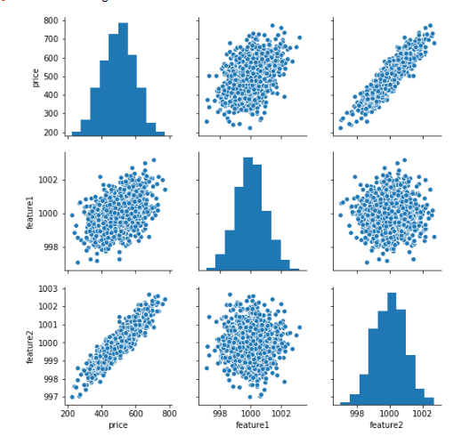

Artificial Neural Network

## Keras Syntax Basics 

Keras is now the main API to interact with TensorFlow 2.0 thus here we will take notes of the basic of this API, we will use the same example use in the Udemy course materials for sake of simplicity.

1. [Load the data](#load_the_data)
2. Explore the data
3. Split the data in test and training 
4. Normalize the data
5. import TensorFlow
6. Create a model
7. Training
8. Evaluation
9. Predict in brand new data
10. Saving and loading the model 

### Load the data

To load data we use pandas rather than keras, and to load it is as we saw before with `read_csv()`

so the code will be something like:

```python 
import pandas as pd

df = pd.read_csv('path/to/the/file')
``` 

### Explore the data

To explore the data we can use the different visualization libraries, example: 
* seaborn
* matplotlib

the code as and example will be 

```python 
import pandas as pd
import seaboran as sns
import matplatlib.pyplot as plt

df =  pd.read_csv('../DATA/fake_reg.csv')
sns.pairplot(df)


``` 

{:.center}


