Here we mentioned the very basics for the visualization tools, just enough to understand how Pandas plotting and Seaborn are built on top of Matplotlib.

##Matplotlib 

It is common to create an alias for Matplotlib as `plt` and that will in this way:

```python 
import matplotlib.pyplot as plt
``` 

Now, since Jupyter notebooks is the most common tool it is important to mentione that we need to add an extra line after importing matplotlib.pyplot. so a common import session of a file will look like:

```python 
import numpy as np
import pandas as pd

import matplotlib,pyplot as plt
``` 

### Simple plot

To simple plot we can use `plot(x,y)` but in jupyter notbooks we can add a ";" at the end so the matplotlib text wont be display

```python 
import numpy as np
import pandas as pd

import matplotlib,pyplot as plt

x = [0,1,2]
y = [100,200,300]

plt.plot(x,y)
#plt.plot(x,y);
``` 

> in a .py file we will need to add `plt.show()` in order to see the graph

we will create a DataFrame that we can use to plot

```python 
housing = pd.DataFrame({'rooms':[1,1,2,2,2,3,3,3],
                       'price':[100,120,190,200,230,310,330,305]})
``` 
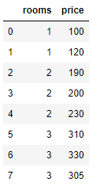{: .center}


If we use the normal plot this will display some straight line but if we use the `scatter` we will have dots in the x and Y points 

```python 
 plt.scatter(housing['rooms'],housing['price'])
``` 

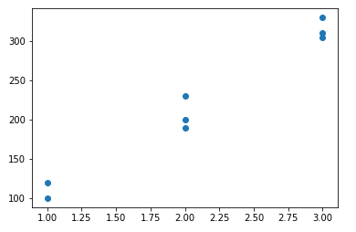{: .center}


#### Adding title and name to the axis 

1. we draw the plot `plt.plot(x,y)`
2. we put the title `plt.title('title')`
3. we name the axis `plt.xlabel('X Label'), plt.ylabel('Y Label')`

```python 
plt.plot(x,y)
plt.title('Title')
plt.xlabel('X Label')
plt.ylabel('Y Label')
``` 

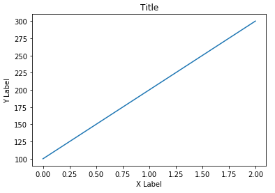{: .center}


#### Adding limits or changing the axis scale

We can limit or expand the limit of the graphic, in this case we want the previous plot axis to start 0 for X and 100 for Y and finish at 2 for X and 30 for Y.


```python 
ptl.plot(x,y)

#axis and ticks
plt.xlim(0,2)
plt.ylin(100,300)

#labeling
plt.title('Title')
plt.xlabel('X Label')
plt.ylabel('Y Label')
``` 

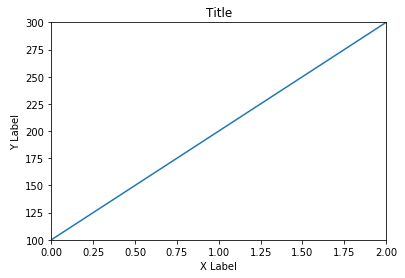{: .center}


#### Changing the markers

We can change the color and style of the line, but also we can change the style of the markets 

```python 
ptl.plot(x,y,color='red', marker='o', markersize=20,linestyle='--')

# Axis and Ticks
plt.xlim(0,20)
plt.ylim(100,300)

#labels
plt.title('Title')
plt.xlabel('X label')
plt.ylabel('y label')

``` 

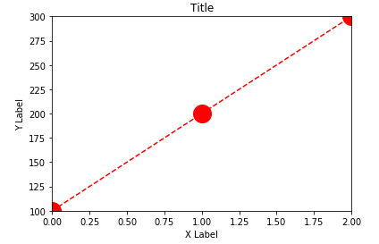{: .center}


## Seaborn

Seaborn is a library on top of Matplotlib that allow the creation of different charts and graphics with less code 


for the examples we will use a Csv file

```python
import pandas as pd
import matplotlib.pyplot as plt
import seaborn as sns

df = pd.read_csv('../DATA/heart.csv')
df.head()
```

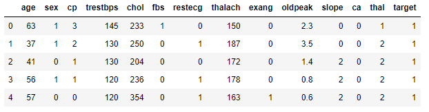{: .center}

### Distribution plots

```python 
sns.displot(df['age'])
``` 
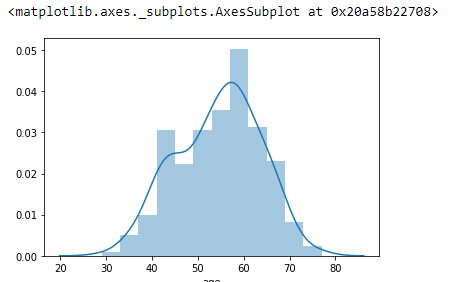{: .center}

####Resizing and modify seaborn plots

for resizing

```python 
plt.figure(figsize=(12,8))
sns.displot(df['age'])
``` 

to remove the KDE (Kernel Density Estimates)

```python 
sns.distplot(df['age'],kde=False)
``` 

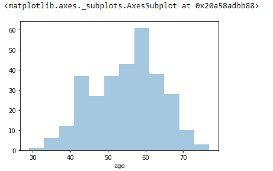{: .center}

similar to remove the histogram 

```python 
sns.distplot(df['age'],hist=False)
``` 
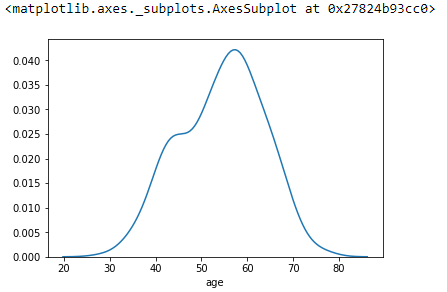{: .center}


to change the color

```python 
sns.distplot(df['age'],kde=False,bins=40,color='red')
``` 

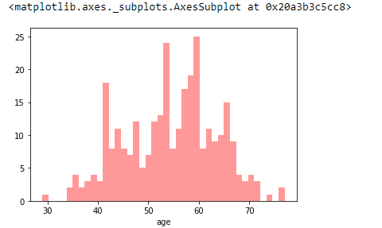{: .center}

we can limit the axis in seaborn as we limit the axis in matplotlib

```python 
sns.distplot(df['age'],kde=False,bins=40,color='green')
plt.xlim(50,60)
``` 
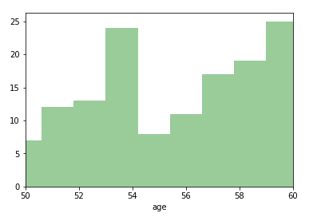{: .center}

### Count plot

From the same csv file

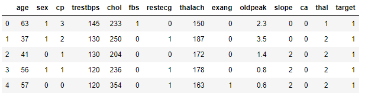{: .center}

```python 
sns.countplot(x='sex',data=df)
``` 
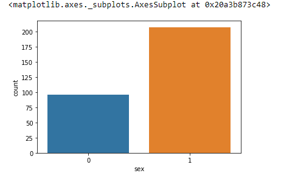{: .center}

```python 
sns.countplot(x='cp',data=df)
``` 
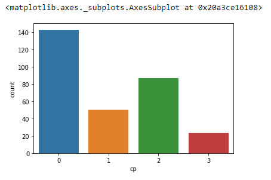{: .center}

and we can use `hue` to add more information 

```python 
sns.countplot(x='cp',data=df,hue='sex')
``` 
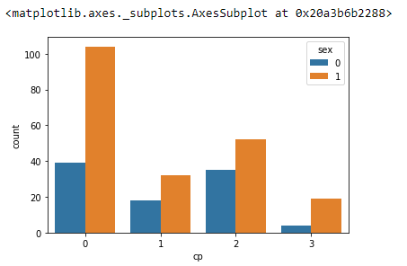{: .center}

we can change the color ( there are predefine color [colormaps](https://matplotlib.org/3.1.0/tutorials/colors/colormaps.html))

```python 
sns.countplot(x='cp',data=df,palette='terrain')
``` 

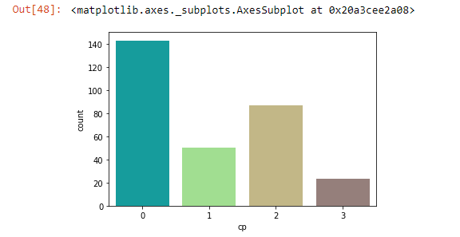{: .center}

### Box Plot

{: .center}

```python 
sns.boxplot(x='target',y='thalach',data=df)
``` 

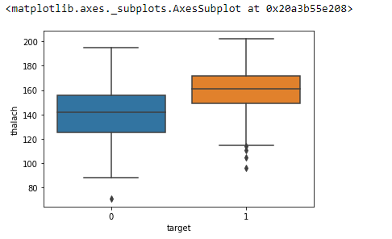{: .center}

and in the same way that with count plots we can use the hue to add more information to the Box plot

```python 
sns.boxplot(x='target',y='thalach',data=df, hue='sex')
``` 

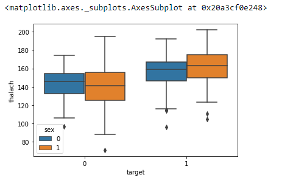{: .center}