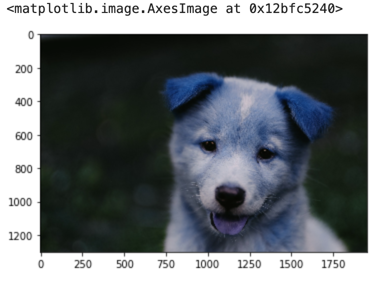
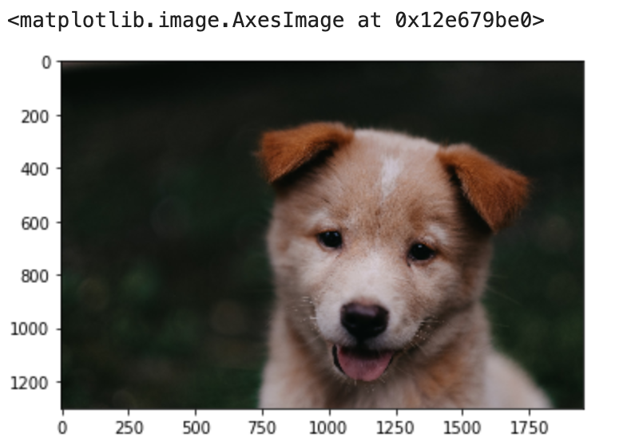
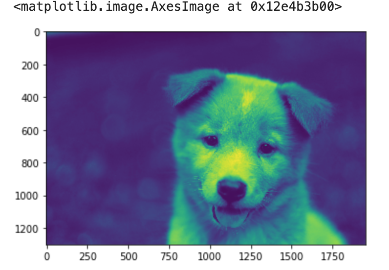
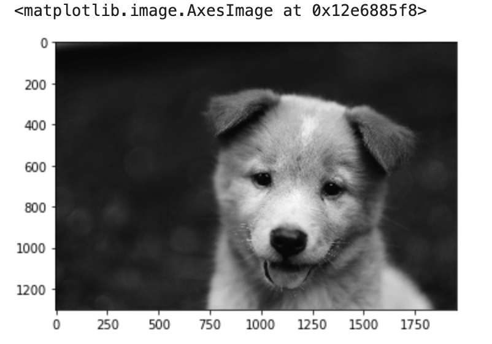
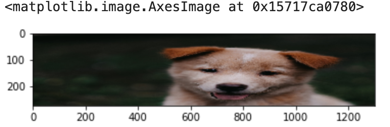
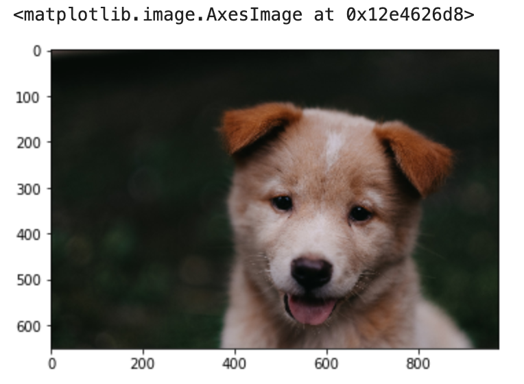
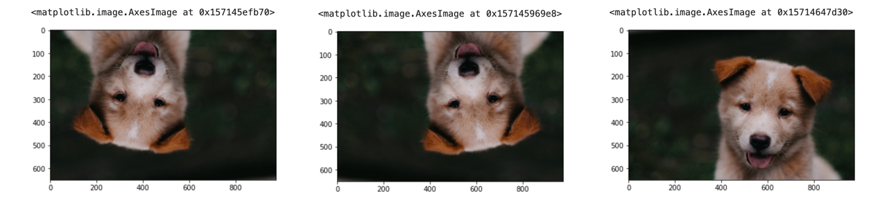

OpenCV or Open source computer vision is a library written in C++ although for the purpose of this notes we are going to use the python bindings.

## Importing and possible errors

To import the library we can use `cv2`

```python
import cv2
```

now to load an image we need to have the correct path to it, otherwise we can generate an error that will be difficult to fine. If for some reason we add the wrong path, we wont get an error message instead `None`

```python 
img = cv2.imread('some/wrong/path.png')
print(img)
# None
type(img)
# NoneType
```

now, lets load from a correct path

```python
img = cv2.imread('../DATA/00-puppy.jpg')
type(img)
# numpy.ndarray
img
array([[[78, 81, 95],
        [80, 83, 97],
        [81, 84, 98],
        ...,
        [22, 27, 25],
        [22, 27, 25],
        [22, 27, 25]],

       [[78, 81, 95],
        [79, 82, 96],
        [79, 82, 96],

        ...,
        [22, 30, 23],
        [23, 31, 24],
        [23, 31, 24]]], dtype=uint8)

img.shape
# (1300, 1950, 3)
```
so this `imread` gave me a Numpy.narray with 3 color channels

## Color Correction

Now that we have the correct image, or rather the correct path, we have the image loaded, but when we display it 

```python
img_bgr = cv2.imread('../DATA/00-puppy.jpg')
plt.imshow(img_bgr)
```


The image has been correctly loaded by openCV as a numpy array, but the color of each pixel has been sorted as BGR. Matplotlib's plot expects an RGB image so, for a correct display of the image, it is necessary to swap those channels

for this, we can use a build-in function 
```python
img_rgb = cv2.cvtColor(img, cv2.COLOR_BGR2RGB)
```

in this case we are going to use `cvtColor` to transform from BGR to RGB, we pass first the image `img`, later the type of conversion `cv2.COLOR_BGR2RGB`



## Load Image to a Specific Color Map

We can use opencv to load an image to a specific color channel, in this case we want to import it as a gray scale image

```python
img_gray = cv2.imread('../DATA/00-puppy.jpg',cv2.IMREAD_GRAYSCALE)
plt.imshow(img_gray)
```



so in this case we have have the default color mapping but this is not the gray scale we wanted, we need to be specific to `plt` to map the image to gray-scale

```python
img_gray = cv2.imread('../DATA/00-puppy.jpg',cv2.IMREAD_GRAYSCALE)
plt.imshow(img_gray, cmap='gray')
```



##Resizing and Flipping the Image

First we need to remember what is the shape of the image

```python
img_rgb.shape
# width, height, color channels
```

now, we can use resize to change the size of the image

```python
img =cv2.resize(img_rgb,(1300,275))
plt.imshow(img)
```



### By Ratio

Here we will use the ratio

```python
w_ratio = 0.5
h_ratio = 0.5
new_img =cv2.resize(img_rgb,(0,0),img,w_ratio,h_ratio)
plt.imshow(new_img)
```


### Flipping Images

```python
# Along central x axis
new_img = cv2.flip(new_img,0)
# Along central y axis
new_img = cv2.flip(new_img,1)
# Along both axis
new_img = cv2.flip(new_img,-1)
plt.imshow(new_img)
```


## Saving Image Files

```python
type(new_img)
#numpy.ndarray
cv2.imwrite('my_new_picture.jpg',new_img)
#True
```
Keep in mind, the above stored the BGR version of the image.

## Drawing Images

We start by making a canvas, we are going to create an array that will serve as it.

```python
import numpy as np
import matplotlib.pyplot as plt
%matplotlib inline
import cv2

blank_img = np.zeros(shape=(512,512,3),dtype=np.int16)
blank_img.shape
plt.imshow(blank_img)
```


