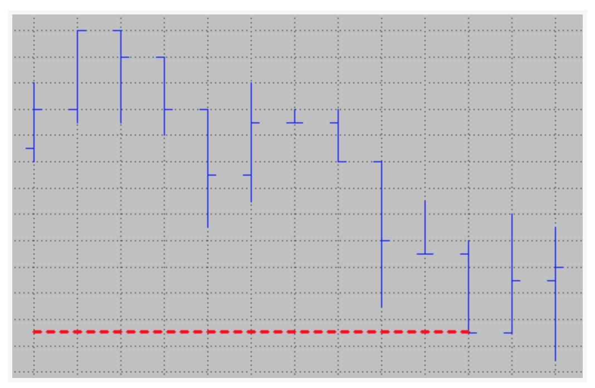
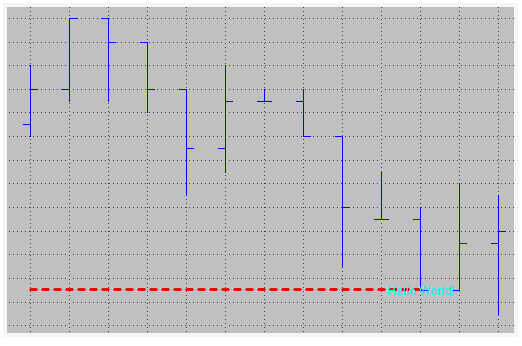
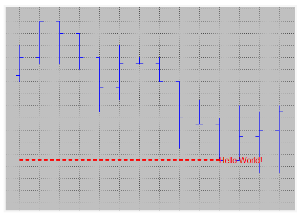
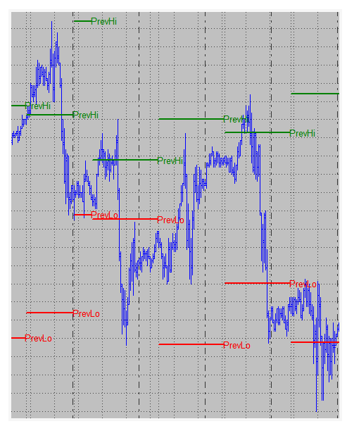

To demonstrate how to make lines and text in easylanguage(powerlanguage) we can create a study which goal is to track the daily extremes and to **display** them on the chart. We want to be able to see the current extremes for the day and also show yesterday’s extremes on today’s data. 

* We need to be able to find the **highest high** and **lowest low** for each day
* The study should use trendlines to display yesterday’s extremes
* We want to be able to change the appearance on the chart via inputs
* The study should display text on the chart that labels the lines

## Simple Program Logic

* Track daily high and low with a variable throughout the day
* Store the previous daily extremes on a new day and reset the tracking variables
* Draw text and trendlines for the previous extremes on today’s data and update it with every new bar
* Add inputs to be able to conveniently change the text and trendline looks (color, size etc.)

## Trendlines

Each Trendline has his own ID assigned automatically by Multicharts, to create a new trendline we need to use `TL_New` follow by 6 parameters, bellow we will create a variable to store the ID and we will name the different parameter, just to make it easier to read

```
TLID = TL_New(StartDate, StartTime, StartValue, EndDate, EndTime, EndValue);
```

so a simple code that will draw a horizontal line will be

```
Variables:
            TLID            (-1) // can be 0 but just for debugging we use -1

once
    begin
        // draw a trendline spacing over eleven bars
        TLID = TL_New(Date[10], Time[10], Close, Date, Time, Close);
    end;
```

the result will be something like:


there are some characteristics of the line that we can change, those will be:

* Color: TL_SetColor(TLID, Color);
* Size: TL_SetSize(TLID, size); size will be from 0 to 6
* Style: TL_SetStyle(TLID, Style) for the style we have 5 different types, we can use reserve words or numbers as bellow


so let see how the statement change after adding this settings

```
TLID =  TL_New(Date[10], Time[10], Close, Date, Time, Close);
        TL_SetColor(TLID, red);
        TL_SetSize(TLID,2);
        TL_SetStyle(TLID,2); // 2 can be change for Tool_Dashed
```

and the result will be similar to this:




## Text

Similar to the trendlines, the text will need an anchor point, as well as the trendlines each text will have an ID and some parameter, thus the structure will be like:

```
TxtID = Text_New(TextDate, TextTime, TextPrice, TextString);
```

so our script will be 

```
Variables:
            TLID            (-1) // can be 0 but just for debugging we use -1
            TxtID			(-1)

once
    begin
        // draw a trendline spacing over eleven bars
        TLID =  TL_New(Date[10], Time[10], Close, Date, Time, Close);
        TL_SetColor(TLID, red);
        TL_SetSize(TLID,2);
        TL_SetStyle(TLID,2); // 2 can be change for Tool_Dashed

        TxtID = Text_New(Date, Time, Close, "Hello World");
    end;
```

then the result will be 



Like the trendlines we can modify the text style, position and color, we do this with:

* Color: Text_SetColor(TxtID, red)
* Size: Text_Setsize(TXtID, 12)
* Style: Text_SetStyle(TxtID, Horizontal_point, Vertical_point)

The horizontal placement parameter can have three values:

* 0 – will place the text to the right of the bar
* 1 – will place the text to the left of the bar
* 2 – the text will be centered on the bar

The vertical placement parameter can have three different values, too:

* 0 – will place the text under the specified price value
* 1 – the text will be above the price value
* 2 – will center the text on the price

The code will be:


```
Variables:
			VertTxtP1		(2 )
			HorizTxtP1		(0 )
            TLID            (-1) // can be 0 but just for debugging we use -1
            TxtID			(-1)

once
    begin
        // draw a trendline spacing over eleven bars
        TLID =  TL_New(Date[10], Time[10], Close, Date, Time, Close);
        TL_SetColor(TLID, red);
        TL_SetSize(TLID,2);
        TL_SetStyle(TLID,2); // 2 can be change for Tool_Dashed

        TxtID = Text_New(Date, Time, Close, "Hello World");
        Text_SetColor(TxTID, red);
        Text_Setsize(TxtID, 12);
        Text_SetStyle(TxtID, HorizTxtP1, VertTxtP1);
    end;
```

And we will have as a result:



## The study 

```
Inputs:
		HighTLColor			(darkgreen),
		LowTLColor			(red),
		TLSize 				(1),
		TLStyle 			(1),
		HighTextColor		(darkgreen),
		LowTextColor		(red),
		TextSize 			(10);

variable:
		VertTxtP1			(2),
		HorizTxtP1			(0),
		HaveTextAndLines	(false),
		DayHigh				(High),
		DayLow				(Low),
		PrevDayHigh			(0),
		PrevDayLow			(0),
		HiTxt 				(-1),
		LoTxt 				(-1),
		HiTL 				(-1),
		LoTL 				(-1);

//Reset on a date change

if Date <> Date[1] ten
begin
	// save previous extremes
	PrevDayHigh = DayHigh;
	PrevDayLow	= DayLow;

	// get the high and low of the day
	DayHigh = High;
	DayLow = Low;

	// variable just to make sure the lines and text exist
	HaveTextAndLines = true;

	// Create the trendlines
	HiTL = 	TL_New(Date, Time, PrevDayHigh, Date, Time, PrevDayHigh);
        	TL_SetColor(HiTL, HighTLColor);
        	TL_SetSize(HiTL,TLSize);
        	TL_SetStyle(HiTL, TLStyle);

	LowTL = TL_New(Date, Time, PrevDayLow, Date, Time, PrevDayLow);
        	TL_SetColor(LoTL, LowTLColor);
        	TL_SetSize(LoTL, TLSize);
        	TL_SetStyle(LoTL, TLStyle);

    HiTxt = Text_New(Date, Time, PrevDayHigh, "PrevHi");
        Text_SetColor(HiTxt, HighTextColor);
        Text_Setsize(HiTxt, TextSize);
        Text_SetStyle(HiTxt, HorizTxtP1, VertTxtP1);

    LowTxt = Text_New(Date, Time, PrevDayLow, "PrevLow");
        Text_SetColor(LowTxt, LowTextColor);
        Text_Setsize(LowTxt, TextSize);
        Text_SetStyle(LowTxt, HorizTxtP1, VertTxtP1);
end;
```

Now we are going to use some reserve word to finish or end the Trendlines and set the text location

for the Trendlines:

```
TL_SetEnd(TLID, TL_End_Date, TL_End_Time, TL_End_Price);
```

and the text location

```
Text_SetLocation(TextID, Text_Bar_Date, Text_Bar_Time, Text_Bar_price)
```

We will use the boolean variable “HaveTextAndLines” to make sure that we only try to update a text or trendline when it’s ensured that at least one set of text and trendlines exists.

```
if HaveTextAndLines then
begin
	// update the trandline endpoint
	TL_SetEnd(HiTL, Date, TIme, PrevDayHigh);
	TL_SetEnd(LoTL, Date, Time, PrevDayLow);

	//Update text to the new location
	Text_SetLocation(HiTxt, Date, Time, PrevDayHigh);
	Text_SetLocation(LoTxt, Date, Time, PrevDayLow);
end;

// Update the variable tracking the higher high

if High > DayHigh then
	DayHigh = High;

// Update the Variable Tracking the lowest low

if Low < DayLow then
	DayLow = Low;
```

