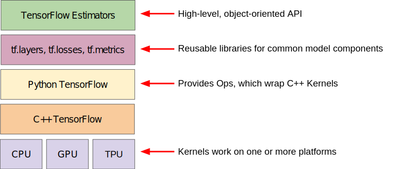

TensorFlow provide different type of toolkits to construct models in a variety of levels of abstraction. It can be a lower_level  with mathematical operations or a higher level with predefine architectures.




| Tollkit                           | Description                            |
|:----------------------------------|:---------------------------------------|
| Estimator (tf.estimator)	        | High-level, OOP API.                   |
| tf.layers/tf.losses/tf.metrics	| Libraries for common model components. |
| TensorFlow	                    | Lower-level APIs                       |


Similar to how Python has and interpreter that can run in multiple hardware to run python code, TensorFlow can run the graph on multiple hardware platforms, including CPU, GPU, and TPU.


Here will be an example of pseudo code of a linear classification program using tf.estimator

```
import tensorflow as tf

# Set up a linear classifier.
classifier = tf.estimator.LinearClassifier(feature_columns)

# Train the model on some example data.
classifier.train(input_fn=train_input_fn, steps=2000)

# Use it to predict.
predictions = classifier.predict(input_fn=predict_input_fn)
```

>
**Tensor:** 
The primary data structure in TensorFlow programs. Tensors are N-dimensional (where N could be very large) data structures, most commonly scalars, vectors, or matrices. The elements of a Tensor can hold integer, floating-point, or string values.
