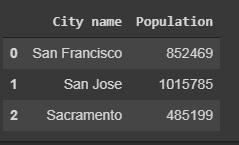
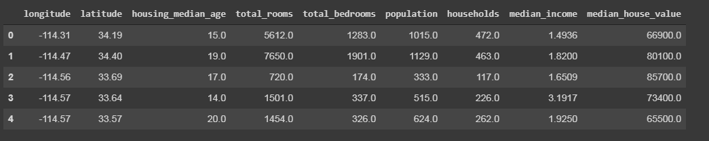
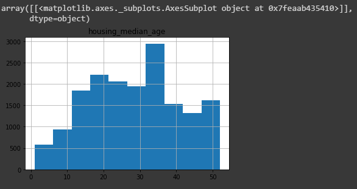

[pandas](http://pandas.pydata.org/pandas-docs/stable/index.html) is a column-oriented dataanalysis API

## Basic Concepts

first we need to import it

```python

from __future__ import print_function

import pandas as pd
pd.__version__

```

The primary data structure in pandas are inmplemented in two classes:

* **DataFrame**, similar to a relational data table, row and columns
* **Series**, single column, DataFrame contains one or more **Series** and a name for each **Series**.

for example a **Series** will be:

```python
pd.Series(['San Fransisco','San Jose', 'Sacramento'])
```

And **DataFrame** can be created similar to `dict` in this case we will have the key, a `String` that serve as column name, and the **series** that will be the content, if we have more than one series  and this series dont mach the length, missing values are filled with special `NA/NaN`

```python
city_names = pd.Series(['San Fransisco','San Jose', 'Sacramento'])
population = pd.Series([852469, 1015785, 485199])

pd.DataFrame({'City name': city_names, 'Population': population})
```



we can load information from a file directly to a DataFrame

```python
california_housing_dataframe = pd.read.csv("https://download.mlcc.google.com/mledu-datasets/california_housing_train.csv", sep = ',')
```
Now to display this information we can use different ways:

```python
california_housing_dataframe.describe()
california_housing_dataframe.head()
```

`describe()` will desplay some stadistics about this DataFrame, and `head()`display few of the first records,
here is what we see with `head()`



now we can use the information that we load to the DataFrame to create a graph, we are going to use `hist()`:

```python
california_housing_dataframe.hist('housing_median_age')
```




## Accessing Data

To access the data on the DataFrame we can use familiar dict/list operations:

```python
cities = pd.DataFrame({'City name': city_names, 'Population': population})
print(type(cities['City name']))
# <class 'pandas.core.series.Series'>
cities['Ciy name']
# 0    San Francisco
# 1         San Jose
# 2       Sacramento
# Name: City name, dtype: object
```

in the code above we access the entire Series, now we can access a single item of that series

```python
print(type(cities['city name'][1]))
# <type 'str'>
cities['city name'][1]
# 'San Jose'
```

