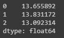
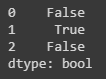
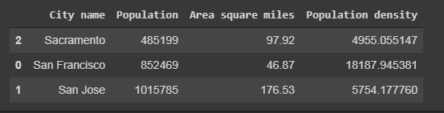
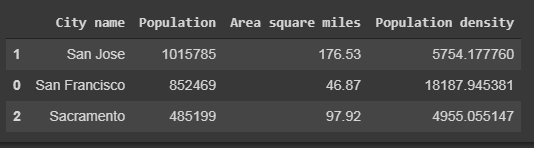

[pandas](http://pandas.pydata.org/pandas-docs/stable/index.html) is a column-oriented dataanalysis API

## Basic Concepts

first we need to import it

```python

from __future__ import print_function

import pandas as pd
pd.__version__

```

The primary data structure in pandas are inmplemented in two classes:

* **DataFrame**, similar to a relational data table, row and columns
* **Series**, single column, DataFrame contains one or more **Series** and a name for each **Series**.

for example a **Series** will be:

```python
pd.Series(['San Fransisco','San Jose', 'Sacramento'])
```

And **DataFrame** can be created similar to `dict` in this case we will have the key, a `String` that serve as column name, and the **series** that will be the content, if we have more than one series  and this series dont mach the length, missing values are filled with special `NA/NaN`

```python
city_names = pd.Series(['San Fransisco','San Jose', 'Sacramento'])
population = pd.Series([852469, 1015785, 485199])

pd.DataFrame({'City name': city_names, 'Population': population})
```


we can load information from a file directly to a DataFrame

```python
california_housing_dataframe = pd.read.csv("https://download.mlcc.google.com/mledu-datasets/california_housing_train.csv", sep = ',')
```
Now to display this information we can use different ways:

```python
california_housing_dataframe.describe()
california_housing_dataframe.head()
```

`describe()` will display some statistics about this DataFrame, and `head()`display few of the first records,
here is what we see with `head()`


now we can use the information that we load to the DataFrame to create a graph, we are going to use `hist()`:

```python
california_housing_dataframe.hist('housing_median_age')
```


## Accessing Data

To access the data on the DataFrame we can use familiar dict/list operations:

```python
cities = pd.DataFrame({'City name': city_names, 'Population': population})
print(type(cities['City name']))
# <class 'pandas.core.series.Series'>
cities['Ciy name']
# 0    San Francisco
# 1         San Jose
# 2       Sacramento
# Name: City name, dtype: object
```

in the code above we access the entire Series, now we can access a single item of that series

```python
print(type(cities['city name'][1]))
# <type 'str'>
cities['city name'][1]
# 'San Jose'
```

or 

```python
print(type(cities[0:2]))
# <class 'pandas.core.frame.DataFrame>
cities[0:2]
#' 	City name	Population
# 0	San Francisco	852469
# 1	San Jose	1015785
```

## Manipulating Data

We can use the python arithmetics to interact with the pandas data types

```python
population / 1000.
```

we can use series as arguments of a Numpy function

```python
import numpy as np

np.log(population)
```



In similar to how in python we use `map()` to perform a transformation of a set of data, we can use `Series.apply()` and `lambda` as arguments 

```python
population.apply(lambda val:val> 1000000)
```
in this case we will get back true or false if the population value of a city is bigger than $1000000$



to modify DataFrames we can do it in a easy way

```python
cities['Area square miles'] = pd.Series([46.87, 176.53, 97.92])
cities['Population density'] = cities['Population'] / cities['Area square miles']
cities
#    City name	Population	Area square miles	Population density
# 0	San Francisco	852469	46.87	             18187.945381
# 1	San Jose	    1015785	176.53	             5754.177760
# 2	Sacramento	    485199	97.92	             4955.055147
```

## Indexes

Both Series and DataFrame objects also define an index property that assigns an identifier value to each Series item or DataFrame row.

By default, at construction, pandas assigns index values that reflect the ordering of the source data. Once created, the index values are stable; that is, they do not change when data is reordered.

```python
city_names.index
# RangeIndex(start=0, stop=3, step=1)
cities.index
# RangeIndex(start=0, stop=3, step=1)
```

Call DataFrame.reindex to manually reorder the rows. For example, the following has the same effect as sorting by city name:

```python
cities.reindex([2, 0, 1])
```


Reindexing is a great way to shuffle (randomize) a DataFrame. In the example below, we take the index, which is array-like, and pass it to NumPy's random.permutation function, which shuffles its values in place.

```python 
cities.reindex(np.random.permutation(cities.index))
```

