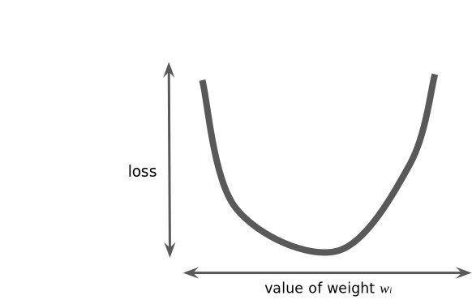
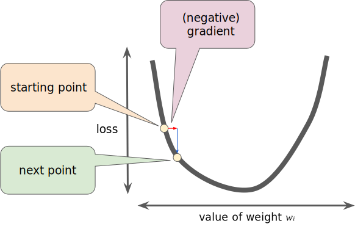
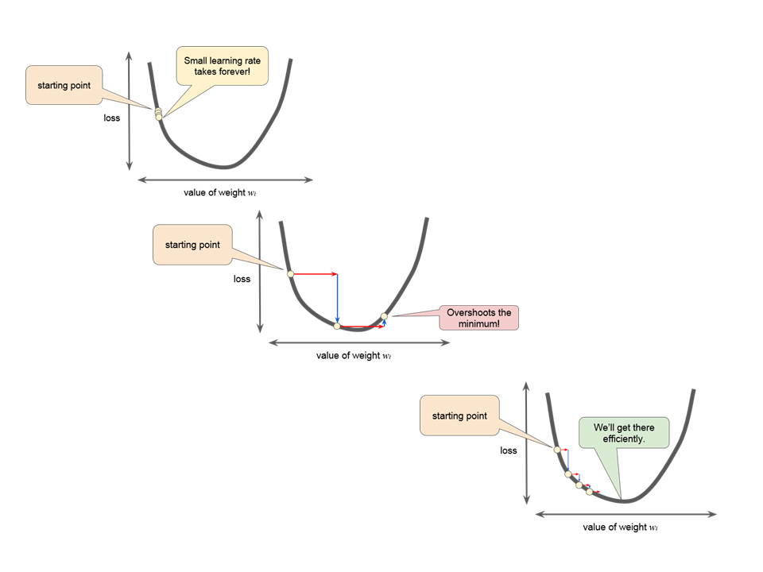

Previously, we mentioned the concept of *loss*, now we are going to see how ML model iteratively reduce the loss.

the figure suggest the iterative _trial-and-error_ process that machine learning algorithms use to train a model:

This iterative approach is use in ML, and basically will work as a Trial and Error, the machine will guess a number, it will calculate the loss and will make adjustment to the wight and bias accordingly. This iterative strategy prevalent in machine learning, primary because they scale so well to large data sets.

The "model" take one or more feature as input and return one prediction $y'$ as output:

$$
y' = b + w_1x_1
$$
 
For lineal regression problems the values to start are not important, in this example we can pick, $b = 0$, $w_1 = 0$, and assuming the first feature value is 10, the prediction yields:

$$
y' = 0 + 0(10)
y' = 0
$$

So $y'$ will be the prediction. The "Compute Loss" part of the diagram is the *loss function* that the model use. Suppose we use the squared loss function. The loss function takes in two inputs values:

* $y'$: The model's prediction for feature x.
* $y$: The correct label corresponding to feature x.

Finally the last part of the diagram the "Compute parameter updates" is here where the ML system examines the value of the loss function and generate new values for $b$ and $w_1$, for the moment less assume that the job of this box is to provide new values for the next iteration, and the learning continue iterating until the algorithm discovers the model parameters with the lowest possible loss. Usually, we will iterate until the loss stop changing or at least changes extremely slowly. when that happen, we say that the model has **converged**.

>A Machine Learning model is trained by starting with an initial guess for the weights and bias and iteratively adjusting those guesses until learning the weights and bias with the lowest possible loss.

## Gradient Descent

in the first diagram we have a box called "Compute parameter updates", lets suppose we have the time to calculate all the possible values of $w_1$ for the type of regression exercises mentioned until now, the resulting plot of loss vs $w_1$ will be:

For this type of bowl-shape problems is easier to find the minimum loss, in order to make efficient the process we can use a mechanism called **gradient descent** instead of calculate the loss function for every single $w_1$ point.

The first step will be to pick a starting value, the starting value is not important at this point, then the algorithm calculate the gradient of the loss at that point, the result will be a derivative(slope) of the curve that will tell you how close or far is this point from the minimum loss point (or the converge point).

The gradient is a vector, thus has "a direction", and " a Magnitude", the gradient points in the direction where the loss increase, so the gradient descent algorithm points to the direction where the loss is reduce.

To determine the next point along the loss function curve, the gradient descent algorithm adds some fractions of the gradient's magnitude to the stating point.

## Learning Rate

The Gradient descent algorithm multiply the gradient by a scalar knows as the **Learning Rate** or **Step size**  to determinate the next point, For example, if the gradient magnitude is 2.5 and the learning rate is 0.01, then the gradient descent algorithm will pick the next point 0.025 away from the previous point.

it is important to find the right Learning rate to don't overshot the minimum or a so small learning rate that will take for ever reach the converge point.

## Stochastic Gradient Descent

a batch is the total number of examples you use to calculate the gradient in a single iteration, A large data set with randomly sampled examples probably contains redundant data. In fact, redundancy becomes more likely as the batch size grows. Some redundancy can be useful to smooth out noisy gradients, but enormous batches tend not to carry much more predictive value than large batches.

By choosing examples at random from our data set, we could estimate a big average from a much smaller batch **Stochastic gradient descent** (**SGD**) takes this idea to the extreme--it uses only a single example (a batch size of 1) per iteration. Given enough iterations, SGD works but is very noisy. The term "stochastic" indicates that the one example comprising each batch is chosen at random.

**Mini-batch stochastic gradient descent** (**mini-batch SGD**) is a compromise between full-batch iteration and SGD. A mini-batch is typically between 10 and 1,000 examples, chosen at random. Mini-batch SGD reduces the amount of noise in SGD but is still more efficient than full-batch.

    