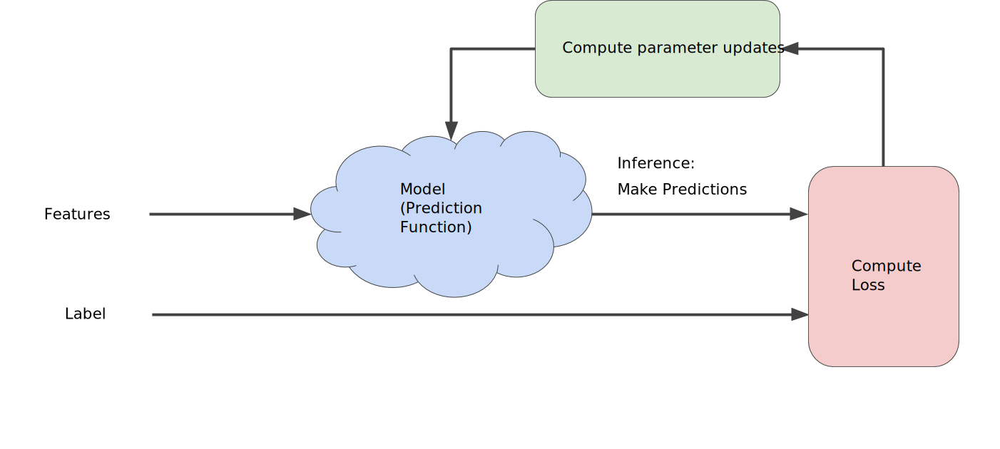

Previously, we mentioned the concept of *loss*, now we are going to see how ML model iteratively reduce the loss.

the figure suggest the iterative _trial-and-error_ process that machine learning algorithms use to train a model:

This iterative approach is use in ML, and basically will work as a Trial and Error, the machine will guess a number, it will calculate the loss and will make adjustment to the wight and bias accordingly. This iterative strategy prevalent in machine learning, primary because they scale so well to large data sets.

The "model" take one or more feature as input and return one prediction $y'$ as output:

$$
y' = b + w_1x_1
$$
 
For lineal regression problems the values to start are not important, in this example we can pick, $b = 0$, $w_1 = 0$, and assuming the first feature value is 10, the prediction yields:

$$
y' = 0 + 0(10)
y' = 0
$$

So $y'$ will be the prediction. The "Compute Loss" part of the diagram is the *loss function* that the model use. Suppose we use the squared loss function. The loss function takes in two inputs values:

* $y'$: The model's prediction for feature x.
* $y$: The correct label corresponding to feature x.

Finally the last part of the diagram the "Compute parameter updates" is here where the ML system examines the value of the loss function and generate new values for $b$ and $w_1$, for the moment less assume that the job of this box is to provide new values for the next iteration, and the learning continue iterating until the algorithm discovers the model parameters with the lowest possible loss. Usually, we will iterate until the loss stop changing or at least changes extremely slowly. when that happen, we say that the model has **converged**.

>A Machine Learning model is trained by starting with an initial guess for the weights and bias and iteratively adjusting those guesses until learning the weights and bias with the lowest possible loss.