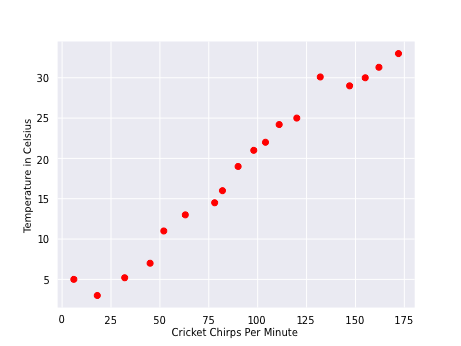
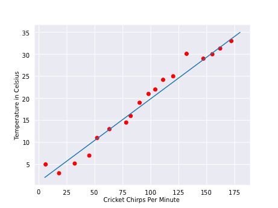

Linear Regression, Training and loss
====================================

## Lineal Regression

**Linear regression** is a method for finding the straight line or hyperplane that best fits a set of points.

As an example, we can use the relationship between the temperature and the cripts-per-minutes of crickets

As expected, the plot shows the temperature rising with the number of chirps. the relationship between chirps and temperature is linear, you could draw a single straight line like the following to approximate this relationship:

the line doesn't pass through every dot, but the line does clearly show the relationship between chirps and temperature. Using the equation for a line:

$$
 y = mx + b
$$

where:

* $y$ is the temperature Celsius - the vale the model need to predict
* $m$ is the slope of the line
* $x$ is the number of chirp per minute
* $b$ is the y-intercept 

in the field of machine learning the **lineal regression** formula change to:

$$
 y' = b_1 + w_1x_1
$$

where:

* $y'$ is the predicted label (the desired output)
* $b$ is the bias, the y-intercept (sometimes refer as $w_0$)
* $w_1$ is the weight of feature 1.
* $x_1$ is a feature (a known input)

To **infer** (predict) the temperature $y'$ for a new chirps-per-minute $x_1$ value, just substitute the $x_1$ value into this model.

Although this model uses only one feature, a more advance model might rely on multiple features, each having a separate weight ($w_2$,$w_3$, etc.). so a model that relies on three features might look as follows:

$$
 y' = b_1 + w_1x_1 + w_2x_2 + w_3x_3
$$

## Training and Loss

**Training** a model simply means learning good values for all the weights and the bias from labeled examples, in this case we talk about __supervised learning__ in this case we want to find a model that minimize loss, this is call **empirical risk minimization**.

We can see **loss** like a penalty for a bad prediction, this number indicate  how bad the model's prediction was on a single example.

Here:

* the arrows represent loss.
* the blue line represent prediction.

## Squared loss: a popular loss function

Most of the Lineal regression models will use the loss function called _squared loss_ ($L_2 loss$), for the example above (the two lineal function side by side) the squared loss will be 

$$
= (observation - prediction(x))^2 
$$

$$ 
= ( y - y' )^2
$$

**Mean square error (MSE)** is the average squared loss per example over the whole dataset.

$$
MSE = \frac{1}{N} \sum_{(x,y)\in D} (y - prediction(x))^2
$$

Where:

* $(x,y)$ is an example in which:  
	- $x$ is the set of features that the model used to make prediction 
	- $y$ is the example's label
* $prediction(x)$ is a function of the weights and bias in combination with the set of features $x$
* $D$ is a dataset containing many examples and labels, which are $(x,y)$ pairs.
* $N$ is the number of examples in $D$  

## Important Concepts 

### Bias

An intercept or offset from an origin. Bias (also known as the bias term) is referred to as b or w0 in machine learning models. For example, bias is the b in the following formula:

$$
y' = b + w_1x_1 + w_2x_2 + ... + w_nx_n
$$

### Inference

In machine learning, often refers to the process of making predictions by applying the trained model to unlabeled examples. In statistics, inference refers to the process of fitting the parameters of a distribution conditioned on some observed data.

### Weight

A coefficient for a **feature** in a linear model, or an edge in a deep network. The goal of training a linear model is to determine the ideal weight for each feature. If a weight is $0$, then its corresponding feature does not contribute to the model.

### Loss

A measure of how far a model's **predictions** are from its **label**. Or, to phrase it more pessimistically, a measure of how bad the model is. To determine this value, a model must define a loss function. For example, linear regression models typically use **mean squared error** for a loss function, while logistic regression models use **Log Loss**.