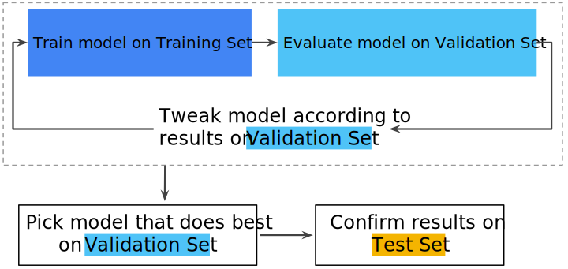

In most of the ML project we will have to deal with datasets, this dataset in an ideal situation will be divided or split in:

* **training set**: a subset to train a model
* **test set**: a subset to test the trained model

It is important to be sure that the test set meet the following criteria:

* Is large enough to wield statistically meaningful results.
* Is representative of the data set as a whole. do not pick a test set with different characteristics than the training set.

**Important** to know that one never train on test data, otherwise we will get close to 100% accuracy  or surprisingly good results, that are not totally true.

## Overfitting

Creating a model that matches the training data so closely that the model fails to make a correct predictions on new data.

## Training set

The subset pf the dataset used to train a model

## Test set

the subset of the dataset use to test your model after the model has gone through initial vetting by the validation set.

## Validation set

A subset of the dataset -disjoin from the training g set- used in validation

An approach of Training data and test data is certainly a good idea, although not the best in some situations, It will be better if the data can be spitted in 3 different sets, the Training set, Validation Set and Test set.

Using the validation set to evaluate results from the training set. Then use the test set to double-check your evaluation after the model has "passed" the validation set will be a more efficient approach.

few things to take in count in this model:

1. Pick the model that does best on the validation set
2. Double-check that model against the test set.
