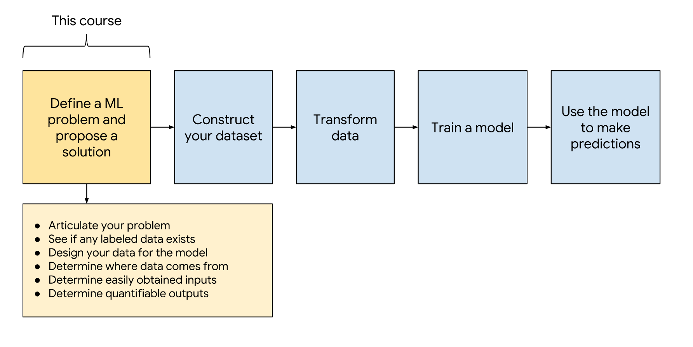
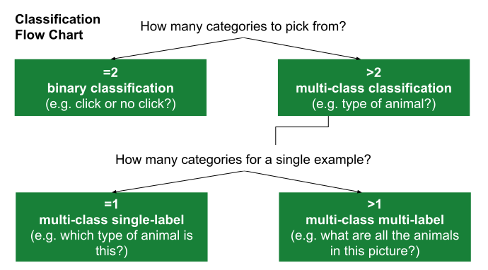
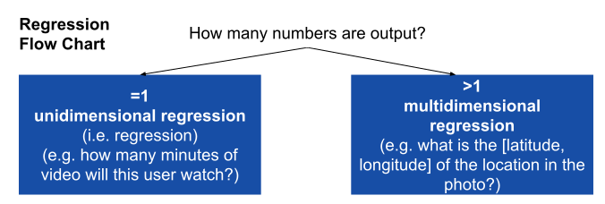
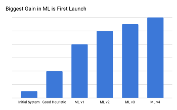

## Common ML Problem 

In basic terms, ML is the process of training a piece of software, called a model, to make useful predictions using a data set.

There are two common paradigms mentioned in ML, Supervised and Unsupervised training.

### What is Supervised Learning?
Supervised learning is a type of ML where the model is provided with labeled training data, this means that we feed the model with **features** ( $x$ If you want) and the answer or so call **label** ($y$) and it will learn the relationship between these two.

### What is Unsupervised Learning?

In unsupervised learning, the goal is to identify meaningful patterns in the data. To accomplish this, the machine must learn from an unlabeled data set. In other words, the model has no hints how to categorize each piece of data and must infer its own rules for doing so.

## Types of ML Problems

There are several subclass of ML, depending of the prediction task

|type of ML Problem | Description | Example|
|:-----------------:|:-----------:|:-------|
|Classification|Pick one of N labels|Cat, dog, horse, or bear|
|Regression|Predict numerical values|Click-through rate|
|Clustering|Group similar examples|Most relevant documents (unsupervised)|
|Association rule learning|Infer likely association patterns in data|If you buy hamburger buns, you're likely to buy hamburgers (unsupervised)|
|Structured output|Create complex output|   Natural language parse trees, image recognition bounding boxes|
|Ranking|Identify position on a scale or status|Search result ranking|

## The ML Mindset

In traditional software, you can trick, tune and reason to find the design that fit the requirements, but in machine learning, more often than not, it will be necessary to experiment to find the correct or rather the workable model.

ML produce models that interpret signals in a different way ( compare with humans), for example a Neural network might interpret the words "tree" liek something like this `[0.37,0.24,0.2]` and "car" as `[0.1,0.78, 0.9]` the Neural network might use this interpretation to do an accurate translation or a sentiment analysis, but humans looking to this embeddings would find them very hard to understand, this can make machine learning difficult but not impossible for humans to evaluate and understand.

## Experimental Design Prime

### Get Comfortable with Some Uncertainty

One of the difference between ML and the traditional programming, is that in traditional programming you will end with a set of parameters that you understand and you know how they should behave, but with ML, the non-coding work can be very complicated, but the code usually far less code. you might get the code correctly and expect a result, but the result you will find suitable might be obtain after several changes and tunning that you might not fully understand.

### Scientific Method

It is useful to think ML process as an experiment where we run test after test to converge on a workable model.

| Step | Example |
|:----------------------------|:----------------------------|
|1. Set the research goal.    | I want to predict how heavy traffic will be on a given day|
|2. Make a hypothesis.        | I think the weather forecast is an informative signal.     |
|3. Collect the data.         | Collect historical traffic data and weather on each day. |
|4. Test your hypothesis.     | Train a model using this data.|
|5. Analyze your results.     | Is this model better than existing systems?|
|6. Reach a conclusion. | I should (not) use this model to make predictions, because of X, Y, and Z. |
|7. Refine hypothesis and repeat.| Time of year could be a helpful signal.|

## Identifying Good Problems for ML

### Clear Use Case

>Start with the problem, not the solution. Make sure you aren't treating ML as a hammer for your problems.

Ask yourself the following question in order:

1. What problem is my product facing?
2. Would it be a good problem for ML?

### Know the Problem Before Focusing on the Data

>Be prepared to have your assumptions challenged.

If you understand the problem clearly, you should be able to list some potential solutions to test in order to generate the best model. Understand that you will likely have to try out a few solutions before you land on a good working model.

### Predictive Power

You should not try to make ML do the hard work of discovering which features are relevant for you. If you simply throw everything at the model and see what looks useful, your model will likely wind up overly complicated, expensive, and filled with unimportant features.

### Predictions vs. Decisions

Make sure your predictions allow you to take a useful action. For example, a model that predicts the likelihood of clicking certain videos could allow a system to prefetch the videos most likely to be clicked.

Conversely, a model that predicts the probability that someone will click "thumbs down" for a specific YouTube video might be interesting, but we can't do anything useful with that knowledge.

|   Prediction         |            Decision                |
|:---------------------|:-----------------------------------|
| What video the learner wants to watch next. | Show those videos in the recommendation bar.|
| Probability someone will click on a search result.| If P(click) > 0.12, prefetch the web page.|
| What fraction of a video ad the user will watch. | If a small fraction, don't show the user the ad.|

## Success and Failure Metrics

How I will measure the success or failure of the model, the success or failure metric are different than metrics such as precision, recall, etc, rather the specific anticipated outcome. As an example, let say i want a video recommendations model, the success metric might be "A success metric is the number of popular videos properly predicted by the model. Success means predicting 95% of the most popular videos as measured by watch time within 28 days of being uploaded." and the failure metric will be "Failure means the number of popular videos properly predicted is no better than current heuristics"

### Are the Metrics Measurable?

Ask the following: 

* How will you measure your metrics?
* When can you measure your metrics?
* How long will it take to know whether your new ML system is a success or failure?

### What Output Would You like the ML Model to Produce?

Revisiting this table, which type of output are you looking for: a number, a label, a cluster, or something else?

| Type of ML Problem | Description               | Example                   |
|:-------------------|:--------------------------|:--------------------------|
|Classification      |	Pick one of N labels     |	cat, dog, horse, or bear |
|Regression	         |  Predict numerical values |	click-through rate       |
|Clustering	         |  Group similar examples   |	most relevant documents (unsupervised) |
|Association rule learning | Infer likely association patterns in data |	If you buy hamburger buns, you're likely to buy hamburgers (unsupervised)|
|Structured output   |	Create complex output	 | natural language parse trees, image recognition bounding boxes |

## Heuristics 

How might you solve your problem without ML?

Suppose you need to deliver a product tomorrow, and you have only time enough to hard-code the business logic. You could try a heuristic (non-ML solution) like the following:

>Example
Consider people who uploaded popular videos in the past. Assume that new videos uploaded by these people will also become popular.

The preceding heuristic might not be the world’s greatest heuristic, but it does provide a baseline. Never launch a fancy ML model that can't beat a heuristic. The exercise of making a heuristic often will help you identify good signals in your ML model.

Non-ML solutions can sometimes be simpler to maintain than ML solutions.

## Formulate YourProblem as an ML Problem

We are to follow the suggested approach for framing the ML problem:

1. Articulate your problem.
2. Start simple.
3. Identify Your Data Sources.
4. Design your data for the model.
5. Determine where data comes from.
6. Determine easily obtain inputs.
7. Ability to Learn.
8. Think About Potential Bias.

### Articulate Your Problem

There are several subtype of classification an regression, the following flowchart can give help to define which can be use.

  

Our problem is best framed as:

* Binary classification
* Unidimensional regression
* Multi-class single-label classification
* Multi-class multi-label classification
* Multidimensional regression
* Clustering (unsupervised)
* Other (translation, parsing, bounding box id, etc.)

### Start Simple

Can you simplify your problem?

First, simplify your modeling task. State your given problem as a binary classification or a unidimensional regression problem

Then, for that task, use the simplest model possible. A simple model is easier to implement and understand. Once you have a full ML pipeline, you can iterate on the simple model with greater ease.

The biggest gain from ML tends to be the first launch, since that's when you can first leverage your data. Further tuning still gives wins, but, generally, the biggest gain is at the start so it's good to pick well-tested methods to make the process easier.

### Identify Your Data Sources

Provide answers to the following questions about your labels:

* How much labeled data do you have?
* What is the source of your label?
* Is your label closely connected to the decision you will be making?

### Design your Data for the Model

Identify the data that your ML system should use to make predictions (input -> output), If an input is not a scalar or 1D list, consider whether that is the best representation for your data.

### Determine Where Data Comes From

Assess how much work it will be to develop a data pipeline to construct each column for a row. When does the example output become available for training purposes? 

### Determine Easily Obtained Inputs

Pick 1-3 inputs that are easy to obtain and that you believe would produce a reasonable, initial outcome.

Which inputs would be useful for implementing heuristics mentioned previously?

### Ability to Learn

Will the ML model be able to learn? List aspects of your problem that might cause difficulty learning. For example:

* The data set doesn't contain enough positive labels.
* The training data doesn't contain enough examples.
* The labels are too noisy.
* The system memorizes the training data, but has difficulty generalizing to new cases

### Think About Potential Bias

Many dataset are biased in some way. These biases may adversely affect training and the predictions made.