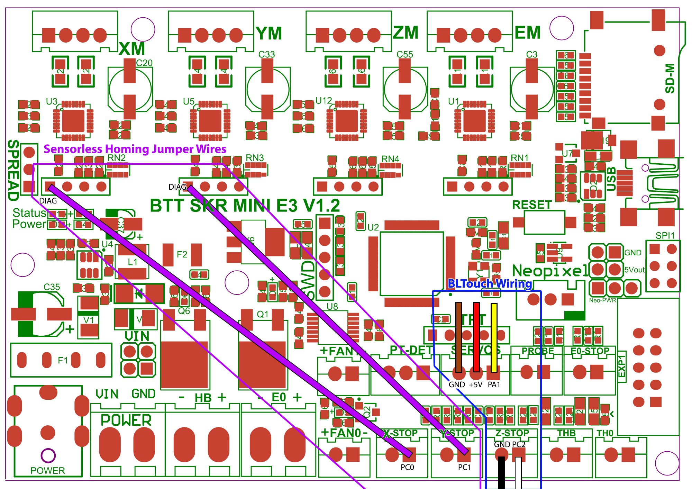

Here some concepts related with 3D printing, this can be concepts from a specific board, firmware, etc
The idea is have a place to refresh memory when reading other articles.

## Sensorless Homing

Sensorless homing allows to home an axis without the need for a physical limit switch. Instead, the carriage on the axis is moved into the mechanical limit making the stepper motor lose steps. Then the firmware will trigger stop for the axis.

>SKR mini  E3 v1.2
> for this specific one we will need to use cables jumpers 
