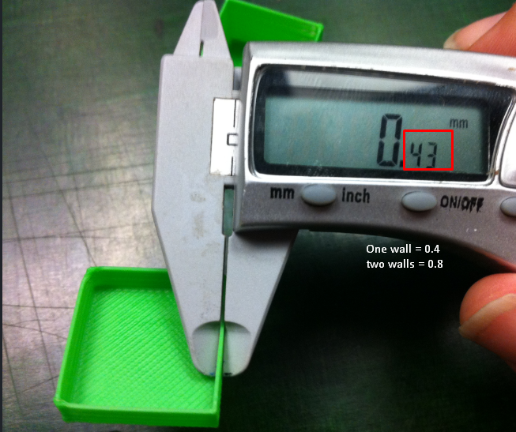

In order to have the best print quality, we need to have a correct calibration for the extruder this is achieve making a extruder steps and flow rate tune and calibrated for the printer.

## E-steps

First we need to know what are the E-steps that the printer has at the moment, for that we use Octoprint *(or any software that allow me to communicate with the printer by G-code)* to send `M503` that will give me as a result different values, between those value we have the steps for each axis and the extruder

This is an example of  a response with `M503`
```
G21    ; Units in mm
M149 C ; Units in Celsius
Filament settings: Disabled
M200 D1.75
M200 D0
Steps per unit:
M92 X100.00 Y100.00 Z398.70 E100.00
Maximum feedrates (units/s):
M203 X400.00 Y400.00 Z8.00 E50.00
Maximum Acceleration (units/s2):
M201 X1000 Y1000 Z100 E10000
Acceleration (units/s2): P R T
M204 P400.00 R1000.00 T1000.00
Advanced: S T B X Z E
M205 S0.00 T0.00 B20000 X10.00 Y10.00 Z0.30 E5.00
Home offset:
M206 X0.00 Y0.00 Z0.00
Auto Bed Leveling:
M420 S1 Z0.00
Material heatup parameters:
M145 S0 H195 B55 F0
M145 S1 H205 B60 F0
PID settings:
M301 P52.25 I5.60 D122.00
Z-Probe Offset (mm):
M851 Z-2.41
```

Notice the lines

```
Steps per unit:
M92 X100.00 Y100.00 Z398.70 E100.00
```

This means that currently the E-steps is 100

### Calibrate the E-steps will be:

1. Make a mark in the filament, already loaded in the printer, at 120mm.
2. Connect to the printer to send G-code.
3. Execute `M83` ( this will  set the extruder to relative mode)
4. Make the printer extrude 100mm of filament using `G1 E100 F100` (you can use the printer interface screen if it has one).
5. wait until the printer finish the extrution
6. measure how much filament is left before the extruder motor and the mark if the measurement is 20mm the e-steps are correct, if the number is different than that you need to make some changes in the E-steps

### Formula to find new E-steps

Now with the old E-step value and number we got from the previous procedure we can find the new e-steps, for this example lets assume that the distance from the extruder gear/motor to the mar was 19mm, it means our printer extruded 101mm instead of the 100mm we ask for

$$
E-Steps(New) = old steps\ x\ (100/measured\ distance\ filament)
$$

the old steps will be 100, the 100 is the amount of filament we asked to extrude and the "measured distance filament" will be $120-19=101$, so

$$
E-steps_n = 100\ x\  (100/101)
$$

$$
E-steps_n = 101
$$

###Save the New E-step Value

To save this new value, you will need to use the following command
```
M92 E101.00 ; change E-steps for the new value
M500 ; save new values to the EEPROM
```

## Calibrating the Extrusion multiplier or flow rate
After calibrate the E-steps we need to make sure the machine is extruding the correct amount of filament comparing with the model on the slicer.

For this we will print a calibration cube that will be a hollow object with 2 perimeter layers or 2 walls , by default the Extruder width  will be 0.4mm the diameter of the nozzle, so the thickness of the walls ( 2 walls) should be 0.8mm, once we print the model we will measure the thickness with a caliper ( two measurements per wall).

>This example picture the there is just one wall

{: .center}

### Formula to calculate flow rate

After measure all the walls we need to make the calculation

$$
Average_t = (measurement_1wall_1 + measurement_2wall_1 + measurement_1wall_2 + ... measurement_2wall_4) / 0.8mm
$$

now

$$
Flow-rate_n = Average_t\ X\ Current-Flow-rate
$$
