This are some notes about design, mostly take it from the Sketch class in [instructable](https://www.instructables.com/class/Design-Sketching-Class/)

## Drawing 2D

It is a good idea start with 2D and separate the object in "orthographic" views. this will help to understand the proportions , scale and relationship that are difficult to see in 3D.

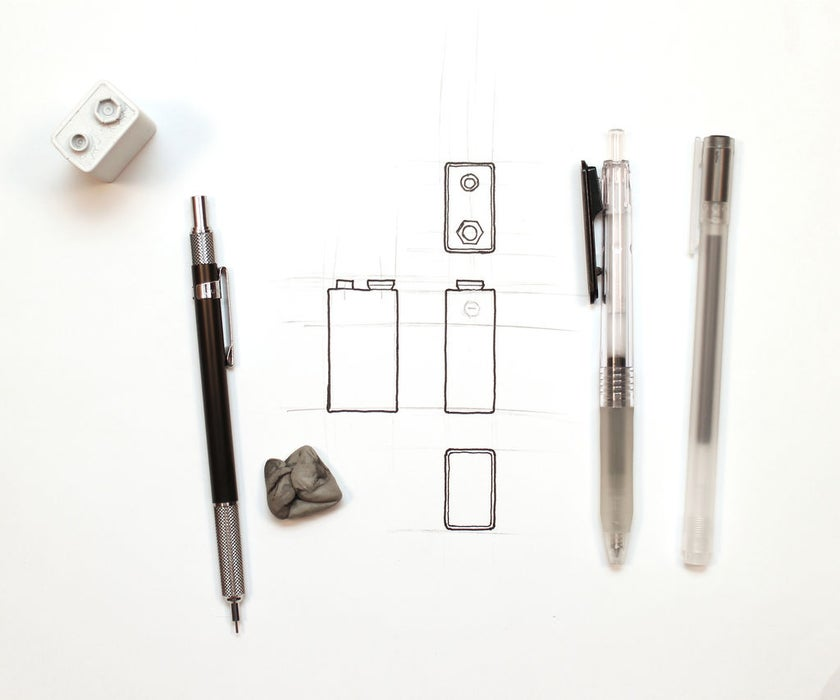{: .center}

For this we can start by drawing the Construction lines, sort of a cage around the object.

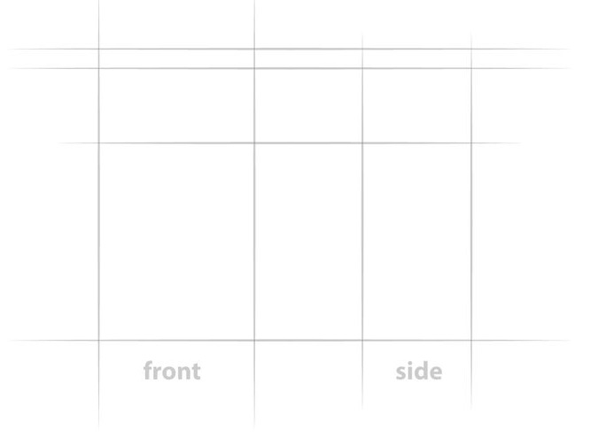{: .center}

Draw the lines that define the shape of the object, just the general shape, start but the horizontal or vertical lines and later make the curve lines.

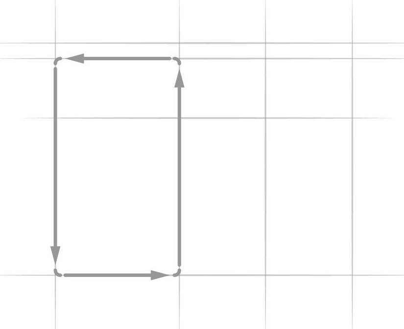{: .center}

Later make construction lines for the other details

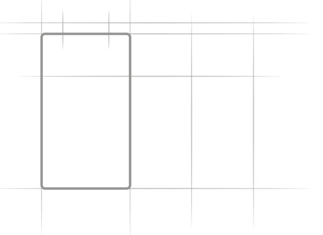{: .center}

This extra line can help to center the details and see what is the position of this extra details in the other faces

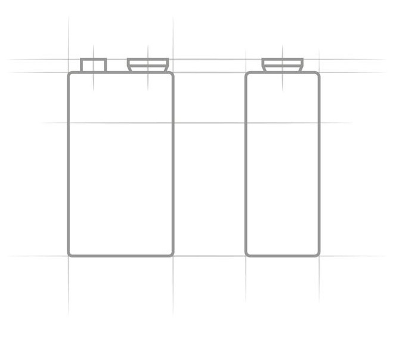{: .center}

Finally we can proceed to draw the upper and lower parts, using the construction lines to keep the size consistent.

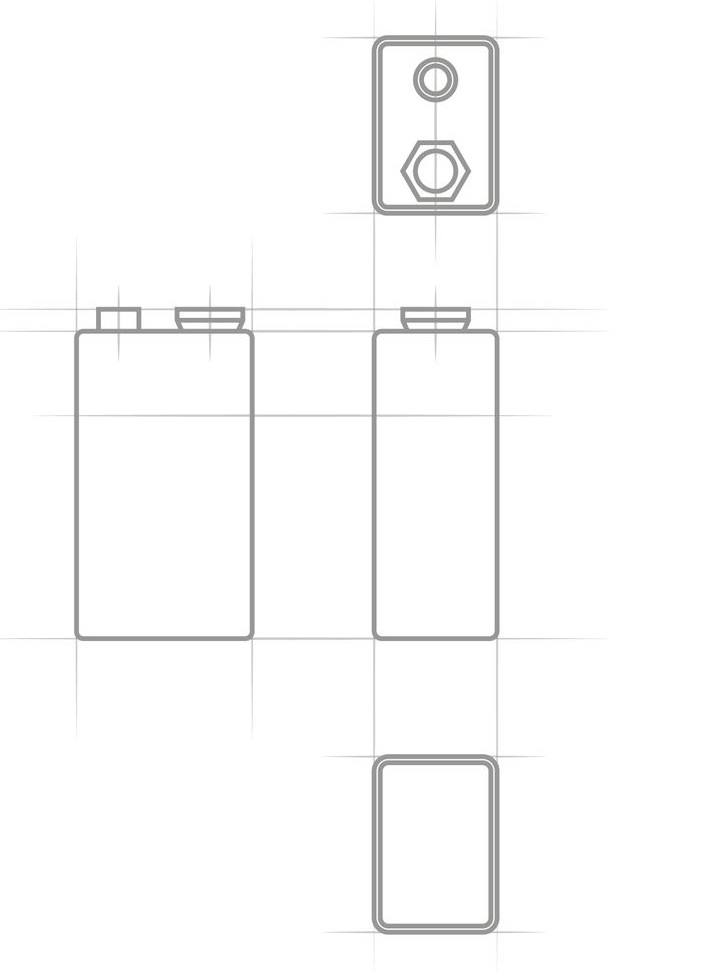{: .center}

### Using different line weight

In order to give more details about the object we can use different line weights

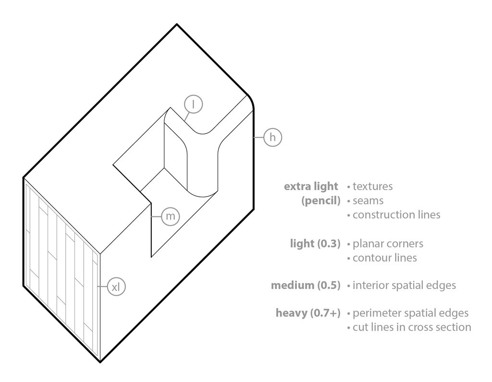{: .center}

> This is a direct copy of the information in this class, this describe where each line weight its been use

**1. Extra Light (pencil or light weight pen):** This weight is used for aspects that should either be secondary to the overall form of the object or almost disappear entirely. It's good for construction lines, surface features like textures or patterns, and seams between parts that don't have much depth (like the edge where a fender touches a hood on a car, for example).
**2. Light (+/- 0.3mm):** This weight is most often used for contour lines (lines that follow a surface to express its 3D shape) and planar corners (edges between two planes in which you can see both planes in the view).
**3. Medium (+/- 0.5mm):** This weight is generally used for spatial edges (the edges of surfaces where only one surface is seen in the view).
**4. Heavy (0.7mm+):** Heavy lines are reserved for the perimeter edges of an object and for the cut edges of a cross-section drawing.

## Drawing 3D

Once we have clear the relationship of the different size or faces of the object, we can move to 3D in order to understand the object, after all we see in 3D, now, in this case we are no going to use perspective, we are going to use something call *Isometric*.

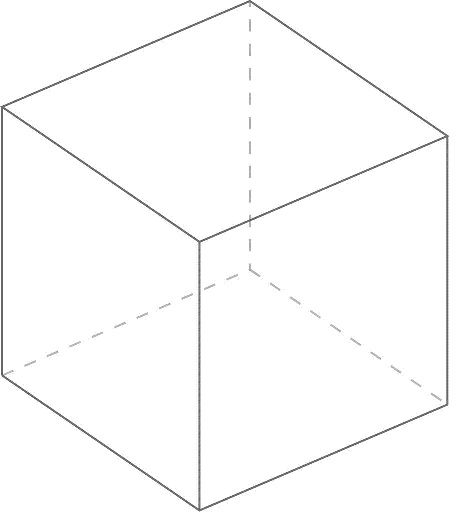{: .center}

We start in a similar way than 2D, we start making a cage for the object, we can start drawing 3 parallel lines, notice that line 1 and 2 from left to right represent how thick is the object, this can be different to different objects.

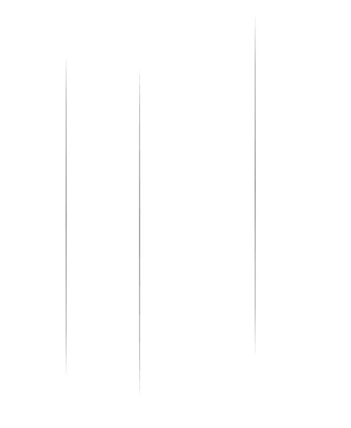{: .center}

Now we can draw the last vertical line, this will be the back each of the object, and will be (most of the time) be aware that the distance between this last line and line 3 should be same line 1 and 2, since the object has the same thickness.

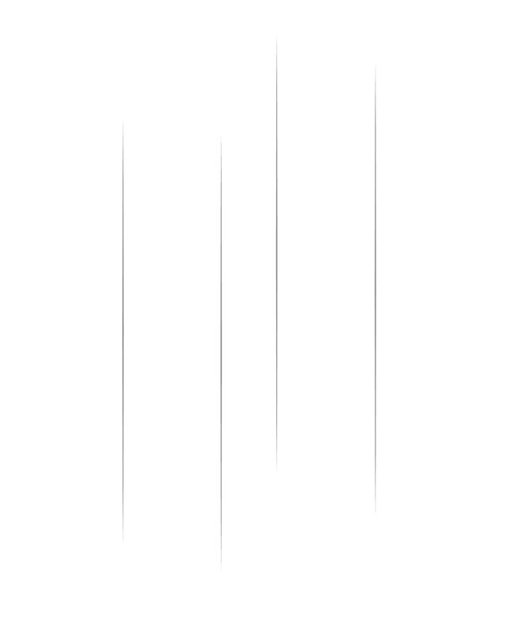{: .center}

Now, we will use the angles of the bottom lines to emphasis the side, explained in other way will be, if the viewer is at the lower angle the focus will be in the side of the cube.

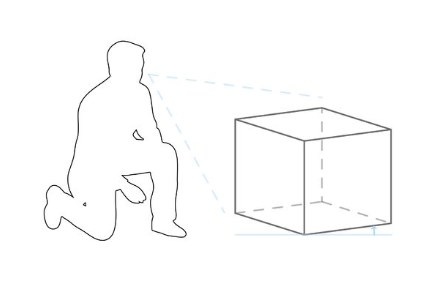{: .center}

if the viewer is looking from a higher place the focus will be the top.

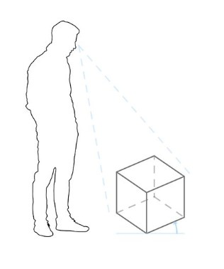{: .center}

>Angles that are more acute to the horizon will show less of the top of the object, emphasizing the sides. Angles that are more oblique to the horizon will show more of the top.

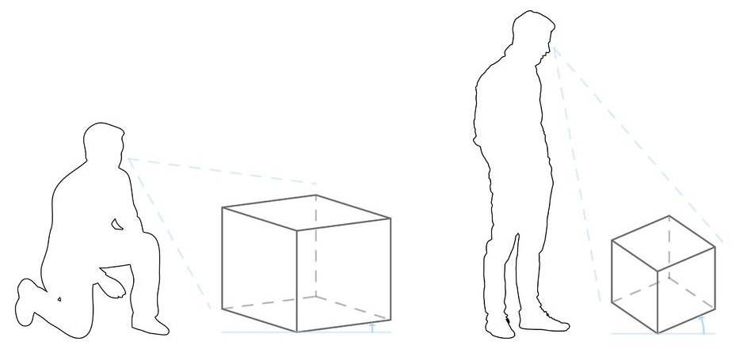

Both faces the lower and the upper will be parallel to each other

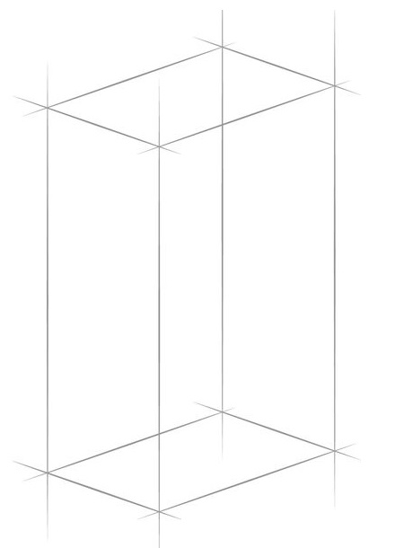{: .center}

Similar what we did with the 2D we can continue making construction lines for the other features of the objects, for example in this case we need some lines for the circles on top of the object.

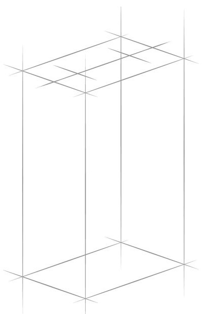{: .center}

In order to draw the circles we need to have an idea of how the look like at different angles

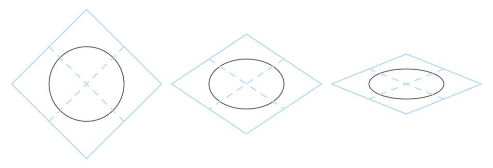{: .center}

> According to the instructor in the class

A Rule of thumb will be:

1. A circle will hit the construction lines at the same points in 3D as they will in 2D.
2. The curve along the obtuse corners of the box get longer and flatter.
3. The curve along the acute corners of the box shorter and deeper.

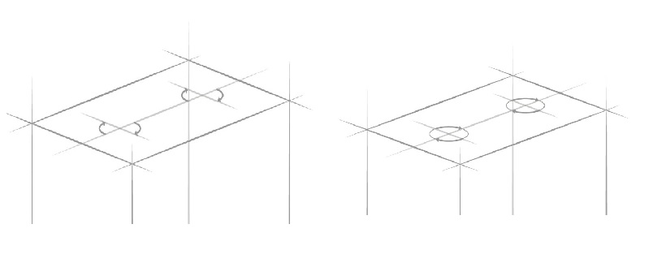{: .center}

> here will be a big jump in the instruction, but basically we need to follow similar instruction that we did until now, just that this time we will focus in the details

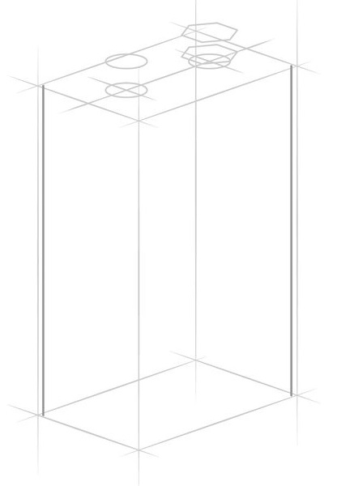{: .center}

in each step we increase the amount of details

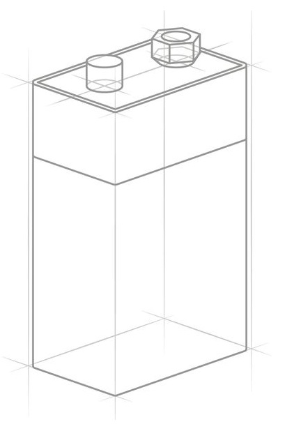{: .center}

finally we use the different line weights

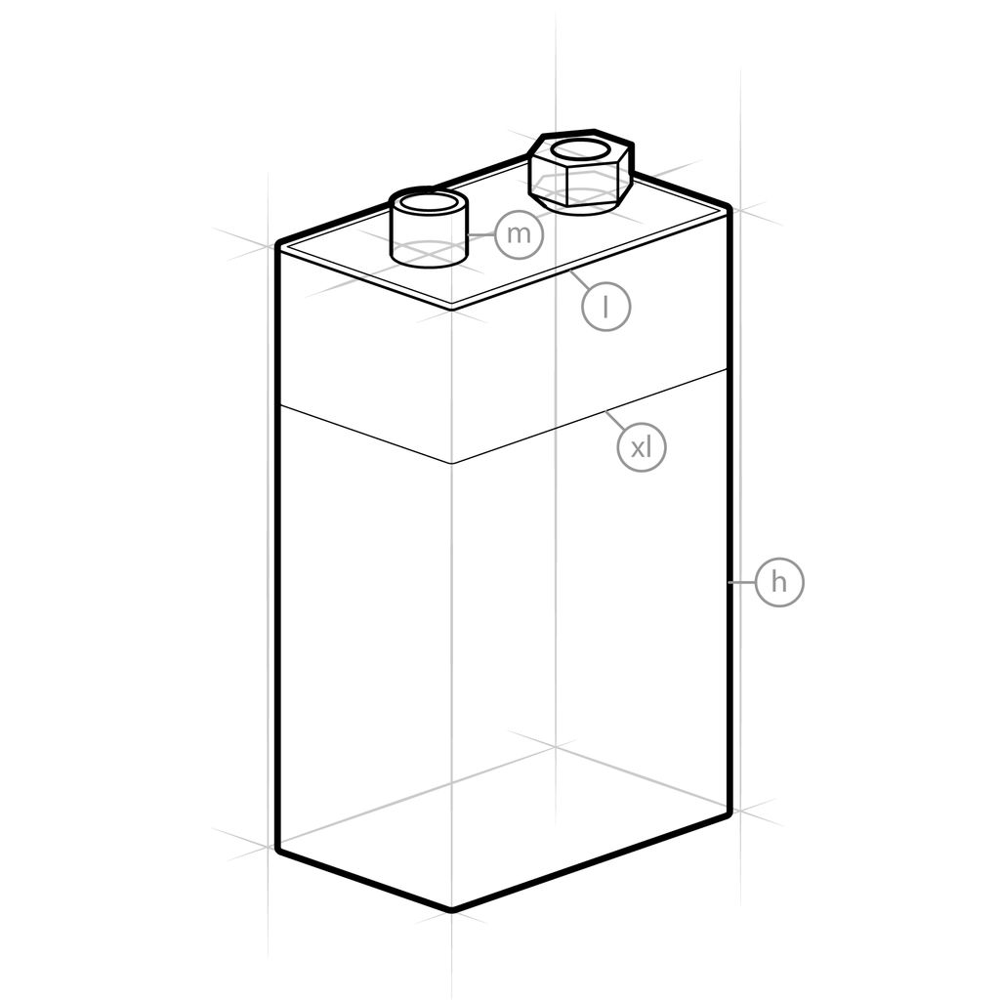{: .center}

* **Extra Light:** surface details.
* **Light:** corner edges.
* **Medium:** edges with background surfaces.
* **Heavy:** perimeter outline.

## Shadows and Light

>Taken directly and literally from the class

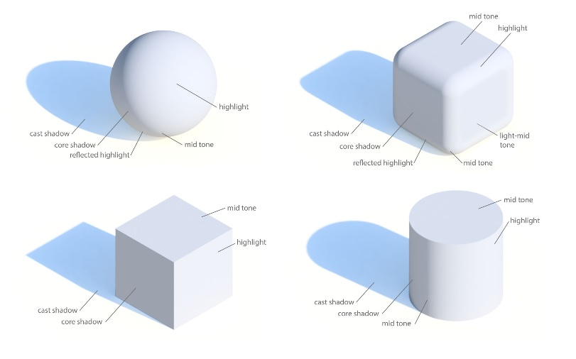{: .center}

There are 5 basic parts of a shadow.

**1. Cast Shadow:** Just like your own shadow on the sidewalk on a sunny day, a cast shadow is a -distorted- projection of the shape of the object. The length of the shadow and its direction depend on the direction of the light. On the Copic Marker scale, this would be **N8**.

**2. Core Shadow:** This is the shaded part on the opposite side of an object from the direction of the light. This part is especially useful in defining geometry. On the Copic Marker scale, this would be **N6**.

**3. Reflected Highlight:** This is ambient light bounced off of the ground to brighten part of an object that would otherwise be in core shadow. It's often okay to leave this part out if you want to make a quick drawing. On the Copic Marker scale, this would be **N4**.

**4. Mid Tone:** This is the part of the shadow that transitions from the core shadow to the highlight on a curved surface. Think of it as a blurred edge of the core shadow / highlight. The mid tone also shows up on flat faces that aren't directly in the line of the light direction. On the Copic Marker scale, this would be **N2**.

**5. Highlight:** This is the part of the object that reflects the most light. The highlight is directly in line with the direction of the light. This will remain white.

>In the class the had a video where the instructor explain how to make the different shadows

The suggestion is start with the cast shadows, since this will gave us the sense of what surface will have the level of shadows.

>Choose a light direction: imagine the rays of light are parallel, like sunlight, and project the top of the object onto the floor. The lines this projection follows should be parallel to each other.

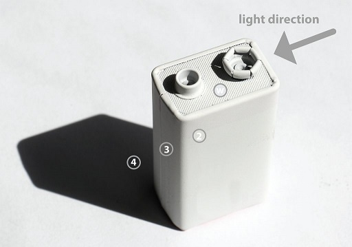{: .center}

Notice that the Shadow is parallel to the top edge of the object

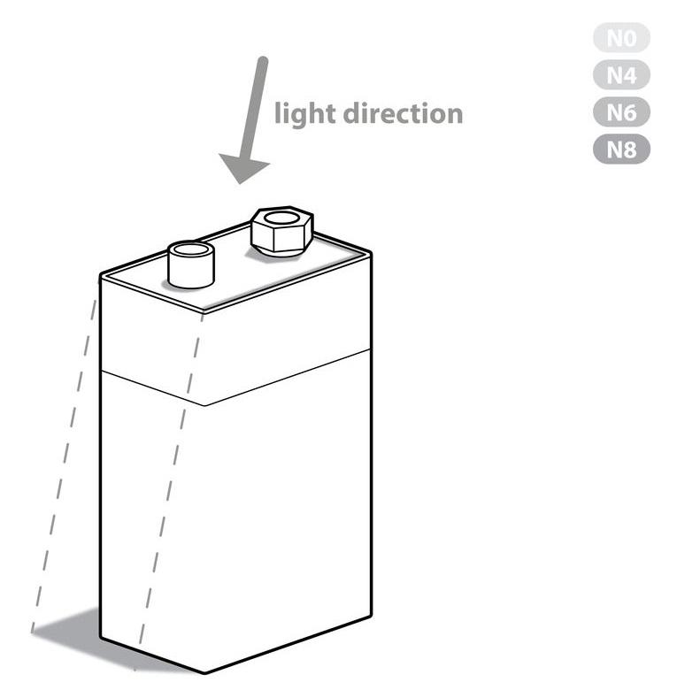{: .center}
