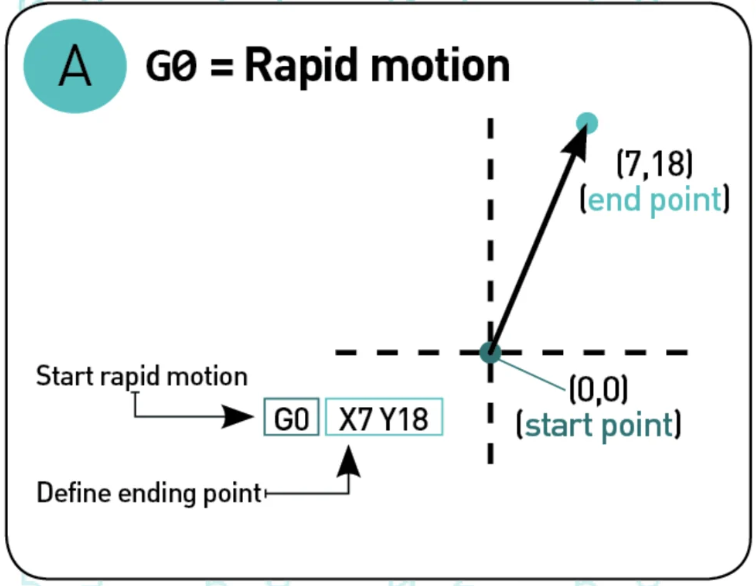
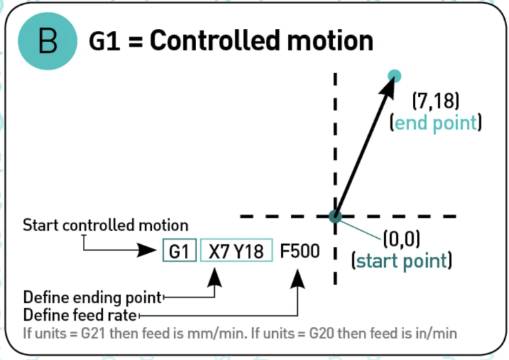
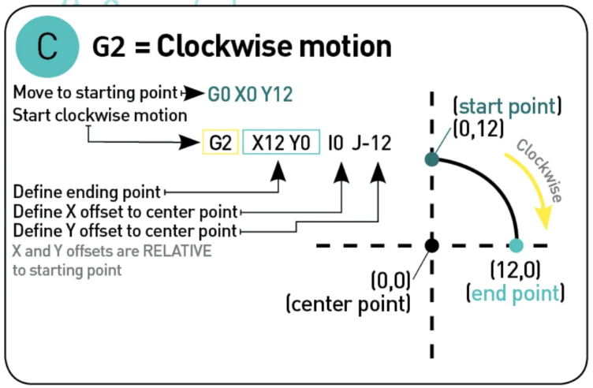
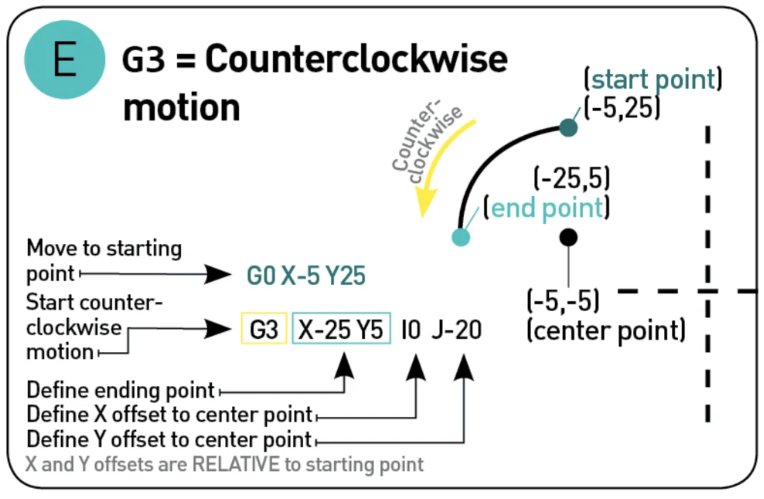

## What are G-code Commands?

G-code stands for **"Geometric code"**, it is a rudimentary programing language, a numerical control programing language, that lacks of data structure such as variable, control blocks as conditionals and loops, its main function is to provide instruction to the machine  of how to move in the 3 geometrical dimension, how ever it can send non-geometric instruction, like  heat the bed, extrude specific amount of material at a specific extrusion rate, etc.

## How to read G-code Commands?

A typical G-code line will look like:

```
G1 X-10 Y4.5 Z0.5 F30000.0 E 0.0377
```

This line tell the machine to move in a straight line toward the coordinates `X-10`, `Y4.5`, `Z0.5` at a feed rate of `3000.0` and extrude `0.0377mm` of material while moving.

But how to read it, well each line start with a specific code, in this case the code is `G1`, which it means "move in a straight line in a controlled fashion".

```
G1 X-10 Y4.5 Z0.5 F30000.0 E 0.0377
```

The values after the code are the arguments, it start with a English letter and then the value:

* `XYZ` Are values for the Cartesian coordinates 
* `F` is the Feed rate
* `E`  is the Extrusion

So the code:
```
G1 X2 Y4 Z0 F30000.0 E 0.02
```

Reads "*Move towards X=2,Y=4, Z=0 in a straight line in a control fashion at a feed rate 3000.00 while extruding 0.02mm of material*".

SOmething that help use to understand the code faster, is the fact that all g-code that start with **G** is code related with geometric commands. But a machine do more that geometric movements, there fore we have another type of commands, Non-geometroc and those command start with M.

Each English letter in a G-code has an specific meaning here a reference table from [reprap](https://reprap.org/wiki/G-code#Fields), for example G for Geometric commands, M for Non-geometric, X means $x$ coordinate, Y $y$ coordinate, Z  $z$ coordinate, F means feed rate, E Extruder, etc

> `G1` command means “move the nozzle in a controlled fashion in a straight line”

Following will be a description of the most common command, i will use the same graphic use in the document [g-code tutorial 3D printer gcode-commands](https://all3dp.com/g-code-tutorial-3d-printer-gcode-commands/)

##The most common G-code

### `G00` "Rapid Motion"

This command ask the printer to move to the maximum speed possible from the current position to the coordinate given. With this command no material is extrude, and it is normally use to move the nozzle before start and after finished the print

```
G0 X7 Y18
```


### `G01`  "Controlled motion"

This Command will move the nozzle or printed head to a specific speed from the current position to the coordinated specified, the speed is specify by the Feed rate `F`, the amount of material extruded will be define by the number after `E`.

```
G01 X7 Y18 F500 E0.02
```



### `G17/G18/19` "set planes"

This is to set the plan where the nozzle should move, `G17` will be X-Y, `G18` Z-X and `G19` Y-Z
.

### `G20/G21` "Set units"

With `G20` you set the units to mm and `G21` to Inches

### `G28` "Homing"

Send the printing head to the home position 

### `G90` "absolute mode"

This mode tell the printer to move to the absolute coordinate.

```
G90
G0 X10
```

The machine will move the print head to the coordinate X=10

### `G91` "Relative mode"

Tells the machine to interpreted the coordinate as relative, if the machine is currently at X=10 and we use this command

```
G91
G0 x10
```

the print head will move 10 units in the X direction, finishing at X=20. 

### `G2` and `G3` "clockwise or anticlockwise motion"

This commands tell the printer to move either clockwise `G2` or andticlockwise `G3` from the current point to the coordinate given, the center of the rotation is given by the parameter I and J, I denotate the X offset and J the Y offset

```
G21 G90 G17

G0 X6 Y18

G2 X18 Y6 I0 J-12
```

```
G21 G90 G17

G0 X-5 Y25

G3 X-25 Y5 I0 J-20
```



### Comments `;`

Like any other programming languages, we can make comments in G-code, this is done using `;` after the command, example

```
G0 X-25 Y5  ; rapid movement to X=-25 and Y=5
```

## Example of the beginning of a G-code

```
G90

M82

M106 S0

M140 S100

M190 S100
```

1. `G90` Set the coordinate as absolute
2. `M82` Put the E axis into absolute mode independent of the other axes. 
3. `M106 S0` turn fan on and set speed to 0
4. `M140 S100` set Bed temperature as 100 degrees
5. `M190 S100` Wait until the temperature is 100

Now the printing phase

```
G1 X108.587 Y111.559 F525 ; controlled motion in X-Y plane

G1 X108.553 Y111.504 F525 ; controlled motion in X-Y plane

...

G1 Z0.345 F500 ; change layer
```

There is nothing to explain here that is not already explained, there are some movements in X-Y and others in Z.

After the print is complete we pass to the Reset printing phase

```
G28 ; bring the nozzle to home

M104 S0 ; turn off heaters

M140 S0 ; turn off bed

M84 ;  disable motors
```