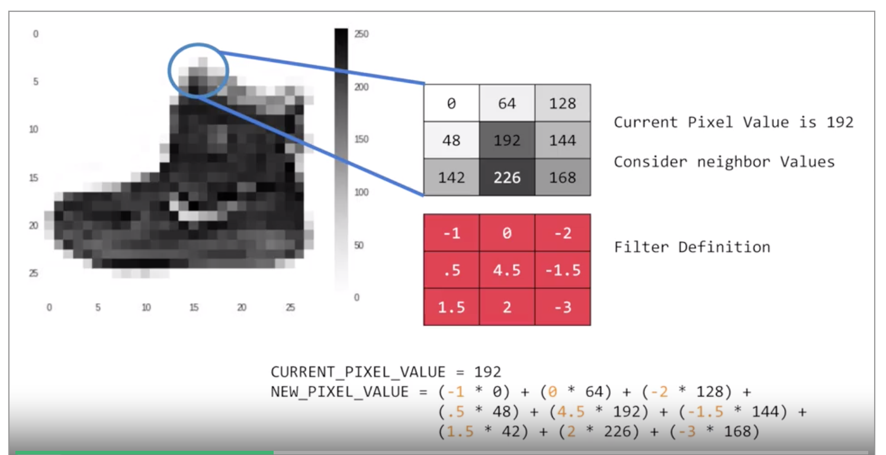
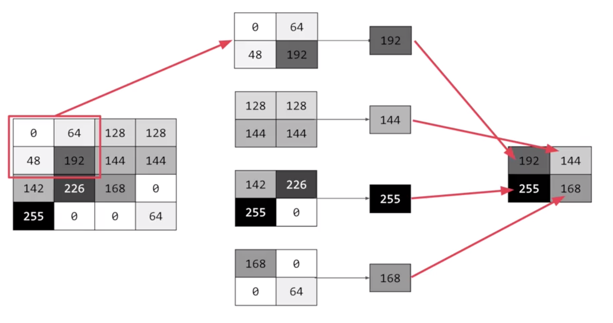
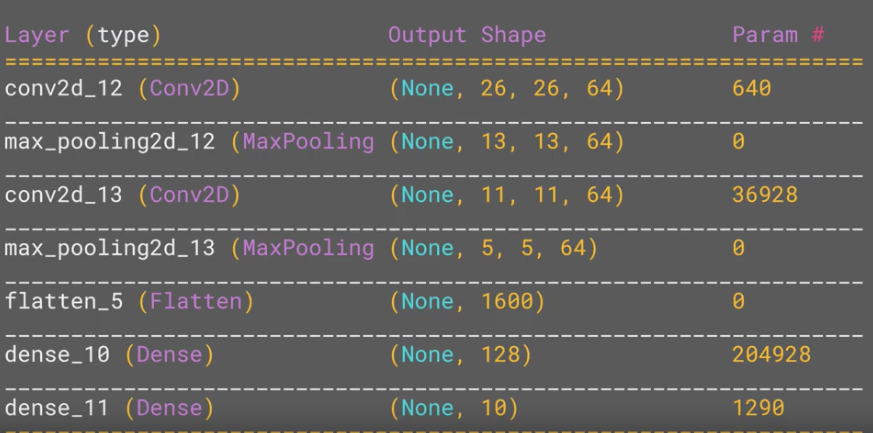
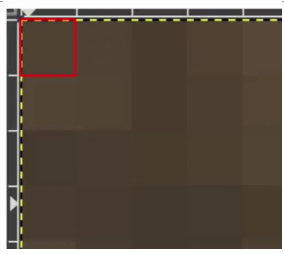

## What are convolutions and pooling?

One thing, we can see from the previous exercise is that there is a lot of wasted space in each image. while there are only 784 pixels, it will be interesting if there is a way to condense this image to those important features that make a bag, a shoe or a bag, that's is where convolutions come in.

###What is convolution?

To use an analogy, in image processing normally involve having a filter and passing that filter over the image in order to change the underlying image.
The convolution will work in a similar way.
 

**The process** will be a little bit like this:

* For every pixel, take its value, and take a look at the value of its neighbors. let say 192 in the image above.

```
|   0    |    64    |   128  |
|--------|----------|--------|
|   48   |    192   |   144  |
|--------|----------|--------|
|  142   |    226   |   168  |
```


* If the filter is $3x3$, then we can take a look at the immediate neighbor, so we will have a corresponding $3x3$ grid.

```
|   -1   |    0     |   -2   |
|--------|----------|--------|
|  0.5   |    4.5   |  -1.5  |
|--------|----------|--------|
|  1.5   |    2     |   -3   |
```

* Now we can get the new value for the pixel, we simply multiply each neighbor by the corresponding value in the filter.

$$ Current pixel = 192$$

$$ New pixel = (-1 * 0)+(0 * 64)+(-2 * 128)+(0.5 * 48)+(4.5 * 192)+(-1.5 * 144)+(1.5 * 142)+(2 * 226)+(-3 * 168) $$

* we have the new pixel with the sum of each of the neighbor values multiplied by the corresponding filter value, and that's a convolution.


The idea here is that some convolutions will change the image in such a way that certain features in the image get emphasized. So, for example, if you look at this filter.


Then the vertical lines in the image really pop out.


Now with this filter, the horizontal lines pop out.

When convolution is combine with something call *pooling* they will become really powerful, a quick and easy way to do this, is to go over the image of four pixels at a time, of these four, pick the biggest value and keep just that. So, for example:



So 16 pixels on the left are turned into the four pixels on the right, by looking at them in two-by-two grids and picking the biggest value. This will preserve the features that were highlighted by the convolution, while simultaneously quartering the size of the image. We have the horizontal and vertical axes.

## Class `Conv2d`

This is the class that we are going to use to make the convolution, for more detailed information we can check the TesorFLow documentation about [Conv2d](https://www.tensorflow.org/api_docs/python/tf/nn/conv2d).

This layer creates a convolution kernel, which in or example was a 3x3, that is convolved with the layer input to produce a tensor of outputs. If `use_bias` is True, a bias vector is created and added to the outputs. Finally, if `activation` is not `None`, it is applied to the outputs as well.

When using this layer as the first layer in a model, provide the keyword argument `input_shape` (tuple of integers, does not include the sample axis), e.g. `input_shape=(128, 128, 3)` for 128x128 RGB pictures or `input_shape(128,128,1)` for one gray scale 128x128 image.

### **Syntax** Convolution layer

```python
tf.keras.layers.Conv2D(64,(3,3), activation+'relu', input_shape(28,28,1))
```

This will be if this is the first layer of the model, we will need to add `input_shape(28,28,1)
` because the image is a gray scale 28x28.

for a layer that is not the first one it will be:

```python
tf.keras.layers.Conv2D(64,(3,3), activation='relu')
```

##  Class `MaxPooling2D`

Max pooling layer for 2D inputs (example an image)

more information in the tensorFlow documentation about [MaxPooling2D](https://www.tensorflow.org/versions/r1.8/api_docs/python/tf/layers/MaxPooling2D)

### **Syntax** MaxPooling layer

```python
tf.keras.layers.MaxPooling2D(2,2)
```

in this case we create a grid of 2x2.

## Example of a model with Convolutional and Maxpooling

```python
model= tf.keras.models.Sequencial([
	tf.keras.layers.Conv2D(64,(3,3), activation='relu', input_shape=(28,28,1)),
	tf.keras.layers.MaxPooling2D(2,2),
	tf.keras.layers.Conv2D(64,(3,3), activation='relu'),
	tf.keras.layers.MaxPooling2D(2,2),
	tf.keras.layers.Flatten(),
	tf.keras.layers.Dense(128, activation='relu'),
	tf.keras.layers.Dense(10,activation='softmax')
	])
```
so in the first convolution layer we are asking keras to generate 64 filters for us, these filter are 3x3, their activation is `relu`, which mean that negative value will be throw away, finally  the input shape is as before, the 28 by 28. that extra 1 just means that we have just 1 color depth.

the second layer, it is the pooling layer, it is max-pooling because we're going to take the maximum value.

so in the script we have a image that have being pass for 2 convolutional layers and 2 max-pooling, that means, that the image has been quarter and quarter again, so when we arrived to the flatten layer we have a greatly simplify image.

now, we can use a good method call `summary()` like this

```python
model.summary()
```

this allow use to inspect the layers of the model and see the journey of the image through the convolution.




the table is showing  the layer and some details about them, including the output, one of the most important columns is the output shape, one things that we will notice is:


the output shape isn't 28x28 instead 26x26, remember the filter is 3x3, so if we are trying to scan a picture we won't be able to scan form the top left corner, because  it doesn't have any neighbors.



we will need to start from one pixel down and one pixel to the right


this means we cant use a one pixel margin all around the image, so the output of the convolution will be 2 pixel smaller in `x`  and 2 pixel smaller in `y`, if we use a filter 5x5 the output will be smaller, but in a filter 3x3 the output shape of an input of 28x28 will be 26x26.

The next, is the first max-pooling layer. We specified it to be *two-by-two*, thus turning four pixels into one, so now the output get reduced from 26 by 26, to 13 by 13.


The next convolution will operate in this, losing one margin as before, and we are down to 11 by 11, add another *two-by-two* max-pooling layers, rounding down, and we when down to a image of 5 by 5 instead of 28 by 28.


The Number of convolutions per image, in this case 64 (filters) and size  five-by-five pixels are fed in to the Flatten, that will output 25 pixels times 64, which is 1600. Then the flattened layer will get 1,600 elements in it, as opposed to the 784 that you had previously. This number is impacted by the parameters that you set when defining the convolutional 2D layers.
