# Create my own Dictionary for kindle

Creating a hold dictionary is time-consuming. So, I will use an existing dictionary as a source file. With a mixture of a project called pyGlosassary, some modification of the source code, and Kindle preview, I will be able to create a compatible dictionary.

There might be better ways to do this process but this is the way I did. The goal will be to obtain a .mobi file that will represent the dictionary.

---

## The Steps:

1. Get the dictionary source.
2. Get the pyGlossary.
3. Run and use `pyGlosassary` with the correct settings.
4. Modify source code.
5. Kindle Preview 3
6. Upload with Calibre.

---

## Get the dictionary source.

There are not many options for a dictionary of Spanish-traditional Chinese, and the format of those dictionaries is not always compatible with the Kindle system.

I know the goal is to get a .mobi file, but I will need to start from a different extension.

I found some Spanish-traditional Chinese on a page called [freemdict.com](https://downloads.freemdict.com/Recommend/%E8%A5%BF%E7%8F%AD%E7%89%99%E8%AF%AD/#%E5%85%B6%E4%BB%96%E8%AF%AD%E7%A7%8D-%E2%97%86%E7%AE%80%E6%98%8E%E8%A5%BF%E6%B1%89%E6%B1%89%E8%A5%BF%E8%AF%8D%E5%85%B8%E3%80%90philostone%E5%88%B6%E4%BD%9C%E3%80%91%E3%80%90%E7%89%88%E6%9C%AC%E6%97%A5%E6%9C%9F20100720%E3%80%91mdx) . These dictionaries are in .mdx and .mdd format.


---

## Get the pyGlossary.

I have the dictionary, but it is in a format that the Kindle won't be able to read. So I need to convert this file to a supported extension. For this purpose, I will use [pyGlossary](https://github.com/ilius/pyglossary) .

> A tool for converting dictionary files aka glossaries. Mainly to help use our offline glossaries in any Open Source dictionary we like on any modern operating system / device.

---

## Run and use `pyGlosassary` with the correct settings.

pyGlossary will run in most of the Operative systems, Mac, Linux, and Windows, what is required is the following:

1. Python is installed in version 3.8 or higher.

There is a detailed description of how to install it on the Github repository.

## installed on Windows

First, let's make sure I have python.

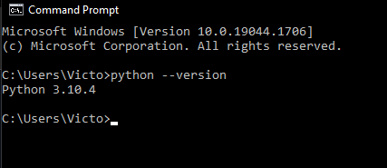

I can get [pyGlossary from GitHub](https://github.com/ilius/pyglossary) or just use the `pip` package manager for python to obtain it.

I will check if `pip` is installed

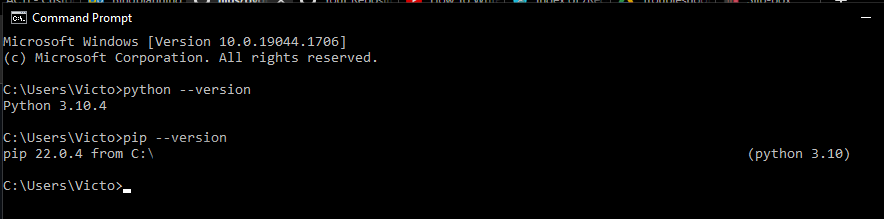

If python is installed and pip is in the system I can proceed to get pyGlossary, like this

`pip install --upgrade pyglossary`

it is important to run the terminal as an administrator to avoid any permission issues.

To launch by pyglossary, I can use
```` commandline
pyglossary
````


but I need to make use of some options first. According to the documentation pyglossary have two modes, direct and indirect if I want to generate a:

- [StarDict](https://github.com/ilius/pyglossary/blob/master/doc/p/stardict.md)
- [EPUB-2](https://github.com/ilius/pyglossary/blob/master/doc/p/epub2.md)
- [Mobipocket E-Book](https://github.com/ilius/pyglossary/blob/master/doc/p/mobi.md)

I need to run `pyglossary` in  indirect mode, for that, I need to use the flag `--indirect`, so I need to modify the command as follows:

``` commandline
pyglossary --indirect
```

<aside> Indirect mode means the input glossary is completely read and loaded into RAM, then converted into the output format.
</aside>

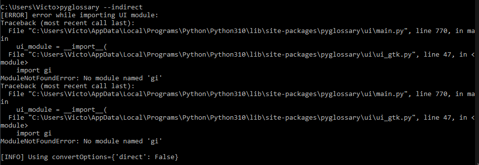

`pyglossary` use different graphical components. In some cases, those components won't be present in some OS. However, since `pyglossary` support several of them it won't be a problem, but this explains the error in the screenshot above.
Here how `pyglossary` look in windows.

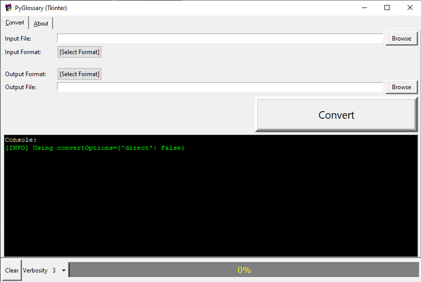

## Convert the dictionary

Now I can proceed to convert the dictionary.

1. select the dictionary file. PyGlossary in some cases will select the input format, most of the time this will be correct but is a good idea to double-check.

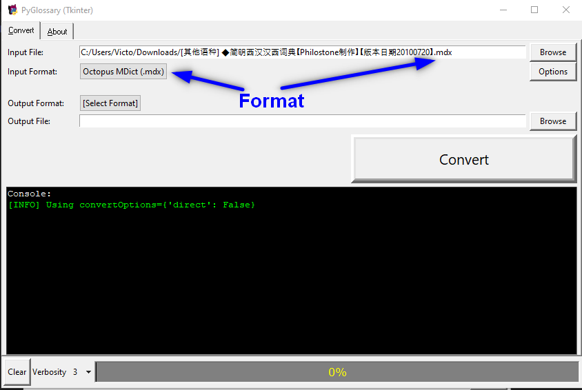

2. select the output format. in this case .mobi and select the location where to receive the new file.

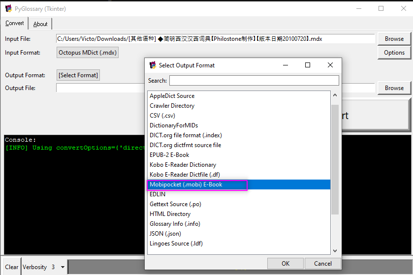

Once the source is defined and the output file selected, I can proceed to use convert.

In this example, I'm running into some errors. However, the file I need was created.
What I'm looking for is to get `content.opf` file. In my case, it will be located on `C:\Users\Victo\Desktop\diccionario_espanol_chino\OEBPS`

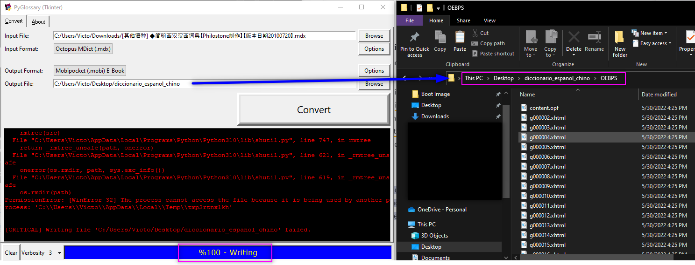

## Modify source code.

If I try to import this generated file to the kindle preview 3, I will have some message error that will mention something related to the language targe.
By modifying some parameters in the source code (`content.opf`) this error can be solved.
Using sublime text ( or any enriched text editor) I can modify the `content.opf` files to add the required information

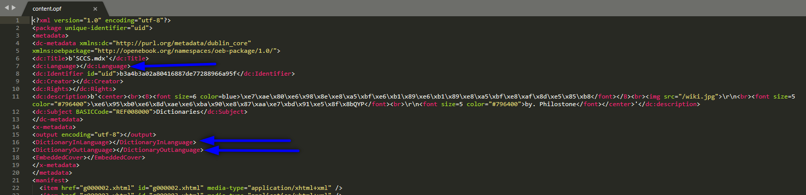

The tag \<dc:Language></dc:Language>\ holds the information of the main language of the dictionary, in this case, is a dictionary Spanish to Chinese, so the language will be Spanish, so I use `es` to fill this tag

`\<dc:Language>es</dc:Language>`

The following two tags represent the `in language`  `<DictionaryInLanguage></DictionaryInLanguage>`and `out language`  `<DictionaryOutLanguage></DictionaryOutLanguage>` again, the dictionary is Spanish to Chinese so the `in language` will be Spanish and the `out language` will be Chinese.

`<DictionaryInLanguage>es</DictionaryInLanguage>
<DictionaryOutLanguage>zh</DictionaryOutLanguage>`

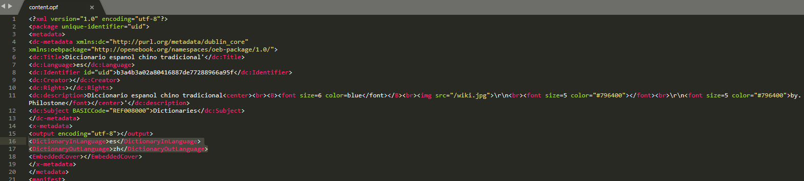

## Kindle Preview 3

This software will allow me to check if the Dictionary was created correctly.

It can be [downloaded  here](https://www.amazon.com/gp/feature.html?docId=1003018611)

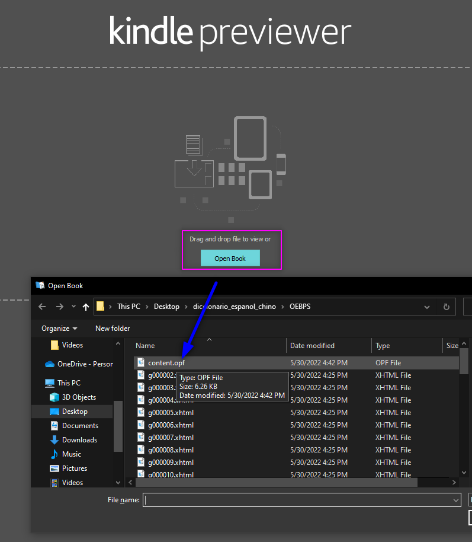

On Kindle Previewer I can preview the dictionary by uploading the `content.opf` file.

Once the Dictionary is loaded I will use the export functions to get the .mobi file.

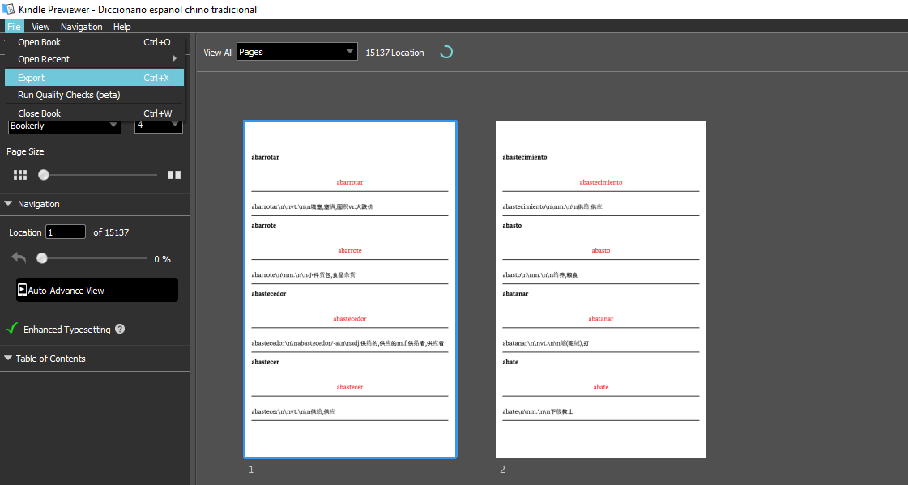

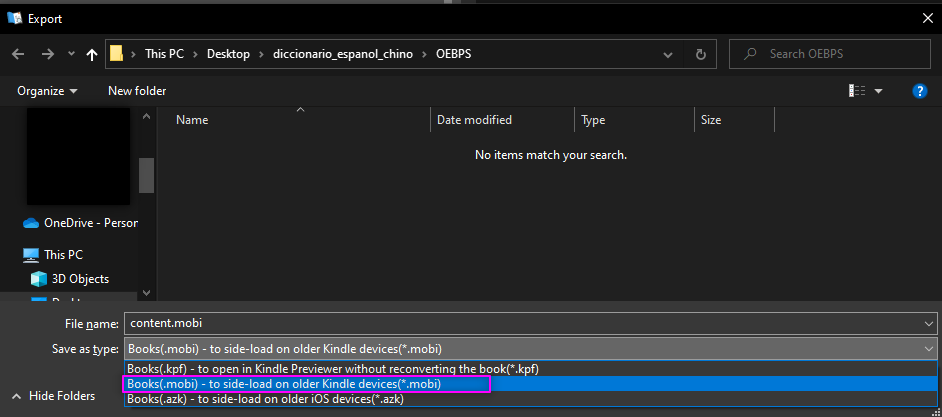

## Upload with Calibre.

Here is a disclaimer, I m using open source free dictionaries therefore I doubt there is any legal consequence but it is better to check for any license, mention, or acknowledge required by the license which the source material is under.

Once the .mobi is created, caliber can be used to upload the dictionary to the kindle.


## How it looks on the Kindle


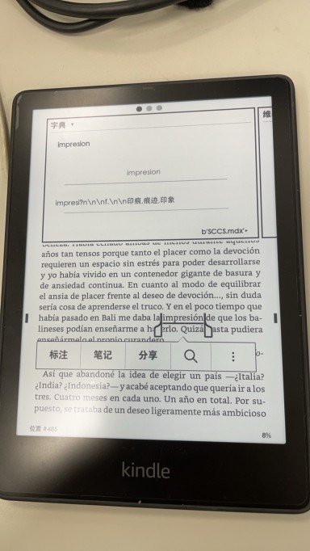
